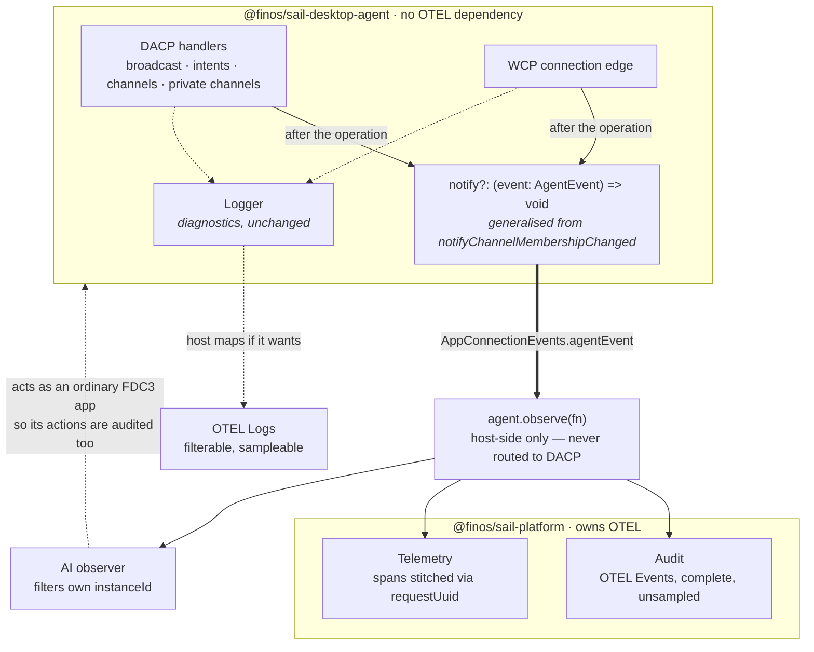
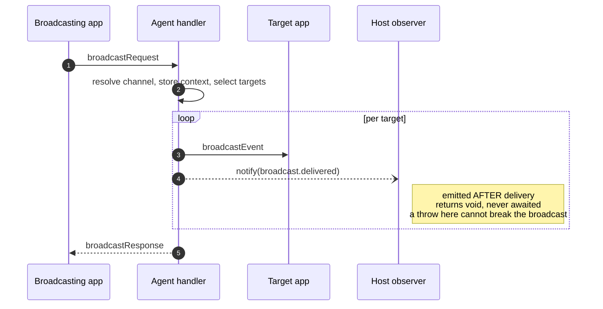
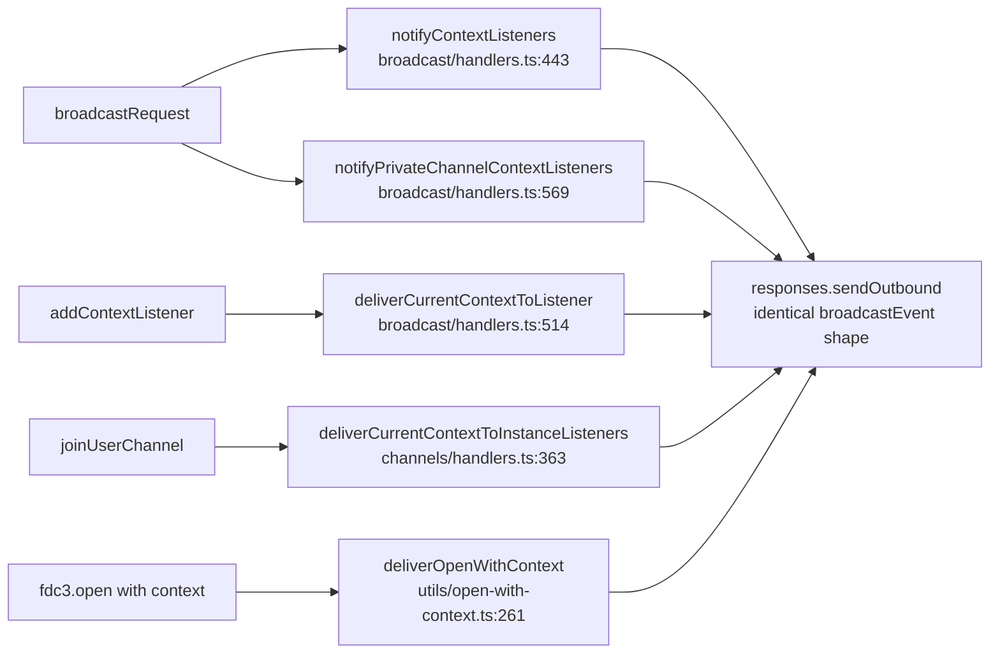

# Minimal Viable Delivery Plan: Agent Observability Seam

Status: planning
Current slice: 1
Review/fix loops: 0

Scope: `packages/sail-desktop-agent`. One seam — a typed stream of completed FDC3
operations — built by **widening machinery the agent already has**, not by adding a
parallel event system. `@finos/sail-platform` maps it to OpenTelemetry. The agent
takes no OTEL dependency.

**Do not interleave with `.cursor/plans/sail-desktop-agent-review-remediation.md`** —
it is nearly complete and edits `channels/handlers.ts`,
`wcp-connection-management.ts` and `intent-result-handlers.ts`, all of which this
plan also touches. Land that first.

---

## Intent

- **Outcome:** A host can answer *"what happened?"* — who broadcast what to whom,
  which intent went where and **who the user picked**, who joined or left a channel,
  who connected and **why they went away** — from typed events, without parsing log
  strings or reverse-engineering wire messages.
- **User:** three consumers off one seam — compliance audit, telemetry, and an AI
  observer. Plus standalone Desktop Agent adopters, who must pay nothing for it.
- **Success:**
  - `notify` undefined ⇒ zero allocation, zero call, no behaviour change.
  - Every `AgentEvent` member fires from at least one production path, proven by test.
  - `npm run typecheck`, `lint`, `vitest`, `test:cucumber` — all green, no conformance
    movement.
  - `package.json` dependencies unchanged; `grep -rn "@opentelemetry" src` empty.
- **Constraint:** observation only. Events are emitted **after** the operation,
  return void, and are never awaited. Nothing a host does can block, delay, reorder
  or modify an FDC3 operation.
- **Out of scope:**
  - Interception / mutation — parked at `.cursor/plans/parked-context-interception.md`.
  - Trace/span **generation**. The agent emits `requestUuid`; the host derives ids.
  - Batching, sampling, retention, redaction policy — all host concerns.
  - A host-side "act as an app" API. See *AI consumer* below.

---

## The purity rule

The agent must stay consumable standalone as a plain FDC3 Desktop Agent. One test
decides what may enter it:

> **Does the seam describe FDC3, or describe Sail?**

`broadcast.delivered` and `intent.resolved` describe FDC3 — any Desktop Agent
implementation would want them, and a standalone adopter benefits equally. Anything
named for a workspace, a layout, an entitlement or a telemetry vendor does not
belong and must live in `@finos/sail-platform`.

By that test the agent gains **a window, not logic**. Every decision —
interpretation, OTEL mapping, correlation, sampling, retention — stays host-side.

---

## Why widen, rather than add

The agent already has this seam twice over. This plan uses it rather than building a third.

| Already exists | Where |
|---|---|
| A typed event map with 5 members | `app-connection/app-connection-events.ts` |
| An emitter with `on`/`off`/`emit` and per-handler `try/catch` | `wcp/app-connection-event-emitter.ts` |
| Public host subscription in controller shape | `sail-desktop-agent.ts` — `apps.onConnect`, `channels.onAppChannelChange` |
| **A typed semantic event emitted from a DACP handler** | `DACPHandlerContext.notifyChannelMembershipChanged`, injected at `desktop-agent.ts:370`, called at `channels/handlers.ts:427` under the comment *"Typed host-chrome path"* |

That last row is this design, already shipped, for exactly one event. The work is to
generalise it.

**Two alternatives were evaluated and rejected:**

- **A wire tap** at `handleMessage` / `sendToAppInstance` is cheap (~42 lines) but
  **disqualified on correctness**: the tap fires before `sendOutbound`, and
  `sendOnPort` returns silently on a dead port — so **a failed delivery is recorded
  as a success**. False positives are worse than gaps in an audit trail. It is also
  blind to all five semantic signals below, and to every disconnect cause.
- **A parallel `AgentEventSink`** with its own threading is ~250-280 lines across
  ~16 files and adds a second observability system beside the logger and emitter that
  already exist. `DACPHandlerContext` would carry four observability members out of
  fifteen — at which point it stops describing what a handler needs to implement FDC3.

### The five signals that exist nowhere on the wire

These are what make typed events necessary rather than merely convenient:

1. **Intent resolver choices** — what was offered and what the user chose. The
   resolver is an in-process host callback, never a DACP message.
2. **Private channel grants** — `connectInstanceToPrivateChannel` is a state
   mutation with no outbound message.
3. **Host- vs app-initiated channel change** — both emit identical
   `channelChangedEvent` messages. The `hostInitiated` flag is internal.
4. **Disconnect cause and `appId`** — no message carries either.
5. **Delivery failures** — a throw produces no message at all.

---

## Shape



One-way by construction — the arrow into the host never returns:



---

## Simplicity Bias

- **Reuse:** `AppConnectionEvents` + `AppConnectionEventEmitter` (already has the
  per-handler `try/catch` a host sink needs). The `notifyChannelMembershipChanged`
  injection pattern at `desktop-agent.ts:370`. `meta.requestUuid` as the correlation
  attribute — already on every inbound message.
- **Avoid:** a second emitter, a subscriber registry, async emit, queues, batching,
  a builder or factory per event. `AgentEvent` is a plain discriminated union of
  plain objects.
- **Architecture:** unchanged. One new file for the union; one new member on an
  existing event map; one existing context field widened.

---

## Code

**The union** — the only genuinely new type surface:

```ts
// src/observability/agent-events.ts

/**
 * Completed FDC3 operations, observed by the host. Emitted after the operation,
 * returns void, never awaited.
 *
 * Members describe FDC3, never Sail — see the purity rule in the plan.
 */
export type AgentEvent =
  | BroadcastDelivered | BroadcastDeliveryFailed
  | IntentRaised | IntentResolved | IntentDelivered | IntentResult
  | ChannelJoined | ChannelLeft
  | PrivateChannelCreated | PrivateChannelGranted | PrivateChannelDisconnected
  | AppConnected | AppDisconnected
  | OpenContextDelivered

interface AgentEventBase {
  at: number
  /** The DACP request that caused this, where one exists.
   *  The host derives OTEL TraceId/SpanId from it — the agent mints nothing. */
  requestUuid?: string
}

export interface BroadcastDelivered extends AgentEventBase {
  kind: "broadcast.delivered"
  channelId: string
  channelKind: "user" | "app" | "private"
  contextType: string
  sourceInstanceId: string
  sourceAppId?: string
  targetInstanceId: string
  targetAppId: string
  /** Live fan-out, replay to a new listener, or fdc3.open delivery. */
  trigger: "live" | "replay" | "openWithContext"
}

export interface IntentResolved extends AgentEventBase {
  kind: "intent.resolved"
  intent: string
  contextType: string
  sourceInstanceId: string
  /** Every candidate shown to the user — invisible on the wire. */
  offered: Array<{ appId: string; instanceId?: string }>
  /** null when the user cancelled. */
  chosen: { appId: string; instanceId?: string } | null
}

export interface AppDisconnected extends AgentEventBase {
  kind: "app.disconnected"
  instanceId: string
  appId: string
  reason?: "goodbye" | "heartbeatTimeout" | "hostInitiated" | "handshakeTimeout"
}
```

**Wiring** — three one-line edits to existing declarations:

```ts
// app-connection/app-connection-events.ts — one new member on the existing map
agentEvent: (event: AgentEvent) => void

// handlers/types.ts — generalises notifyChannelMembershipChanged
notify?: (event: AgentEvent) => void

// agent/desktop-agent.ts, createHandlerContext — same bind pattern already present
notify: conn.notifyAgentEvent?.bind(conn),
```

**Emit site** — one call after the FDC3 work:

```ts
// handlers/broadcast/handlers.ts, inside the per-target loop
handlerContext.responses.sendOutbound(broadcastEventWithRouting)

handlerContext.notify?.({
  kind: "broadcast.delivered",
  at: Date.now(),
  requestUuid,
  channelId,
  channelKind,
  contextType: context.type,
  sourceInstanceId: handlerContext.instanceId,
  sourceAppId: senderInstance?.appId,
  targetInstanceId: instance.instanceId,
  targetAppId: instance.appId,
  trigger: "live",
})
```

**Host side** — the only place OTEL appears anywhere:

```ts
// @finos/sail-platform
agent.observe(event => {
  switch (event.kind) {
    case "broadcast.delivered":
      otelLogger.emit({
        timestamp: event.at,
        severityNumber: SeverityNumber.INFO,
        attributes: {
          "event.name": "fdc3.broadcast.delivered",
          "fdc3.channel.id": event.channelId,
          "fdc3.context.type": event.contextType,
          "fdc3.source.app_id": event.sourceAppId,
          "fdc3.target.app_id": event.targetAppId,
          ...traceFrom(event.requestUuid),
        },
      })
      break
  }
})
```

**AI consumer** — same seam, plus a loop guard:

```ts
agent.observe(event => {
  if ("sourceInstanceId" in event && event.sourceInstanceId === assistantInstanceId) return

  if (event.kind === "broadcast.delivered" && event.contextType === "fdc3.instrument") {
    void assistantFdc3.raiseIntent("ViewAnalysis", context)  // acts as an app → audited
  }
})
```

---

## Traps — read before starting

**Trap 1 — broadcast has FIVE delivery paths, not four.** All five emit a
byte-identical `broadcastEvent`, so only a typed event can distinguish them. Hooking
a subset silently drops deliveries from the audit trail and nothing fails.



Paths 3, 4 and 5 do **not** receive `requestUuid` — they replay context from an
earlier, finished request. Mark them `trigger: "replay" | "openWithContext"` with no
correlation id. Do not invent one.

**Trap 2 — do NOT reuse the `traceId` at `intent-result-metadata.ts:79`.** Minted at
the **result** so it cannot correlate raise→result; never read back anywhere; a
36-char UUID where OTEL TraceId is 32 hex; and can be generated twice for one result.
Use `meta.requestUuid`. Do not add trace generation to the agent — that is how the
OTEL dependency creeps in.

**Trap 3 — `appDisconnected` loses `appId`.** `wcp-connection-management.ts:186`
deletes the connection two lines before `:188` emits. Capture before the delete.

**Trap 4 — `notifyChannelMembershipChanged` has a live consumer.**
`SailDesktopAgent.changeAppChannel` awaits the resulting `channelChanged` connector
event with a 10s timeout, and redundant joins must still resolve it. Generalising the
field means migrating that waiter in the same change. **This is the only place this
plan touches working behaviour rather than adding alongside it** — a mistake here
hangs a channel pill for ten seconds.

**Trap 5 — the observe feed is host-privileged.** It carries traffic across all apps
and channels. It must never be reachable over DACP, or any connected app could
subscribe to everything.

---

## Slices

### Slice 1 — The seam

**Goal:** `AgentEvent`, the widened event map, the generalised `notify`, and the
migration of the one existing consumer. **Zero new emit sites.**

**What to do:**
1. New `src/observability/agent-events.ts` — the union above.
2. Add `agentEvent` to `AppConnectionEvents`; surface `agent.observe(fn)` on
   `SailDesktopAgent` using the existing controller pattern (`apps.onConnect` shape).
3. Replace `notifyChannelMembershipChanged` on `DACPHandlerContext` with
   `notify?: (event: AgentEvent) => void`; update the injection at
   `desktop-agent.ts:370`.
4. **Migrate the call site** at `channels/handlers.ts:427` to emit
   `channel.joined` / `channel.left`, and update `changeAppChannel`'s waiter to
   resolve off the new event. Trap 4.

**Acceptance:** typecheck green. `changeAppChannel` still resolves promptly on a
redundant join and does not regress the 10s timeout. Every other path unchanged —
`notify` undefined everywhere else.

**Test:** reproduction-shaped for trap 4 — assert a redundant `changeAppChannel`
resolves; this is the existing guarantee and must survive.

**Verify:**
```bash
npx vitest run src/handlers/channels src/agent --root packages/sail-desktop-agent
```

**Likely files:** `src/observability/agent-events.ts` (new),
`src/app-connection/app-connection-events.ts`, `src/handlers/types.ts`,
`src/agent/desktop-agent.ts`, `src/agent/sail-desktop-agent.ts`,
`src/handlers/channels/handlers.ts`, `src/index.ts`

---

### Slice 2 — Emit where everything is already in scope

**Goal:** the events needing no signature changes. If a site needs plumbing it
belongs in slice 4.

| Event | Site |
|---|---|
| `intent.delivered` | `intents/intent-delivery-helpers.ts:105-112` |
| `intent.result` | `intents/intent-result-handlers.ts:189-201` |
| `intent.raised` + `intent.resolved` | `intents/intent-raise-intent.ts:155-174` — captures both **offered** and **chosen** |
| `open.contextDelivered` | `utils/open-with-context.ts:234-272` |
| `app.connected` | `wcp/wcp-identity-validation.ts:259` — takes `DACPHandlerContext`, so already in scope |
| `privateChannel.created` | `private-channels/handlers.ts:53` |

**Acceptance:** each fires once per operation. With `notify` undefined these paths
are byte-identical to today.

**Test:** one integration test per event with a capturing array (not a mock). Plus
the **zero-cost guard**: an operation with `notify` undefined produces observably
identical output to one with an observer attached. Keep this test permanently.

**Verify:**
```bash
npx vitest run src/handlers src/app-connection --root packages/sail-desktop-agent
```

---

### Slice 3 — Broadcast: all five paths

**Own slice because of trap 1.** Getting it wrong doesn't fail loudly — it quietly
omits replayed context forever.

**What to do:** thread `requestUuid` into `notifyContextListeners` and
`notifyPrivateChannelContextListeners` (the caller already has it). Emit at all five
sites, tagged `trigger` and `channelKind`. Emit **inside** the per-target loop after
`sendOutbound` — the `catch` at `broadcast/handlers.ts:459` must emit
`broadcast.deliveryFailed`, never `delivered`.

**Acceptance:** N listeners ⇒ N events. A throw emits `deliveryFailed`, not
`delivered`. Both replay paths appear, tagged. No path fabricates a `requestUuid`.

**Test:** one per path. The three non-live paths are the load-bearing tests — they
are what a naive implementation misses.

---

### Slice 4 — The wire-invisible signals and their plumbing

| Signal | Gap to close |
|---|---|
| `channel.left` names the channel left | `channels/handlers.ts:156` never calls `getInstance` on the leave path — read `currentUserChannel` **before** the mutation |
| `privateChannel.granted` | thread `requestId` + target identity into `grantPrivateChannelToIntentSource` (`intent-result-handlers.ts:37-60`) |
| `privateChannel.disconnected` on teardown | `removeInstancePrivateChannels` (`private-channels/handlers.ts:312`) doesn't destructure `logger` — add `notify` too |
| `app.disconnected` carries `appId` | emit before `connections.delete` (trap 3) |
| reaching the disconnect site | `disconnectApp` takes `AppConnectionContext`, **not** `DACPHandlerContext` — unlike `app.connected` in slice 2. Either thread `notify` onto that context, or emit from the agent-side teardown choke point where both the context and `appId` exist. **Verify the agent-side point covers all four disconnect routes before choosing.** |

**Test:** reproduction-first for `app.disconnected` carrying a non-empty `appId` and
for `channel.left` naming the prior channel — write both against current code and
watch them fail before changing anything.

---

### Slice 5 — Disconnect reason

**Last and separable.** Everything before ships a useful trail; this makes the
disconnect record honest.

Add `DisconnectReason` at the four callers that funnel into `disconnectApp` /
`cleanupDACPHandlers`: WCP6 goodbye, heartbeat timeout, host-initiated
`disconnectAppByInstanceId`, handshake timeout. **Optional, with no default
masquerading as a real reason** — absent must be absent. A wrong reason in an audit
log is worse than a missing one.

**Ask before expanding:** if the enum wants sub-reasons or error objects, park it.

**Note:** the remediation plan records that `createTestAgent` hardcodes
`handshakeTimeout: 30_000` with no override. If that knob still isn't there, add it or
document handshake-timeout as untested — **do not** write a 30-second test.

---

## Test Plan

- **Reproduction-first (must fail before the change):** `app.disconnected` carrying
  `appId`; `channel.left` naming the prior channel; the redundant-`changeAppChannel`
  guard in slice 1. If any cannot be made to fail first, stop and report.
- **Unit:** the union's attribute typing — a compile-time assertion is enough. Do not
  write runtime tests for a type.
- **Integration:** one per event with a capturing array. Slice 3's three non-live
  paths are the highest-value tests here.
- **Zero-cost guard, kept permanently:** `notify` undefined ⇒ observably identical
  behaviour. This is what stops the seam becoming load-bearing on the FDC3 path.
- **Conformance:** `npm run test:cucumber` after slices 1, 3, 4. Expected unchanged —
  movement means an emit site changed behaviour, which is a bug in this plan's premise.
- **Not testing:** console formatting; which attributes the host chooses to export.

---

## Review Plan

- **Main-agent, every slice:** diff contains only this slice? `notify?.()` never a
  bare `.()`? No emit inside a `try` whose `catch` swallows FDC3 errors? Any new
  union member still pass the purity rule?
- **Fresh-context subagent required for:** slice 1 (touches a working waiter) and
  slice 3 (five paths — a reviewer who hasn't read this plan is the right person to
  check none was missed).
- **Loop limit:** 3, then back to the user.

---

## Risks

- **Observability becoming load-bearing.** The moment an emit can throw, block or
  reorder an operation this stops being observability. Decide in slice 1 whether the
  contract is "must not throw" or the emitter's existing `try/catch` covers it —
  `AppConnectionEventEmitter` already wraps handlers, which is a reason to route
  through it rather than calling host functions directly. Write the choice down.
- **The union growing past FDC3.** Every new member must pass the purity rule. A
  `sail.*` member is the signal this has drifted.
- **Slice 3 omission is silent.** Missing a path yields a plausible but incomplete
  trail and nothing fails.
- **Overlap with the remediation plan** on three shared files.
- **`AppConnectionContext` vs `DACPHandlerContext` asymmetry** (slice 4) — connect is
  free, disconnect is not.

---

## Slice Checkpoints

- [ ] 1 — The seam (union, widened map, generalised `notify`, migrate the waiter)
- [ ] 2 — Emit where everything is in scope
- [ ] 3 — Broadcast: all five paths
- [ ] 4 — Wire-invisible signals and their plumbing
- [ ] 5 — Disconnect reason

## Verification Notes

- (none yet)

## Review Notes

- Required:
- Follow-up:
- Ignore for MVP:

## Parked Follow-ups

- **Context interception** — `.cursor/plans/parked-context-interception.md`. The one
  thing that would justify reopening the middleware question.
- **OTEL-shaping the `Logger`.** Was originally slice 1 of this plan. Downgraded to
  optional: the logger was only being asked to carry audit because no event seam
  existed. With one, `Logger` stays plain diagnostics and the host maps it to OTEL
  Logs if it wants a single pipeline.
- Dead `daTraceId` at `intent-result-metadata.ts:79` — generated, never read.
  Deleting it is separate and trivially safe; not folded in here because this plan's
  position is that it must not be used.
- The three `consoleLogger` bypass sites (`app-connection-event-emitter.ts:37`,
  `wcp-intent-resolver.ts:41`, dead `wcp-event-emitter.ts:54`).
- Cross-app causal correlation beyond `requestUuid`.
- A host-side "act as an app" API for in-process services. Deliberately absent — an
  AI acting through a host backdoor would bypass the audit trail watching everyone
  else. In-process services should complete a normal WCP handshake and hold real
  identity.

## Known Limitations

- The agent never produces `TraceId`/`SpanId`. Correlation reaches only as far as
  `requestUuid`. Deliberate — the price of staying OTEL-free.
- Replay deliveries carry no correlation id; the causing request is long finished.
- Events reflect *attempted delivery from the agent*, not receipt by the app. The
  agent has no delivery acknowledgement to report.
