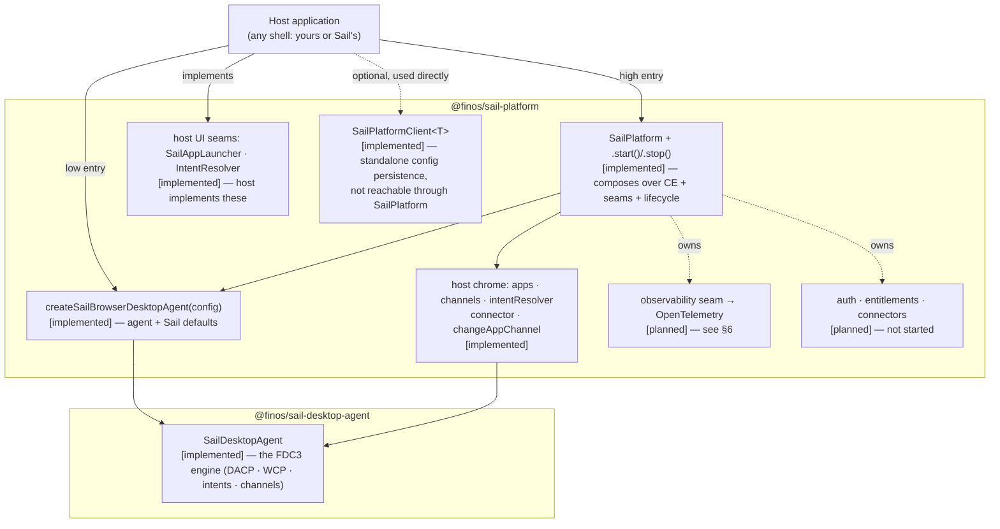
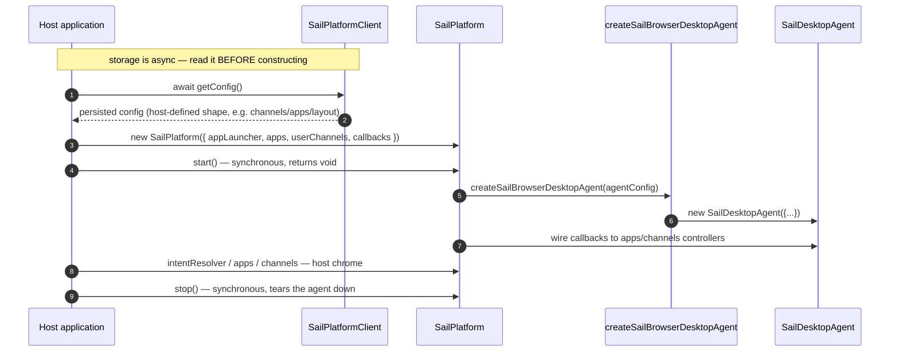

# `@finos/sail-platform` — Package Description (Slice 0 output)

> **ARCHIVED 2026-08-07.** Moved to `.cursor/plans/archive/` — no open items (confirmed: this is a
> package-description doc, not a slice plan; it carries no checkboxes or task list). Re-verified
> the same day: `packages/sail-platform/src/index.ts` now exports only `createWorkspaceStore` and
> storage helpers — none of the APIs this document describes still exist. Superseded by the
> `sail-platform` cull below; current surface is `packages/sail-platform/README.md`.

> **SUPERSEDED 2026-08-04 by the `sail-platform` cull.** Every API this document describes —
> `SailPlatform`, `createSailBrowserDesktopAgent`, `SailAppLauncher`, `SailPlatformClient`,
> `generateUuid`, the agent type re-exports — has been deleted. The package now holds **workspaces,
> layouts and storage** with **zero dependencies**, and hosts construct `SailDesktopAgent` directly
> from `@finos/sail-desktop-agent`.
>
> Kept as a point-in-time record of the "composition layer" framing and why it did not hold: that
> framing was written around whatever happened to be in the package, and it conflicted with
> `sail-platform-extensibility.md` §2, which assigns workspaces, layout, auth, entitlements and
> config to this package. The cull resolved the conflict in favour of §2.
>
> **Current surface:** `packages/sail-platform/README.md` ·
> `website/docs/packages/platform/overview.md`.

Status: **superseded — historical record.** Was: draft awaiting maintainer source-check, the sign-off
gate for blueprint Slice 0.

**Framing rule (maintainer decision, 2026-08-03).** This describes `@finos/sail-platform` **as a standalone
package**: what it is, what it does, why it needs to be what it is, and how to use it. It does **not**
justify the package by who consumes it. No API is downgraded because no in-repo shell drives it, and no API
is explained in terms of what a shell wanted. In-repo shells appear only in §8, as reference
implementations a reader may go look at — never as the reason an API exists.

Every claim is marked **[implemented]** or **[planned]**; the marker convention formalises in Slice 2.

Reference sources (read 2026-08-03, post-refactor):
- `packages/sail-platform/src/sail-platform.ts`
- `packages/sail-platform/src/sail-browser-desktop-agent.ts`
- `packages/sail-platform/src/client/sail-platform-client.ts`

---

## 1. What the package is

`@finos/sail-platform` is the **composition layer** for building an FDC3 host. It layers over its own
`createSailBrowserDesktopAgent` factory — which itself wraps the standards-compliant FDC3 Desktop Agent
(`SailDesktopAgent`, from `@finos/sail-desktop-agent`) with Sail's agent defaults — and adds the things a
host application needs around that agent but which the FDC3 standard does not specify:

- **host UI seams** — where the host plugs in app launching and intent resolution;
- **host chrome** — grouped, push-based controllers a host's own UI can bind to, instead of polling agent state;
- **a lifecycle** — construct, start, stop, with events forwarded to the host.

Config persistence is a separate, standalone helper (`SailPlatformClient`, §4) that a host may use
independently of `SailPlatform` — it is not something `SailPlatform` owns or exposes.

**Scope boundary [implemented].** The package does not own FDC3 semantics — intents, contexts, channels and
the DACP/WCP wire protocols all live in `@finos/sail-desktop-agent`. `sail-platform` composes that engine;
it does not reimplement or extend the standard. It also holds **no UI**: every visual surface is an
interface the host implements.

**`SailPlatform` is stateless [implemented].** It forwards lifecycle events to host callbacks and does not
maintain a model of connected apps or channel membership (`sail-platform.ts:270`). Hosts own their state.

---

## 2. Two entry points

The package exposes two ways in, and they are **layered, not parallel**: `SailPlatform` composes *over*
`createSailBrowserDesktopAgent` rather than constructing its own `SailDesktopAgent` independently. There is
one FDC3 engine and exactly one place Sail's agent defaults (handshake timeout, injected-UI opt-out, FDC3
version) are defined. The two entry points differ only in what host scaffolding sits on top of that engine.

| | `createSailBrowserDesktopAgent(config)` | `new SailPlatform(config)` + `.start()` |
|---|---|---|
| Returns | a `SailDesktopAgent` | a platform object owning an agent |
| FDC3 conformance | identical — same engine | identical — same engine |
| Host UI seams | `appLauncher` | `appLauncher`, `intentResolver` |
| Lifecycle callbacks | none | connect / disconnect / channel-change / handshake-failure |
| Host owns | everything above the agent | everything above the platform |
| Status | **[implemented]** | **[implemented]** |

`SailPlatformConfig` extends `SailBrowserDesktopAgentConfig` (`sail-platform.ts:39`), so every
`createSailBrowserDesktopAgent` option flows through `SailPlatform` unchanged. `SailPlatform.start()`
(`sail-platform.ts:113`) calls `createSailBrowserDesktopAgent(agentConfig)` internally (`:131`) and wires
the lifecycle callbacks to the agent's grouped controllers (`wireEvents`, `:272`).

---

## 3. Lifecycle and its one real constraint

**The constraint worth documenting [implemented].** `apps` and `userChannels` are **constructor data**, and
`start()` is **synchronous** — but `SailPlatformClient` reads are **asynchronous**. A host that seeds the
agent from persisted state must therefore `await` its reads *before* constructing, not after starting.
Starting first and reconciling later means the agent runs briefly on defaults and needs a restart to
correct itself. This is the ordering rule to state in the docs, and it is a property of the package, not of
any one host.

**`start()`/`stop()` are `void`, not `Promise` [implemented]** (`sail-platform.ts:113,149`). Calling
`start()` twice throws; `stop()` on a stopped platform is a no-op. Every accessor throws
`"SailPlatform not started"` before `start()` (`:263`).

The `SailPlatform` class JSDoc example (`sail-platform.ts:77-93`) no longer shows the `await
platform.start()` / `platform.config.get()` mistakes recorded in an earlier pass of this doc — the example
matches the `void` lifecycle and the platform never exposed a `config` property.

---

## 4. API surface

**Host UI seams — the host implements these [implemented].**

| Seam | Required? | Purpose |
|---|---|---|
| `appLauncher: AppLauncher` | **yes** | open and close apps in the host's own windows/panels. `SailAppLauncher` is the supplied helper: give it `onLaunchApp` / `onCloseApp`. This — not raw `AppLauncher` — is the intended host entry. |
| `intentResolver?: IntentResolver` | no | render intent-resolution UI. Omitted ⇒ first handler auto-selected. |

There is no `channelSelector` config seam: it was dead configuration (documented and exported but never
read by `start()`, and `SailDesktopAgentOptions` has no field to receive it) and has been removed from
`SailPlatformConfig`. The package still exports the `ChannelSelector` **type** — an alias of the desktop
agent's `ChannelControl` host contract (`interfaces/index.ts:21`); that re-export is intact but is not a
config seam, and nothing in the package accepts a value of that shape as configuration.

Because Sail hosts control their own UI, the agent factory disables the agent's injected-iframe resolver and
channel-selector surfaces by default (`getIntentResolverUrl: () => false`, `getChannelSelectorUrl: () =>
false`, `sail-browser-desktop-agent.ts:56-57`). The host's implementations are the only UI. This default
lives in `createSailBrowserDesktopAgent`, not `SailPlatform` — both entry points get it.

**Host chrome — push-based controllers for host UI [implemented].**
`platform.apps`, `platform.channels`, `platform.intentResolver` expose the agent's grouped controllers;
`platform.changeAppChannel(instanceId, channelId)` resolves once the change is confirmed on the wire, and
`getAppUserChannel(instanceId)` is the authoritative one-off read. `platform.connector` is the raw
`BrowserAppConnection` for advanced integrators. **Hosts should not poll `getState()`** — the grouped
controllers are the supported path (`sail-platform.ts:226`).

**Lifecycle callbacks [implemented].** `onAppConnected`, `onAppDisconnected`, `onChannelChanged`,
`onHandshakeFailed` — each wired only if supplied (`wireEvents`, `sail-platform.ts:272-296`).

**Agent configuration passthrough [implemented].** `SailPlatformConfig` extends
`SailBrowserDesktopAgentConfig` (`Omit`-ting the three callbacks it re-wires through the grouped host
controllers), so every option the factory accepts flows through `SailPlatform` unchanged. This closes a
former gap: `allowedOrigins` (the WCP4 origin allowlist — the package's only deployment security policy),
`appDirectories`, `logger`, `logPayloadDetail`, `validation`, `autoStart`, `channelChangeTimeoutMs`, and a
genuinely overridable `appConnectionOptions` (previously hardcoded inside `SailPlatform` and silently
ignored) are now all reachable from `SailPlatform`, not just from the low entry. Also passed through: `apps`,
`userChannels`, `implementationMetadata`, `openContextListenerTimeoutMs`, `heartbeatEnabled` /
`heartbeatIntervalMs` / `heartbeatTimeoutMs`, `debug`.

**Config persistence — `SailPlatformClient<T>`, standalone [implemented].** `SailPlatform` owns no storage.
Config persistence lives entirely in `SailPlatformClient` (§1), not reachable through `SailPlatform`; a host
constructs it directly regardless of which entry point it took. Generic and typed (`T`, default `unknown`) — payloads are no
longer forced to `unknown` the way the old `platform.sailConfig` namespace was. Backed by an injectable
`Storage` (`config?.storage`, default `globalThis.localStorage`) behind a `keyPrefix` (default `"sail_"`),
storing a single blob at `` `${keyPrefix}config` ``. `getConfig(): Promise<T | null>` /
`updateConfig(config: T): Promise<void>` (`client/sail-platform-client.ts`). There is no `"remote"` storage
option and nothing here throws on a config value — the two caveats this doc previously carried for
`platform.sailConfig` (untyped payloads, a throwing remote backend) no longer apply because the API they
described no longer exists in that shape.

---

## 5. Choosing an entry point

Pick by **what you want the package to own**, not by maturity — neither entry is more finished than the other.

- **`createSailBrowserDesktopAgent`** — you want a standards-compliant FDC3 Desktop Agent, with Sail's agent
  defaults, and nothing else. You already have state management, persistence and UI, and you will bind the
  agent's controllers yourself.
- **`SailPlatform`** — you want that same agent *plus* host scaffolding built on top of it: lifecycle
  callbacks instead of manual controller wiring, the intent-resolver seam, and a place for the [planned]
  services tier to arrive without a re-architecture. `SailPlatform` composes over the low entry — it does
  not replace it — so anything reachable from `createSailBrowserDesktopAgent` is reachable from `SailPlatform`
  too (§4).

Both require an `appLauncher`. Neither entry offers config persistence — that is `SailPlatformClient` (§4),
used the same way regardless of which entry a host picks. You can start at the low entry and move up later;
the FDC3 surface your apps see is identical either way.

---

## 6. Extensibility: the observability seam [planned]

There is no "middleware" mechanism in this package to document. The customisation and telemetry mechanism
is the **agent observability seam**: a typed `AgentEvent` stream surfaced on the `SailDesktopAgent`
controller surface — alongside logging, channels and intents — emitted **after** each FDC3 operation and
unable to block or alter it. Two separable halves:

1. **Event tracking [planned]** — events mapped to OpenTelemetry **inside `@finos/sail-platform`**, so the
   desktop agent takes no OTEL dependency. The platform is the mapping point because it is already the
   layer that owns lifecycle and host composition.
2. **Logging [planned/existing]** — the `Logger` stays plain diagnostics; a host may map it to OTEL Logs.

Fully specified at `.cursor/plans/agent-observability-seam.md`. `MiddlewarePipeline` — previously
collected-but-unwired — has since been **deleted** (file and all exports); docs must not present it as a
live mechanism or as configuration a host can reach.

---

## 7. Implemented vs planned

**[implemented]** — both entry points, layered (`SailPlatform` composes over
`createSailBrowserDesktopAgent`); the shared `SailDesktopAgent`; the two host UI seams (`appLauncher`,
`intentResolver`); host chrome (`apps`/`channels`/`intentResolver`/`connector`/`changeAppChannel`/
`getAppUserChannel`); the four lifecycle callbacks; full agent config passthrough via
`SailPlatformConfig extends SailBrowserDesktopAgentConfig`; standalone, generic, typed config persistence
via `SailPlatformClient<T>`; start/stop lifecycle.

**[planned]** —
- **Observability / OpenTelemetry** — §6; designed, not built.
- **Auth, entitlements, connectors** — do not exist in any form.

**Removed, not planned** — `MiddlewarePipeline` (deleted, file and all exports; see §6) and the
`channelSelector` config seam (never wired; see §4) are gone from the package, not deferred.

---

## 8. Reference implementations (appendix, not justification)

Two shells in this repo consume the package and can be read as worked examples. Neither defines the
package's contract.

- **`sail-finance`** — low entry. `createSailBrowserDesktopAgent` + `SailAppLauncher`, with Zustand for its
  own state (`main.tsx:32,107`).
- **`sail-one`** — high entry. `new SailPlatform(...).start()` with the lifecycle callbacks
  (`sail-host.ts:129,155`). Separately, and independently of `SailPlatform`, it also constructs a
  `SailPlatformClient` directly for its own config persistence (`client-state.ts:161`).

Both are **example UIs for the platform**, and the split between them is **domain**, not maturity:
`sail-finance` is finance-specific; `sail-one` is domain-neutral, for more general use. (Canvas vs
dashboard is a secondary layout detail, not the primary distinction — corrected 2026-08-03 on maintainer
direction.)

---

## 9. Maintainer source-check (the Slice 0 gate)

**Answered 2026-08-03:** the standalone-package framing rule (header) is the maintainer's; the
`workspaces`/`layouts`/`sailConfig` question is closed — no consumer today, and that no longer downgrades
the API (§7 marks it `implemented`, §4 records the real caveats).

**Superseded 2026-08-03:** the answer above is preserved as history; it no longer describes the package. A
refactor landed the same day that removed the `WorkspacesApi`/`LayoutsApi`/`ConfigApi` interfaces, the
`platform.workspaces`/`platform.layouts`/`platform.sailConfig` namespaces, the `storage` field on
`SailPlatformConfig`, the `PlatformApi` interface, `LocalStorageBackend`, and `RemoteBackendConfig`. What
remains is `SailPlatformClient`, a standalone, generic, typed config-persistence helper not reachable
through `SailPlatform` (§1, §4). The 2026-08-03 answer treated "no consumer today" as a reason the API's
`[implemented]` status stood despite being unused; this refactor instead deleted the API rather than
annotating it as unused. That reversal — deletion instead of the earlier no-downgrade stance — is recorded
here **pending maintainer confirmation**, not as an argued position.

Remaining to confirm:
1. §1's scope boundary — "composes the agent, owns no FDC3 semantics, holds no UI" — is the intended charter.
2. §3's ordering rule (async storage read must precede construction) is a contract to state, not an accident.
3. §5's decision rule, framed as ownership rather than maturity.
4. §6 as the recorded answer to "what happened to middleware".
5. Whether removing `workspaces`/`layouts`/`sailConfig` outright (rather than keeping them, unused, per the
   2026-08-03 no-downgrade answer above) was the intended resolution, or whether that answer should instead
   have constrained the refactor.
