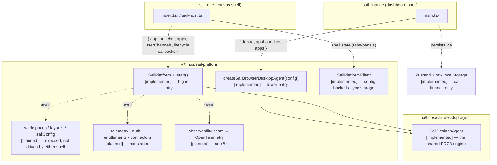
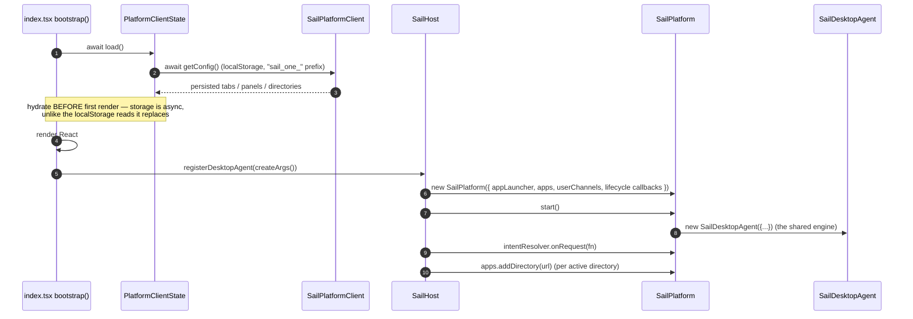

# Sail Platform — Composition & Entry-Point Description (Slice 0 output)

Status: **draft — awaiting maintainer source-check.** This is the sign-off gate for blueprint Slice 0.
It is a *description of how the shipped code composes today*, not a green-field design. Every claim is
marked **[implemented]** or **[planned]**; the marker convention formalises in Slice 2, but it starts here.

Reference sources (read 2026-07-31 @ `18d0de16f`):
- `packages/sail-one/src/index.tsx` — boot flow
- `packages/sail-one/src/state/sail-host.ts` — `SailPlatform` composition
- `packages/sail-one/src/state/client-state.ts` — `SailPlatformClient` persistence
- `packages/sail-finance/src/main.tsx` — `createSailBrowserDesktopAgent` composition
- `packages/sail-platform/src/sail-platform.ts` — `SailPlatform` itself

---

## 1. Two supported entry points, one shared engine

Both entry points live in `@finos/sail-platform`. Both end at the **same** `SailDesktopAgent` — the FDC3
engine from `@finos/sail-desktop-agent`. They differ in what they wrap around it and how the host persists.

- **`createSailBrowserDesktopAgent(config)` [implemented]** — builds a `SailDesktopAgent` directly and
  returns it. The lower entry: a standards-compliant FDC3 Desktop Agent, nothing else. `sail-finance`
  calls it (`main.tsx:110`) with `{ debug, appLauncher, apps }`.
- **`new SailPlatform(config)` + `.start()` [implemented]** — `start()` (`sail-platform.ts:222`, returns
  `void`) constructs `new SailDesktopAgent({...})` internally (`:227`) and wraps it with namespaced APIs
  (`apps`, `intentResolver`, `changeAppChannel`, `workspaces`, `layouts`, `sailConfig`), lifecycle event
  callbacks, and `SailPlatformClient` storage. `sail-one` calls it (`sail-host.ts:129,155`).

**The one host seam both paths share [implemented]:** `SailAppLauncher` with `onLaunchApp` / `onCloseApp`.
`sail-finance/main.tsx:35` and `sail-one/sail-host.ts:172` each construct one. This — not the raw
`AppLauncher` interface the current docs teach — is where a host plugs its window/panel management in.

---

## 2. The `sail-one` boot flow — why the higher entry exists

The flow that justifies `SailPlatform`: **async, platform-backed persistence hydrated *before* the agent
starts**, so the agent is seeded with the persisted channel set rather than defaults-then-restart.

`sail-finance` has no equivalent async-hydrate step: it builds its Zustand store from `localStorage`
synchronously and creates the agent directly, before React renders (`main.tsx:110,126`).

---

## 3. Decision rule — which entry point?

| Reach for… | when the host wants… | evidenced by |
|---|---|---|
| **`SailPlatform`** [implemented] | config-backed **async** persistence (`SailPlatformClient`, swappable backend), platform **lifecycle callbacks** (`onAppConnected`/`onAppDisconnected`/`onChannelChanged`/`onHandshakeFailed`), the built-in **intent-resolver façade** (`platform.intentResolver.onRequest`), and a place for the **[planned]** services tier to plug in | `sail-one` wanted exactly these — `sail-host.ts:129-162`, `client-state.ts:162` |
| **`createSailBrowserDesktopAgent`** [implemented] | just a **standards-compliant FDC3 Desktop Agent** in the browser, owning its own state and UI wiring | `sail-finance` manages Zustand itself and wires the agent's controllers directly — `main.tsx:110` |

Both require the host to implement `SailAppLauncher` (`onLaunchApp`/`onCloseApp`). Neither is more "mature"
than the other — this is a batteries-included vs. bring-your-own choice, not a maturity gradient. The
`sail-one`/`sail-finance` split is likewise a **UX-model** distinction (canvas vs dashboard), not maturity.

---

## 4. Middleware — decided: it is the observability seam [planned]

There is no "middleware" mechanism to document. The customisation/telemetry mechanism is the **agent
observability seam**: a typed `AgentEvent` stream surfaced on the `SailDesktopAgent` controller surface
(like the logging, channels and intent controllers), emitted **after** each FDC3 operation and unable to
block or alter it. It has two separable halves:

1. **Event tracking [planned]** — events mapped to OpenTelemetry **in `@finos/sail-platform`** (the agent
   takes no OTEL dependency). This is where `SailPlatform` earns the services tier: it already owns storage
   and the lifecycle callbacks, so it is the natural OTEL mapping point.
2. **Logging [planned/existing]** — the `Logger` stays plain diagnostics; a host may map it to OTEL Logs.

Fully specified at `.cursor/plans/agent-observability-seam.md`. The collected-but-unwired
`MiddlewarePipeline` in `sail-platform` is **superseded** — docs must not present it as a live mechanism.
Neither shell uses middleware today.

---

## 5. Implemented vs planned — the gap the docs must mark

**[implemented] — the composition spine, with a reference consumer (`sail-one`):**
construct → launch → resolve → persist. Both entry points; `SailDesktopAgent` engine; `SailAppLauncher`
host seam; `SailPlatformClient` async persistence; the intent-resolver façade; `changeAppChannel`.

**[planned] — the services tier and adjacent APIs:**
- **Telemetry** — via the observability seam (§4). Not started beyond the seam's design.
- **Auth, entitlements, connectors** — do not exist in any form.
- **Middleware pipeline** — collected-but-unwired; superseded by the seam.
- **`workspaces` / `layouts` / `sailConfig`** — exposed on `SailPlatform` (`sail-platform.ts:203-205`) but
  **driven by neither shell** (sail-finance uses Zustand; sail-one uses its own `PlatformClientState`).
  Treat as `planned`/unproven pending a real consumer. *(Maintainer: confirm — this is the claim most
  likely to be wrong if a consumer exists that I did not find.)*

**Interim gaps in `sail-one` itself [planned to close]:** structural channel/directory *removals* restart
the agent (`sail-host.ts:268-289`); `embeddable-ui/` carried but unwired.

---

## 6. Maintainer source-check (the Slice 0 gate)

Please confirm or correct, so Slice 2 can build on it:
1. The two entry points and the shared `SailDesktopAgent` engine (§1).
2. The `sail-one` async-hydrate-before-start rationale (§2).
3. The decision rule (§3) — especially "sail-one wanted `SailPlatformClient` + lifecycle callbacks."
4. §5's claim that `workspaces`/`layouts`/`sailConfig` have **no** shipping consumer.
5. The middleware→observability decision (§4) as the recorded answer.
