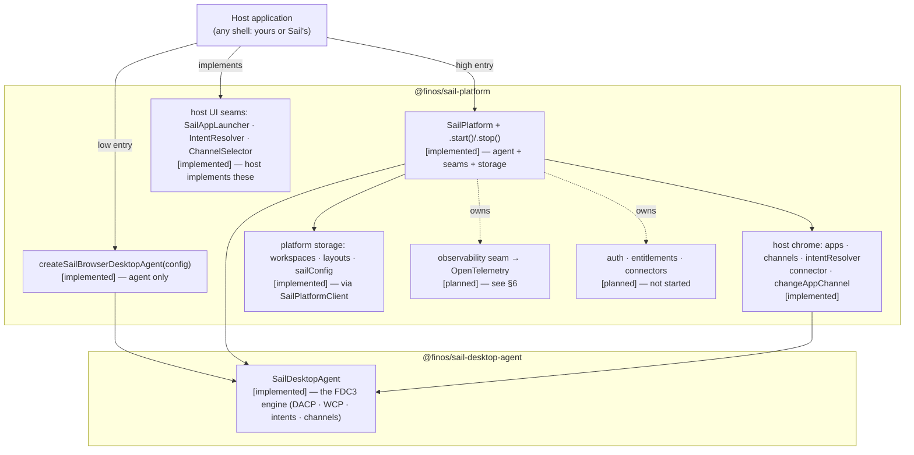
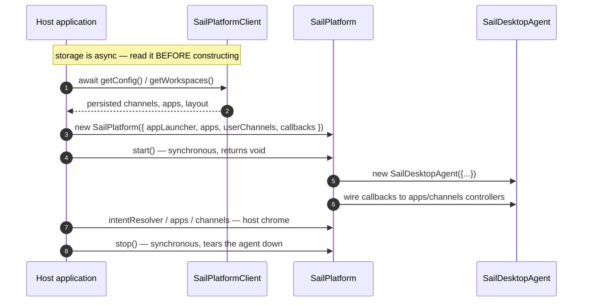

# `@finos/sail-platform` — Package Description (Slice 0 output)

Status: **draft — awaiting maintainer source-check.** This is the sign-off gate for blueprint Slice 0.

**Framing rule (maintainer decision, 2026-08-03).** This describes `@finos/sail-platform` **as a standalone
package**: what it is, what it does, why it needs to be what it is, and how to use it. It does **not**
justify the package by who consumes it. No API is downgraded because no in-repo shell drives it, and no API
is explained in terms of what a shell wanted. In-repo shells appear only in §8, as reference
implementations a reader may go look at — never as the reason an API exists.

Every claim is marked **[implemented]** or **[planned]**; the marker convention formalises in Slice 2.

Reference sources (read 2026-08-03 @ `063553212`):
- `packages/sail-platform/src/sail-platform.ts`
- `packages/sail-platform/src/client/sail-platform-client.ts`
- `packages/sail-platform/src/client/local-storage-backend.ts`

---

## 1. What the package is

`@finos/sail-platform` is the **composition layer** for building an FDC3 host. It packages a standards-
compliant FDC3 Desktop Agent (`SailDesktopAgent`, from `@finos/sail-desktop-agent`) together with the
things a host application needs around that agent but which the FDC3 standard does not specify:

- **host UI seams** — where the host plugs in app launching, intent resolution and channel selection;
- **host chrome** — grouped, push-based controllers a host's own UI can bind to, instead of polling agent state;
- **platform storage** — pluggable persistence for workspaces, layouts and host config;
- **a lifecycle** — construct, start, stop, with events forwarded to the host.

**Scope boundary [implemented].** The package does not own FDC3 semantics — intents, contexts, channels and
the DACP/WCP wire protocols all live in `@finos/sail-desktop-agent`. `sail-platform` composes that engine;
it does not reimplement or extend the standard. It also holds **no UI**: every visual surface is an
interface the host implements.

**`SailPlatform` is stateless [implemented].** It forwards lifecycle events to host callbacks and does not
maintain a model of connected apps or channel membership (`sail-platform.ts:384`). Hosts own their state.

---

## 2. Two entry points

The package exposes two ways in. Both end at the **same** `SailDesktopAgent` — there is one FDC3 engine,
not two. They differ only in what is composed around it.

| | `createSailBrowserDesktopAgent(config)` | `new SailPlatform(config)` + `.start()` |
|---|---|---|
| Returns | a `SailDesktopAgent` | a platform object owning an agent |
| FDC3 conformance | identical — same engine | identical — same engine |
| Host UI seams | `appLauncher` | `appLauncher`, `intentResolver`, `channelSelector` |
| Lifecycle callbacks | none | connect / disconnect / channel-change / handshake-failure |
| Platform storage | none | `workspaces`, `layouts`, `sailConfig` |
| Host owns | everything above the agent | everything above the platform |
| Status | **[implemented]** | **[implemented]** |

`SailPlatform.start()` (`sail-platform.ts:222`) constructs `new SailDesktopAgent({...})` internally
(`:227`) and wires the config callbacks to the agent's grouped controllers (`:384`).

---

## 3. Lifecycle and its one real constraint

**The constraint worth documenting [implemented].** `apps` and `userChannels` are **constructor data**, and
`start()` is **synchronous** — but platform storage is **asynchronous**. A host that seeds the agent from
persisted state must therefore `await` its reads *before* constructing, not after starting. Starting first
and reconciling later means the agent runs briefly on defaults and needs a restart to correct itself. This
is the ordering rule to state in the docs, and it is a property of the package, not of any one host.

**`start()`/`stop()` are `void`, not `Promise` [implemented]** (`sail-platform.ts:222,261`). Calling
`start()` twice throws; `stop()` on a stopped platform is a no-op. Every accessor throws
`"SailPlatform not started"` before `start()` (`:373`).

> **Source defect for Slice 3:** the `SailPlatform` class JSDoc (`sail-platform.ts:178,189`) shows
> `await platform.start()` and `await platform.stop()`. Both are `void`. The example also shows
> `platform.config.get()`, but the property is `sailConfig` (`:205`). Docs must not copy this example.

---

## 4. API surface

**Host UI seams — the host implements these [implemented].**

| Seam | Required? | Purpose |
|---|---|---|
| `appLauncher: AppLauncher` | **yes** | open and close apps in the host's own windows/panels. `SailAppLauncher` is the supplied helper: give it `onLaunchApp` / `onCloseApp`. This — not raw `AppLauncher` — is the intended host entry. |
| `intentResolver?: IntentResolver` | no | render intent-resolution UI. Omitted ⇒ first handler auto-selected. |
| `channelSelector?: ChannelSelector` | no | render channel-selection UI. Omitted ⇒ apps handle it themselves. |

Because Sail hosts control their own UI, the platform disables the agent's injected-iframe resolver and
channel-selector surfaces (`getIntentResolverUrl: () => false`, `getChannelSelectorUrl: () => false`,
`:239-241`). The host's implementations are the only UI.

**Host chrome — push-based controllers for host UI [implemented].**
`platform.apps`, `platform.channels`, `platform.intentResolver` expose the agent's grouped controllers;
`platform.changeAppChannel(instanceId, channelId)` resolves once the change is confirmed on the wire, and
`getAppUserChannel(instanceId)` is the authoritative one-off read. `platform.connector` is the raw
`BrowserAppConnection` for advanced integrators. **Hosts should not poll `getState()`** — the grouped
controllers are the supported path (`:338-340`).

**Lifecycle callbacks [implemented].** `onAppConnected`, `onAppDisconnected`, `onChannelChanged`,
`onHandshakeFailed` — each wired only if supplied (`:389-407`).

**Platform storage [implemented].** `platform.workspaces` (`list`/`get`/`create`/`delete`),
`platform.layouts` (`get`/`save`), `platform.sailConfig` (`get`/`update`) — all async, all delegating to
`SailPlatformClient`, which defaults to a `localStorage` backend with a configurable key prefix. Two honest
caveats to carry into the docs:
- payloads are typed `unknown` (`sail-platform.ts:139-160`) — the schemas are not yet part of the contract;
- `storage: "remote"` **throws** `"Remote storage backend not yet implemented"`
  (`sail-platform-client.ts:78`); only `"localStorage"` works today.

The backend is pluggable behind the `PlatformApi` interface, which is what makes a server-backed store a
later swap rather than a rewrite.

**Agent configuration passthrough [implemented].** `apps`, `userChannels`, `implementationMetadata`,
`openContextListenerTimeoutMs`, `heartbeatEnabled` / `heartbeatIntervalMs` / `heartbeatTimeoutMs`, `debug`.

---

## 5. Choosing an entry point

Pick by **what you want the package to own**, not by maturity — neither entry is more finished than the other.

- **`createSailBrowserDesktopAgent`** — you want a standards-compliant FDC3 Desktop Agent and nothing else.
  You already have state management, persistence and UI, and you will bind the agent's controllers yourself.
- **`SailPlatform`** — you want the agent *plus* the host scaffolding: pluggable persistence for workspaces
  and layouts, lifecycle callbacks instead of manual controller wiring, the intent-resolver and
  channel-selector seams, and a place for the [planned] services tier to arrive without a re-architecture.

Both require an `appLauncher`. You can start at the low entry and move up later; the FDC3 surface your apps
see is identical either way.

---

## 6. Extensibility: the observability seam [planned]

There is no "middleware" mechanism in this package to document. The customisation and telemetry mechanism
is the **agent observability seam**: a typed `AgentEvent` stream surfaced on the `SailDesktopAgent`
controller surface — alongside logging, channels and intents — emitted **after** each FDC3 operation and
unable to block or alter it. Two separable halves:

1. **Event tracking [planned]** — events mapped to OpenTelemetry **inside `@finos/sail-platform`**, so the
   desktop agent takes no OTEL dependency. The platform is the mapping point because it is already the
   layer that owns storage, lifecycle and host composition.
2. **Logging [planned/existing]** — the `Logger` stays plain diagnostics; a host may map it to OTEL Logs.

Fully specified at `.cursor/plans/agent-observability-seam.md`. The collected-but-unwired
`MiddlewarePipeline` is **superseded** — docs must not present it as a live mechanism.

---

## 7. Implemented vs planned

**[implemented]** — both entry points; the shared `SailDesktopAgent`; the three host UI seams; host chrome
(`apps`/`channels`/`intentResolver`/`connector`/`changeAppChannel`/`getAppUserChannel`); the four lifecycle
callbacks; platform storage over a pluggable `PlatformApi` with a `localStorage` backend; agent config
passthrough; start/stop lifecycle.

**[planned]** —
- **Remote storage backend** — the config option exists and throws.
- **Typed storage payloads** — `unknown` today.
- **Observability / OpenTelemetry** — §6; designed, not built.
- **Auth, entitlements, connectors** — do not exist in any form.
- **Middleware pipeline** — collected-but-unwired; superseded by §6.

---

## 8. Reference implementations (appendix, not justification)

Two shells in this repo consume the package and can be read as worked examples. Neither defines the
package's contract.

- **`sail-finance`** — low entry. `createSailBrowserDesktopAgent` + `SailAppLauncher`, with Zustand for its
  own state (`main.tsx:35,110`).
- **`sail-one`** — high entry. `new SailPlatform(...).start()` with the lifecycle callbacks, async-hydrating
  its persisted state before construction per §3 (`sail-host.ts:129,155`).

The `sail-one` / `sail-finance` split is a **UX-model** distinction (canvas vs dashboard), not a maturity
gradient. Neither shell currently drives `workspaces`/`layouts`/`sailConfig`; that is a fact about the
shells, not a limitation of the package.

---

## 9. Maintainer source-check (the Slice 0 gate)

**Answered 2026-08-03:** the standalone-package framing rule (header) is the maintainer's; the
`workspaces`/`layouts`/`sailConfig` question is closed — no consumer today, and that no longer downgrades
the API (§7 marks it `implemented`, §4 records the real caveats).

Remaining to confirm:
1. §1's scope boundary — "composes the agent, owns no FDC3 semantics, holds no UI" — is the intended charter.
2. §3's ordering rule (async storage read must precede construction) is a contract to state, not an accident.
3. §5's decision rule, framed as ownership rather than maturity.
4. §6 as the recorded answer to "what happened to middleware".
