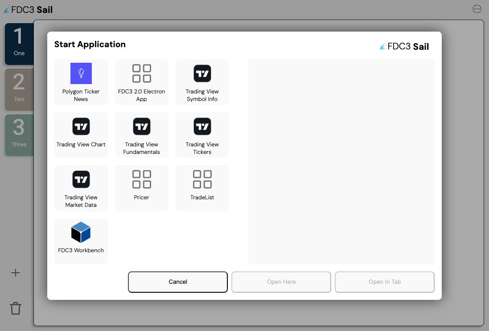
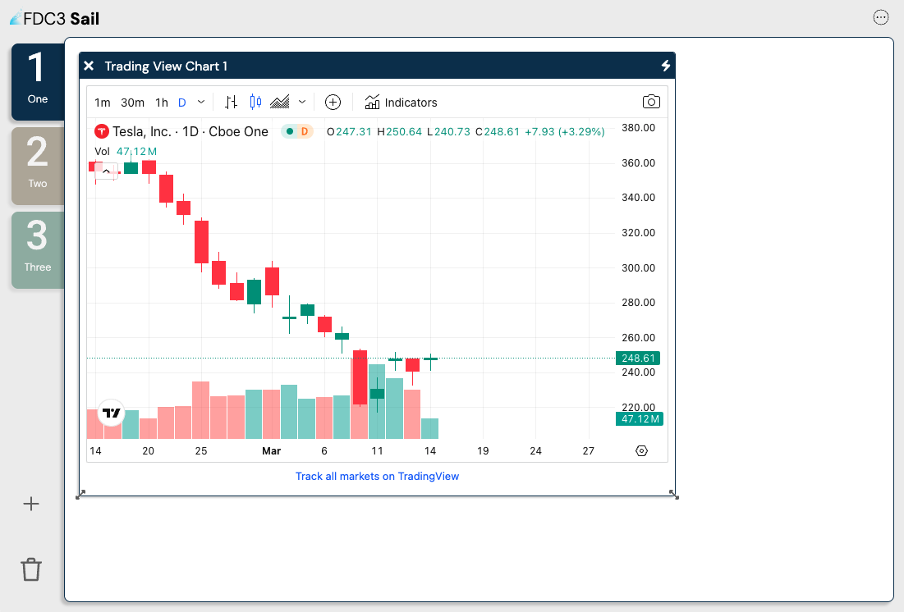

<p align="center">
    
</p>

<h1 align="center">FDC3 Sail</h1>

<h3 align="center">Develop easier. &nbsp; Build faster. &nbsp; Integrate quicker.</h3>

<br />

---

<div align="center">

[](https://finosfoundation.atlassian.net/wiki/display/FINOS/Incubating)
[](https://github.com/finos/fdc3-sail/blob/main/LICENSE)

[](https://github.com/finos/fdc3-sail)

<br />

[](https://github.com/finos/FDC3-Sail/actions/workflows/ci.yml)
[](https://bestpractices.coreinfrastructure.org/projects/12272)
[](https://scorecard.dev/viewer/?uri=github.com/finos/FDC3-Sail)
[](https://github.com/finos/FDC3-Sail/actions/workflows/semgrep.yml)
[](https://github.com/finos/FDC3-Sail/actions/workflows/ql.yml)
[](https://github.com/finos/FDC3-Sail/actions/workflows/cve-scanning.yml)

</div>

---

## What is FDC3 Sail?

If you are new to FDC3, start with [the FDC3 website](https://fdc3.finos.org).

FDC3 Sail is an open-source, **browser-based** [FDC3](https://fdc3.finos.org) Desktop Agent. It lets you run and manage FDC3 apps in iframes or browser tabs, with:

- intent resolution
- channel linking
- app directory search
- workspace tabs

The repo is an npm workspaces monorepo:

| Package                                                      | Role                                                        |
| ------------------------------------------------------------ | ----------------------------------------------------------- |
| [`@finos/sail-desktop-agent`](./packages/sail-desktop-agent) | Reusable browser Desktop Agent (WCP + DACP + App Directory) |
| [`@finos/sail-web`](./packages/sail-web)                     | Sail host UI that embeds the agent                          |

Sail implements [FDC3 for the Web](https://fdc3.finos.org) (browsing contexts + `MessagePort`).

## Status / Disclaimer

FDC3 Sail targets the FDC3 for-the-Web standard and is **still evolving — not production-ready**. Please raise issues as you find them. Contributions welcome — see below.

### Desktop (Electron) Support

Electron support has been removed for now. Electron needs significant security hardening before it can be production-ready, so current work focuses on FDC3 for the web. Desktop support via Electron may be revisited after Sail v3.

## Getting Started

### Prerequisites

1. [Node.js](https://nodejs.org/) (see CI for the current version) and npm
2. `git`
3. An editor (e.g. VS Code)

### Clone and run

```bash
git clone https://github.com/finos/FDC3-Sail.git
cd FDC3-Sail
npm install
npm run build
npm start
```

Open http://localhost:8090


Useful commands:

```bash
npm run sail-web:dev          # Vite dev server (port 8090)
npm test                      # all workspace tests
npm run test -w packages/sail-desktop-agent
npm run test -w packages/sail-web
```

### Opening Apps

Click the Apps control to pick applications from the configured directories:



Opened apps appear in the main workspace:



### The FDC3 Workbench

The [FDC3 Workbench](https://fdc3.finos.org/toolbox/fdc3-workbench/) is a simple app for exercising the FDC3 API. You can load it in Sail via an application directory.

Apps can be hosted on different domains. If you run Sail on `http://localhost` and talk to HTTPS apps, Chrome may block insecure origins. Workaround:

- Open `chrome://flags/#unsafely-treat-insecure-origin-as-secure`
- Add `http://localhost:8090`
- Relaunch Chrome

## About Application Directories

Apps available to Sail come from FDC3 Application Directory records. By default Sail uses the [FINOS FDC3 Directory](https://directory.fdc3.finos.org/v2/apps/). You can add your own directory URLs in Settings. Each entry describes where an app is hosted, its name, icons/screenshots, and which FDC3 messages it supports (in the `interop` section).

Host UI state (tabs, panels, directories, custom apps) is stored in the browser via **localStorage**.

## Other FDC3 Desktop Agents

FDC3 is an open standard. Other desktop agents are listed on the [FDC3 website](https://fdc3.finos.org).

## Meetings

FDC3 Sail holds regular project meetings to discuss development progress, roadmap, and community contributions.

**Join Meeting:**

- [Join FDC3 Sail Meeting](https://zoom-lfx.platform.linuxfoundation.org/meeting/95252800112?password=90638454-991c-4ab0-8aed-791fc372623c)

**Register for Meeting Series:**

- [Register for FDC3 Sail Meetings (add to calendar)](https://zoom-lfx.platform.linuxfoundation.org/meeting/95252800112?password=90638454-991c-4ab0-8aed-791fc372623c&invite=true)

Meeting agendas and minutes are tracked through GitHub issues with the `meeting` label.

## Mailing List

To join the FDC3 Sail mailing list please email [fdc3-sail+subscribe@lists.finos.org](mailto:fdc3-sail+subscribe@lists.finos.org).

## Contributing

1. Fork it (<https://github.com/finos/fdc3-sail/fork>)
2. Create your feature branch (`git checkout -b feature/fooBar`)
3. Read our [contribution guidelines](.github/CONTRIBUTING.md) and [Community Code of Conduct](https://www.finos.org/code-of-conduct)
4. Commit your changes (`git commit -am 'Add some fooBar'`)
5. Push to the branch (`git push origin feature/fooBar`)
6. Create a new Pull Request

_NOTE:_ Commits and pull requests to FINOS repositories will only be accepted from those contributors with an active, executed Individual Contributor License Agreement (ICLA) with FINOS OR who are covered under an existing and active Corporate Contribution License Agreement (CCLA) executed with FINOS. Commits from individuals not covered under an ICLA or CCLA will be flagged and blocked by the FINOS Clabot tool (or [EasyCLA](https://github.com/finos/community/blob/master/governance/Software-Projects/EasyCLA.md)). Please note that some CCLAs require individuals/employees to be explicitly named on the CCLA.

_Need an ICLA? Unsure if you are covered under an existing CCLA? Email [help@finos.org](mailto:help@finos.org)_

### Emeritus Contributors

- [Nick Kolba](@nkolba) contributed the first version of FDC3-Sail, initially called "FDC3 Electron", in 2022.
- [Seb M'Barek](@sebbenmbarek) and Nick Kolba renamed the project to FDC3-Sail and presented it at [OSFF New York in 2023](https://www.youtube.com/watch?v=dKDkOk3btWU)

### Design Decisions

1. Support multiple app directories.
2. Each user channel is a tab within the main browser tab.
3. Users can name and colour user channels, and move apps between them.
4. That is the primary way to control the user channel (unless the app opens outside the main browser tab).
5. React is used for the Sail host UI.
6. Host UI state is persisted in `localStorage` (no server-side session).

## License

Copyright 2022 FINOS

Distributed under the [Apache License, Version 2.0](http://www.apache.org/licenses/LICENSE-2.0).

SPDX-License-Identifier: [Apache-2.0](https://spdx.org/licenses/Apache-2.0)
