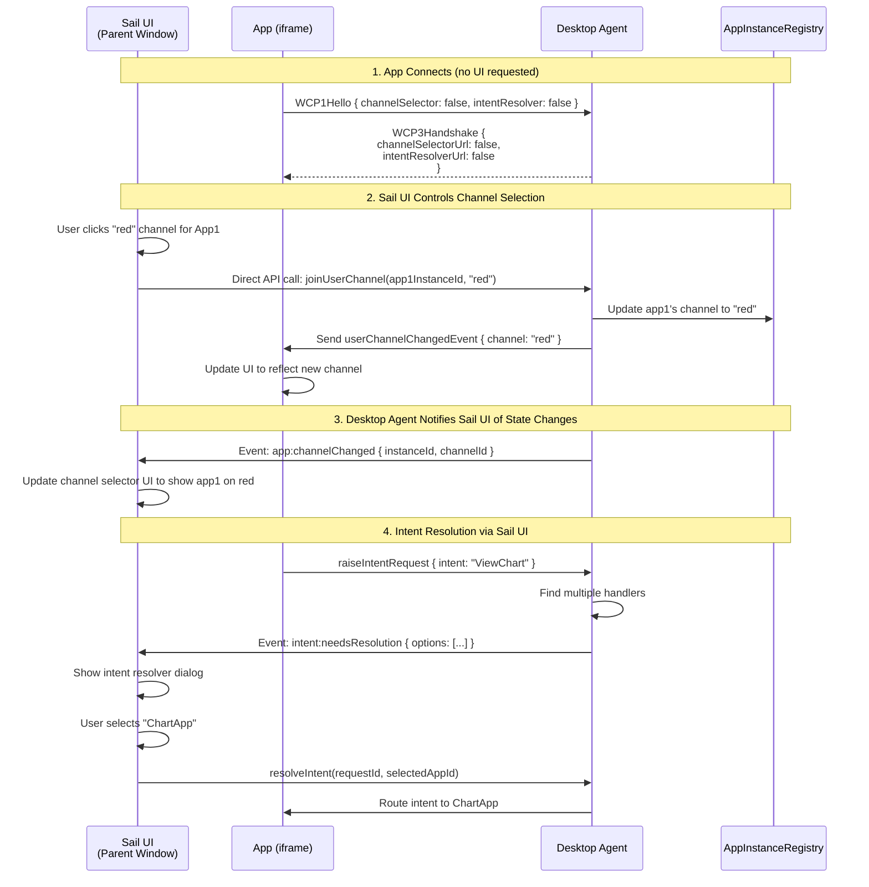
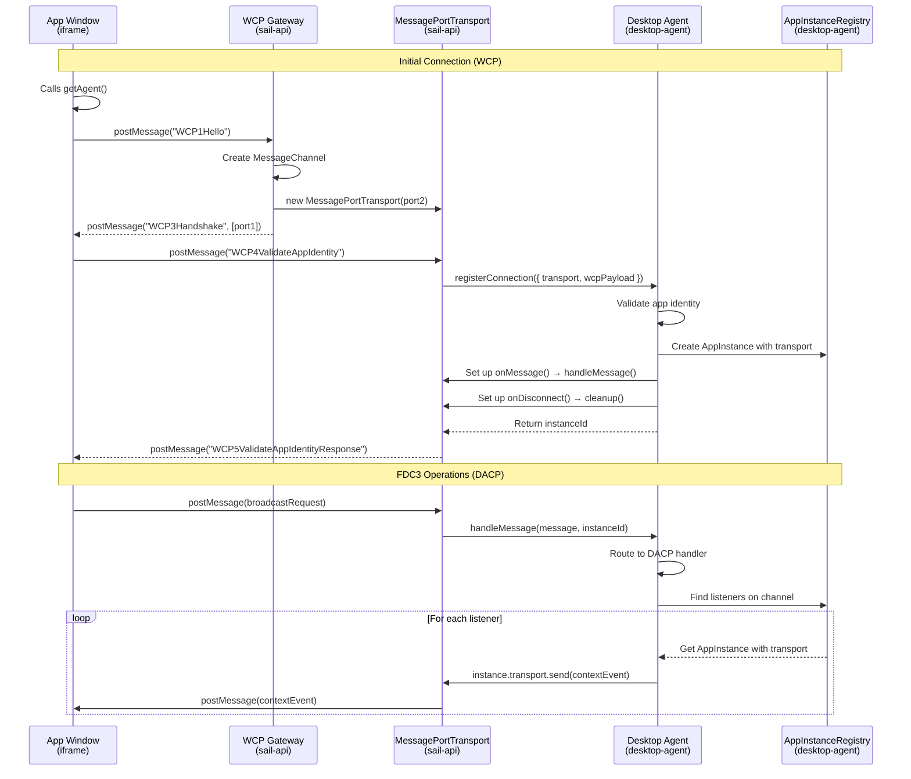

# FDC3 Sail Architecture Summary

**Last Updated**: 2025-11-12
**Status**: Architectural design finalized, implementation pending

## Overview

FDC3 Sail uses a **three-layer architecture** separating protocol handling, transport abstraction, and business logic.

## The Three Layers

```
┌───────────────────────────────────────────────────────────────┐
│  LAYER 1: WCP Gateway (Protocol Handler)                      │
│  Package: sail-api/gateway                                     │
│  Responsibility: WCP1-3 handshake, MessageChannel management  │
│  Environment: Browser-specific (window, postMessage)          │
└───────────────────────────────────────────────────────────────┘
                            ↓ creates
┌───────────────────────────────────────────────────────────────┐
│  LAYER 2: Transport (Connection Abstraction)                  │
│  Package: sail-api/transports                                  │
│  Responsibility: Send/receive messages for ONE app             │
│  Environment: MessagePort, Socket.IO, Worker (implementations)│
└───────────────────────────────────────────────────────────────┘
                            ↓ registers with
┌───────────────────────────────────────────────────────────────┐
│  LAYER 3: Desktop Agent Core (FDC3 Business Logic)            │
│  Package: desktop-agent                                        │
│  Responsibility: WCP4-5, DACP, state management, FDC3 logic   │
│  Environment: Pure (no browser/Node.js dependencies)          │
└───────────────────────────────────────────────────────────────┘
```

## UI Component Architecture

### Sail's UI Approach: External UI Control (Option 2)

**Decision**: Sail uses **Sail-Controlled UI** rather than injected iframe UIs.

The FDC3 spec provides three options for Desktop Agent UI:
1. **Injected iframes** - DA provides URLs, `getAgent()` injects them into each app
2. **Alternative rendering** - DA provides UI by other means (Sail uses this)
3. **Reference implementation** - Use FDC3's hosted UIs

**Sail implements Option 2**: The Sail UI parent window provides channel selector and intent resolver components that control all app instances.

```
┌──────────────────────────────────────────────────────────────┐
│  Sail UI (Parent Window/Container)                           │
│  ┌────────────────────────────────────────────────────────┐  │
│  │ Channel Selector (React Component)                     │  │
│  │ - Shows all apps and their channels                    │  │
│  │ - User clicks to change app's channel                  │  │
│  └────────────────────────────────────────────────────────┘  │
│  ┌────────────────────────────────────────────────────────┐  │
│  │ Intent Resolver (React Component)                      │  │
│  │ - Shows intent resolution options                      │  │
│  │ - User selects which app to handle intent             │  │
│  └────────────────────────────────────────────────────────┘  │
│  ┌────────────────────────────────────────────────────────┐  │
│  │ App Iframe 1 (Trading App)                             │  │
│  │ - Receives userChannelChangedEvent from DA             │  │
│  │ - No injected UI iframes                               │  │
│  └────────────────────────────────────────────────────────┘  │
│  ┌────────────────────────────────────────────────────────┐  │
│  │ App Iframe 2 (News App)                                │  │
│  └────────────────────────────────────────────────────────┘  │
└──────────────────────────────────────────────────────────────┘
```

### UI Flow with Sail-Controlled UI



### Implementation Requirements

**For WCP Gateway (sail-api package):**
```typescript
// Return false for UI URLs in WCP3Handshake
const handshakeResponse = {
  type: "WCP3Handshake",
  payload: {
    fdc3Version: "2.2",
    // Sail provides UI externally, not via injected iframes
    channelSelectorUrl: false,
    intentResolverUrl: false
  }
}
```

**For Desktop Agent (desktop-agent package):**
```typescript
// NO Fdc3UserInterface message handlers needed
// Just send standard DACP events

class DesktopAgent {
  private eventEmitter = new EventEmitter()

  async joinUserChannel(instanceId: string, channelId: string) {
    // Update registry
    this.appInstanceRegistry.setChannel(instanceId, channelId)

    // Send standard DACP event to app
    await this.sendToInstance(instanceId, {
      type: "userChannelChangedEvent",
      payload: {
        channel: { id: channelId, type: "user", displayMetadata: {...} }
      },
      meta: { timestamp: Date.now() }
    })

    // Emit event for Sail UI to listen to
    this.eventEmitter.emit("app:channelChanged", {
      instanceId,
      channelId,
      timestamp: Date.now()
    })
  }

  // Public API for external UI control
  on(event: string, callback: Function) {
    this.eventEmitter.on(event, callback)
  }
}
```

**For Sail UI (apps/sail):**
```typescript
// React component for channel selector
function ChannelSelector() {
  const [appChannels, setAppChannels] = useState<Map<string, string>>(new Map())

  useEffect(() => {
    // Listen to Desktop Agent events
    desktopAgent.on("app:channelChanged", (event) => {
      setAppChannels(prev => new Map(prev).set(event.instanceId, event.channelId))
    })

    desktopAgent.on("app:connected", (event) => {
      // New app connected, add to UI
      setAppChannels(prev => new Map(prev).set(event.instanceId, null))
    })
  }, [])

  function handleChannelClick(appInstanceId: string, channelId: string) {
    // Direct API call to Desktop Agent
    desktopAgent.joinUserChannel(appInstanceId, channelId)
  }

  return (
    <div className="channel-selector">
      {Array.from(appChannels).map(([instanceId, currentChannel]) => (
        <AppChannelControl
          key={instanceId}
          instanceId={instanceId}
          currentChannel={currentChannel}
          onChannelSelect={(channelId) => handleChannelClick(instanceId, channelId)}
        />
      ))}
    </div>
  )
}
```

### Benefits of Sail-Controlled UI

| Aspect | Sail-Controlled UI ✅ | Injected iframe UI |
|--------|---------------------|---------------------|
| **UI Location** | In Sail parent window | Injected into each app |
| **UI Duplication** | Single UI for all apps | One copy per app |
| **Styling Control** | Full Sail styling | Must match app context |
| **State Management** | Centralized in Sail UI | Per-app via `getAgent()` |
| **DACP Messages** | Standard events only | Requires Fdc3UserInterface* |
| **Implementation** | Use existing React components | Build separate HTML/JS files |
| **Communication** | Direct DA API + events | Via MessageChannel proxy |

### What Apps Receive

Apps receive **standard DACP events** - no special UI messages needed:

```typescript
// In FDC3 app (e.g., Trading App)
const fdc3 = await getAgent()

// App receives normal DACP events
fdc3.addEventListener("userChannelChanged", (event) => {
  console.log("Channel changed to:", event.channel.id)
  // Update app UI to reflect new channel (e.g., color border)
})

// App doesn't see or control the channel selector
// That's managed by Sail UI parent window
```

### Key Points

1. **No Fdc3UserInterface messages needed** - Desktop Agent only sends standard DACP events
2. **WCP3Handshake returns false** - Signals Sail provides UI externally
3. **Sail UI has privileged access** - Can call Desktop Agent APIs directly
4. **Single source of truth** - Desktop Agent state, Sail UI reflects it
5. **Apps are passive** - They receive events but don't control UI

## Complete Message Flow



## Package Structure

### packages/desktop-agent (Pure FDC3 Core)

```
packages/desktop-agent/
├── src/
│   ├── desktop-agent.ts                     ← Main class
│   │   └─ constructor(registries)           ← NO transport param
│   │   └─ registerConnection()              ← NEW method
│   │   └─ handleMessage()                   ← Private
│   │   └─ sendToInstance()                  ← Private
│   │
│   ├── interfaces/
│   │   └── transport.ts                     ← Interface ONLY
│   │       └─ send(message)                 ← Simplified (no instanceId)
│   │       └─ onMessage(handler)
│   │       └─ onDisconnect(handler)
│   │       └─ getInstanceId() / setInstanceId()
│   │
│   ├── state/
│   │   ├── app-instance-registry.ts         ← Stores Transport per instance
│   │   ├── intent-registry.ts
│   │   ├── channel-context-registry.ts
│   │   └── ...
│   │
│   └── handlers/dacp/
│       ├── wcp-handlers.ts                  ← WCP4-5 ONLY
│       ├── context-handlers.ts
│       ├── intent-handlers.ts
│       └── ...
│
└── index.ts                                 ← Exports
    └─ DesktopAgent
    └─ AppInstanceRegistry, IntentRegistry, ...
    └─ type Transport (interface only)
```

**Key Points**:
- ✅ No browser dependencies (window, MessageChannel, etc.)
- ✅ No Node.js dependencies (Socket.IO, http, etc.)
- ✅ No Transport implementations (only interface)
- ✅ Pure FDC3 business logic

### packages/sail-api (Composition Layer)

```
packages/sail-api/
├── src/
│   ├── gateway/
│   │   ├── wcp-gateway.ts                   ← WCP1-3 handler
│   │   │   └─ window.addEventListener()     ← Browser-specific
│   │   │   └─ handleWCP1Hello()
│   │   │   └─ sendWCP3Handshake()
│   │   └── message-channel-manager.ts
│   │
│   ├── transports/                          ← Transport implementations
│   │   ├── message-port-transport.ts        ← Browser MessagePort
│   │   │   └─ implements Transport
│   │   │   └─ wraps MessagePort
│   │   ├── socket-io-transport.ts           ← Node.js Socket.IO
│   │   │   └─ implements Transport
│   │   │   └─ wraps Socket
│   │   └── worker-transport.ts              ← SharedWorker (future)
│   │
│   ├── modes/
│   │   ├── browser-mode.ts                  ← Browser DA setup
│   │   ├── server-mode.ts                   ← Server DA setup
│   │   └── worker-mode.ts                   ← Worker DA setup (future)
│   │
│   └── factory.ts                           ← createDesktopAgent()
│
└── index.ts                                 ← Exports
    └─ WCPGateway
    └─ MessagePortTransport, SocketIOTransport
    └─ createDesktopAgent
    └─ Re-export: DesktopAgent, Transport (from desktop-agent)
```

**Key Points**:
- ✅ Contains all environment-specific code
- ✅ Wraps desktop-agent for different deployment modes
- ✅ Implements Transport interface for various environments
- ✅ Handles WCP1-3 protocol setup

## State Management

### Two Types of State

**1. Temporary State (WCP Gateway)**
```typescript
// Lives in WCP Gateway during handshake
Map<connectionAttemptUuid, {
  channel: MessageChannel,
  source: Window,
  timestamp: Date
}>
```

**Purpose**: Track in-progress WCP handshakes
**Lifetime**: Created on WCP1Hello, deleted after WCP5 response

**2. Permanent State (Desktop Agent)**
```typescript
// Lives in AppInstanceRegistry
Map<instanceId, AppInstance>

interface AppInstance {
  instanceId: string
  appId: string
  metadata: AppMetadata
  transport: Transport              // ← The MessagePortTransport
  currentChannel: string | null
  contextListeners: Set<string>
  intentListeners: Set<string>
  // ...
}
```

**Purpose**: Track connected app instances and their transports
**Lifetime**: Created on WCP4 validation, deleted on disconnect

## Key Design Decisions

### 1. One Desktop Agent Instance

```typescript
// ❌ WRONG: One agent per connection
io.on("connection", socket => {
  const agent = new DesktopAgent({ transport: socket })
})

// ✅ CORRECT: One shared agent
const agent = new DesktopAgent({ registries })

io.on("connection", socket => {
  const transport = new SocketIOTransport(socket)
  agent.registerConnection({ transport, wcpPayload })
})
```

### 2. Transport Stored Per Instance

```typescript
// AppInstance includes transport reference
const instance = {
  instanceId: "app-123",
  transport: messagePortTransport,  // ← Used to send messages
  // ...
}

// When broadcasting to listeners:
for (const listener of listeners) {
  const instance = registry.getInstance(listener.instanceId)
  await instance.transport.send(contextEvent)  // ← Each app has own transport
}
```

### 3. WCP Split Across Layers

| Message | Handler Location | Reason |
|---------|-----------------|---------|
| WCP1Hello | WCP Gateway (sail-api) | Browser-specific (postMessage) |
| WCP2LoadUrl | WCP Gateway (sail-api) | Browser-specific (optional) |
| WCP3Handshake | WCP Gateway (sail-api) | Browser-specific (MessageChannel) |
| WCP4ValidateAppIdentity | Desktop Agent (desktop-agent) | Pure validation logic |
| WCP5Response | Desktop Agent (desktop-agent) | Pure validation logic |

### 4. Transport Interface Simplified

```typescript
// Before (confusing - instanceId unused)
interface Transport {
  send(instanceId: string, message: unknown): void
}

// After (clear - each transport is 1:1 with app)
interface Transport {
  send(message: unknown): void
}
```

## Deployment Modes

### Browser Mode (Local Desktop Agent)

```
App iframes → WCP Gateway → MessagePortTransport → Desktop Agent (same window)
```

**Use cases**: Single-user, offline, standalone web app
**State**: All in browser memory
**No proxy needed**: MessagePorts connect directly to Desktop Agent

### Server Mode (Remote Desktop Agent)

```
App iframes → WCP Gateway → Browser Proxy → Socket.IO → Desktop Agent (server)
             (Sail UI)      (Sail UI)
```

**Use cases**: Multi-user, shared state, cloud deployment
**State**: All on server (survives page refresh via server state)

**Critical: Browser Proxy Layer Required**

When Desktop Agent is on the server, we need a **Browser Proxy** in the Sail UI to bridge MessagePorts ↔ Socket.IO:

```typescript
// In Sail UI (browser) - packages/sail-api/src/gateway/browser-proxy.ts
class BrowserProxy {
  // Map instanceId → MessagePort (for routing responses to correct app)
  private portMap = new Map<string, MessagePort>()

  // Single Socket.IO connection to server
  private socket: Socket

  constructor(socket: Socket) {
    this.socket = socket

    // FROM server TO apps
    socket.on("fdc3_message", (data: { targetInstanceId: string, message: unknown }) => {
      const port = this.portMap.get(data.targetInstanceId)
      if (port) {
        port.postMessage(data.message)  // Route to correct app's MessagePort
      }
    })
  }

  // Called by WCP Gateway when new app connects
  registerAppConnection(instanceId: string, port: MessagePort) {
    this.portMap.set(instanceId, port)

    // FROM app TO server
    port.onmessage = (event) => {
      this.socket.emit("fdc3_message", {
        sourceInstanceId: instanceId,  // ← Embed instanceId in message
        message: event.data
      })
    }
  }
}

// WCP Gateway uses Browser Proxy
const socket = io("http://localhost:8080")
const browserProxy = new BrowserProxy(socket)

const wcpGateway = new WCPGateway({
  onConnectionEstablished: (instanceId, port) => {
    browserProxy.registerAppConnection(instanceId, port)
  }
})
```

**Server receives messages with instanceId embedded:**

```typescript
// On server - apps/sail-server/src/main.ts
io.on("connection", (socket) => {
  socket.on("fdc3_message", async (data: {
    sourceInstanceId: string,
    message: unknown
  }) => {
    // Desktop Agent routes by sourceInstanceId
    await desktopAgent.handleMessage(data.message, data.sourceInstanceId)
  })
})
```

**Server sends responses with targetInstanceId:**

```typescript
// In SocketIOTransport (on server)
class SocketIOTransport implements Transport {
  constructor(private socket: Socket, private instanceId: string) {}

  send(message: unknown): void {
    // Send to browser proxy with routing info
    this.socket.emit("fdc3_message", {
      targetInstanceId: this.instanceId,  // ← Browser proxy uses this to route
      message
    })
  }
}
```

**Why Browser Proxy is needed:**
1. **Routing**: Server needs to know which browser client to send to (Socket.IO routing)
2. **Multiplexing**: Multiple app iframes share one Socket.IO connection
3. **MessagePort isolation**: Each app has its own MessagePort, proxy bridges to shared socket

### Worker Mode (Shared Desktop Agent - Future)

```
App iframes → WCP Gateway → Browser Proxy → Worker Port → Desktop Agent (SharedWorker)
             (Browser)      (Browser)
```

**Use cases**: Multiple browser tabs sharing one DA
**State**: In SharedWorker (shared across tabs)

**Similar proxy pattern:**
- Each browser tab has a WCP Gateway + Browser Proxy
- Proxy bridges MessagePorts → SharedWorker port
- SharedWorker has ONE Desktop Agent serving multiple tabs

```typescript
// Browser Proxy for Worker mode
class WorkerProxy {
  private portMap = new Map<string, MessagePort>()
  private worker: SharedWorker

  constructor() {
    this.worker = new SharedWorker("/desktop-agent-worker.js")

    // FROM worker TO apps
    this.worker.port.onmessage = (event) => {
      const { targetInstanceId, message } = event.data
      const port = this.portMap.get(targetInstanceId)
      if (port) {
        port.postMessage(message)
      }
    }

    this.worker.port.start()
  }

  registerAppConnection(instanceId: string, port: MessagePort) {
    this.portMap.set(instanceId, port)

    // FROM app TO worker
    port.onmessage = (event) => {
      this.worker.port.postMessage({
        sourceInstanceId: instanceId,
        message: event.data
      })
    }
  }
}
```

### Comparison of Deployment Modes

| Mode | DA Location | Proxy Needed? | State Persistence | Use Case |
|------|-------------|---------------|-------------------|----------|
| **Browser** | Same window | ❌ No | Page lifetime | Single user, offline |
| **Server** | Node.js | ✅ Yes | Server DB | Multi-user, cloud |
| **Worker** | SharedWorker | ✅ Yes | Worker lifetime | Multi-tab, single user |

## Benefits of This Architecture

### 1. **Pure Desktop Agent Core**
- ✅ Testable without browser/server mocking
- ✅ Reusable across any environment
- ✅ Zero external dependencies (except FDC3 types)

### 2. **Clean Separation of Concerns**
- ✅ Protocol handling (Gateway) separate from business logic (DA)
- ✅ Transport abstraction enables multiple implementations
- ✅ Environment-specific code isolated to sail-api

### 3. **FDC3 Compliance**
- ✅ WCP fully implemented (browser-resident DA compatible)
- ✅ DACP message routing
- ✅ Standard @finos/fdc3 library works unchanged

### 4. **Flexibility**
- ✅ Same DA core works in browser, server, worker
- ✅ Easy to add new transport types (WebRTC, WebSocket, etc.)
- ✅ Can run multiple deployment modes simultaneously

## Implementation Roadmap

### Phase 1: Refactor Desktop Agent Core
- [ ] Remove transport from DesktopAgent constructor
- [ ] Add registerConnection() method
- [ ] Update handlers to use instance.transport
- [ ] Simplify Transport interface (remove instanceId from send)
- [ ] Update tests

### Phase 2: Implement WCP Gateway
- [ ] Create WCPGateway class in sail-api/gateway
- [ ] Implement WCP1-3 handlers
- [ ] Create MessagePortTransport in sail-api/transports
- [ ] Update browser connection flow

### Phase 3: Refactor sail-server
- [ ] Create single shared DesktopAgent instance
- [ ] Update socket connection handling
- [ ] Migrate to new registerConnection() API
- [ ] Remove per-socket DesktopAgent creation

### Phase 4: Testing & Documentation
- [ ] Update all tests for new architecture
- [ ] Document deployment modes
- [ ] Create migration guide
- [ ] Update SYSTEM_ARCHITECTURE.md

## Related Documents

- [Transport Architecture Planning](./TRANSPORT_ARCHITECTURE_PLANNING.md) - Detailed design discussions
- [System Architecture](./SYSTEM_ARCHITECTURE.md) - Overall system design
- [Desktop Agent Architecture](../packages/desktop-agent/ARCHITECTURE.md) - Package-specific details
- [FDC3 WCP Spec](https://fdc3.finos.org/docs/next/api/specs/webConnectionProtocol) - Official WCP documentation
- [FDC3 DACP Spec](https://fdc3.finos.org/docs/next/api/specs/desktopAgentCommunicationProtocol) - Official DACP documentation
