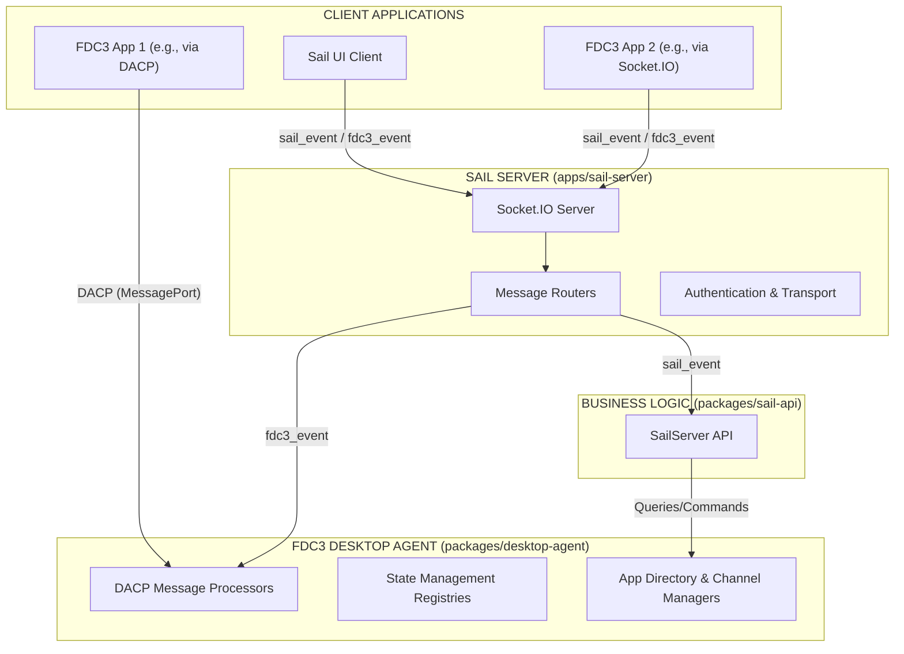
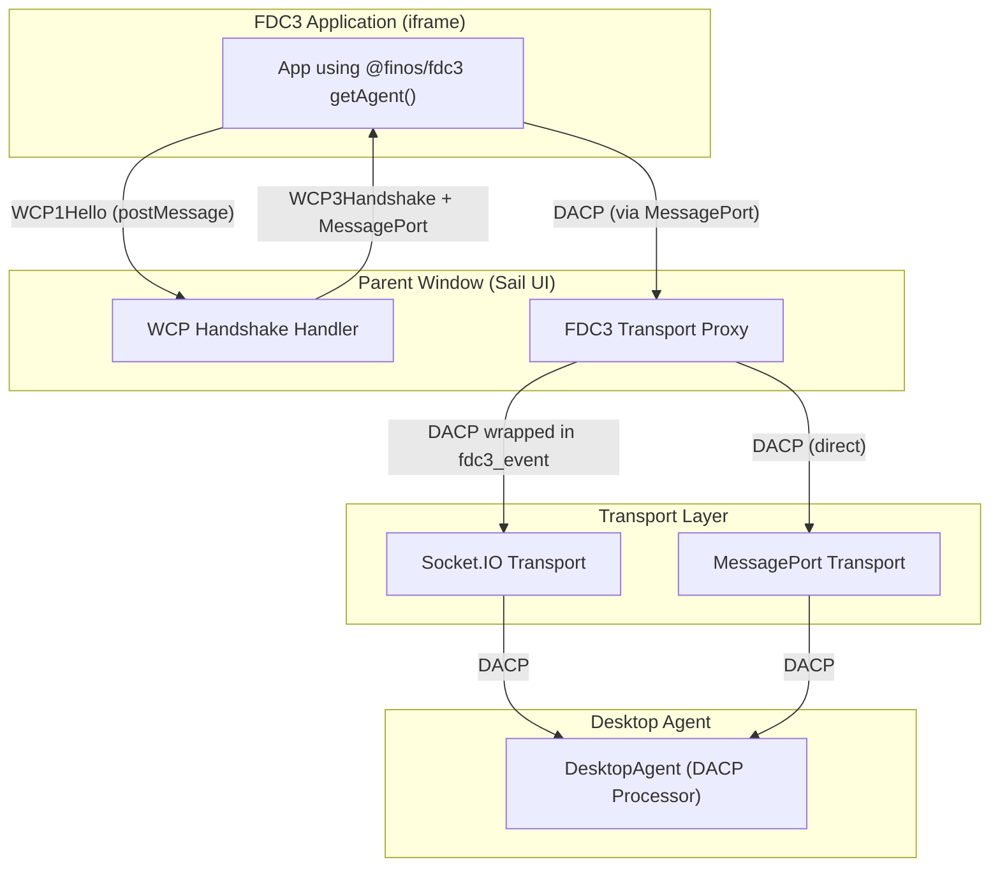
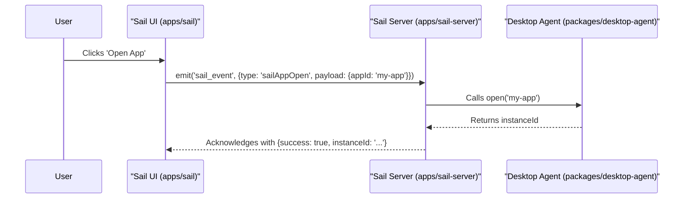
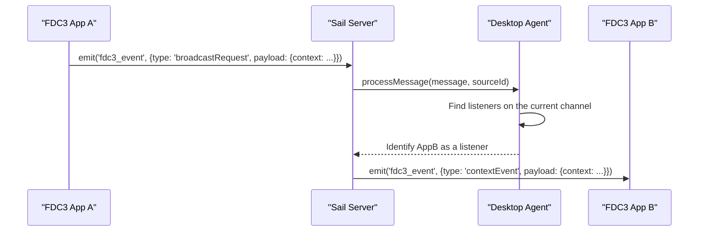
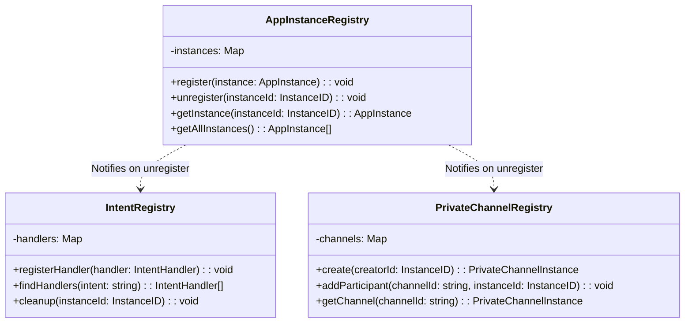

# FDC3-Sail System Architecture

## 1. Overview

This document provides a comprehensive architectural overview of the FDC3-Sail platform. Its purpose is to serve as a central source of truth for developers, explaining how the various components, packages, and applications interact to provide a cohesive FDC3-enabled desktop experience.

## 2. Core Principles

The system is designed around several core principles:

-   **FDC3 Compliance**: Strictly adhere to the FDC3 2.2 standards, particularly the Desktop Agent Communication Protocol (DACP) and Web Connection Protocol (WCP).
-   **Separation of Concerns**: A clear division between the FDC3-standard "Desktop Agent" engine and the proprietary "Sail" platform services (UI, layouts, workspaces).
-   **Transport Agnosticism**: The core desktop agent is decoupled from the underlying transport layer, allowing it to communicate over Socket.IO, MessagePorts, or other mechanisms.
-   **Environment Independence**: The desktop-agent package has no browser or Node.js dependencies - it's pure TypeScript that can run anywhere.
-   **Single Desktop Agent Instance**: ONE shared Desktop Agent instance manages ALL app connections, with transports stored per app instance.
-   **Extensibility**: The architecture is designed to be modular, allowing for the addition of new apps, services, and features with minimal friction.

## 3. Architecture Diagram

The following diagram illustrates the high-level system architecture, from client applications down to the FDC3 Desktop Agent layer.



## 4. Three-Layer Architecture

The FDC3-Sail system follows a three-layer architecture that cleanly separates connection handling, transport abstraction, and FDC3 business logic:

### Layer 1: WCP Gateway (Connection Layer)

**Location**: `packages/desktop-agent/src/browser/wcp-connector.ts`

**Responsibilities**:
- Listens for WCP1Hello messages from FDC3 apps
- Creates MessageChannel per connection
- Sends WCP3Handshake with MessagePort port1
- Wraps port2 as MessagePortTransport
- Bridges app MessagePorts to Desktop Agent via InMemoryTransport

**Key Point**: WCP1-3 are browser-specific (use `window.postMessage`, `MessageChannel`). The WCPConnector is in the desktop-agent's `/browser` submodule, making it tree-shakeable for server-side bundles.

**Browser-Specific Implementation**:
```typescript
// WCPConnector (desktop-agent/src/browser/wcp-connector.ts)
import { createBrowserDesktopAgent } from '@finos/fdc3-sail-desktop-agent/browser'

// Creates Desktop Agent + WCP Connector with InMemoryTransport bridge
const { desktopAgent, wcpConnector, start } = createBrowserDesktopAgent({
  wcpOptions: {
    getIntentResolverUrl: () => false,  // Sail-controlled UI
    getChannelSelectorUrl: () => false
  }
})

start()

// WCPConnector internally handles:
// 1. Listen for WCP1Hello via window.addEventListener("message")
// 2. Create MessageChannel per app
// 3. Send WCP3Handshake with port1 to app
// 4. Wrap port2 as MessagePortTransport
// 5. Bridge to Desktop Agent via InMemoryTransport
```

**Architecture**:
```
FDC3 App (iframe)
    ↓ WCP1Hello (window.postMessage)
WCPConnector (desktop-agent/browser)
    ↓ Creates MessageChannel
    ↓ Sends WCP3Handshake (transfers port1)
    ↓ Wraps port2 as MessagePortTransport
    ↓ Bridges via InMemoryTransport
Desktop Agent Core (desktop-agent/core)
    ↓ Validates identity (WCP4-5)
    ↓ Routes DACP messages
```

### Layer 2: Transport Abstraction (Communication Layer)

**Locations**:
- `packages/desktop-agent/src/core/interfaces/transport.ts` (interface definition)
- `packages/desktop-agent/src/browser/message-port-transport.ts` (MessagePort implementation)
- `packages/desktop-agent/src/transports/in-memory-transport.ts` (InMemory implementation)
- `packages/sail-api/src/transports/` (Socket.IO and other implementations)

**Responsibilities**:
- Abstract send/receive operations
- Handle connection lifecycle (connect, disconnect)
- Support multiple transport types (MessagePort, InMemory, Socket.IO)

**Transport Interface** (defined in desktop-agent/core):
```typescript
interface Transport {
  send(message: unknown): void
  onMessage(handler: MessageHandler): void
  onDisconnect(handler: DisconnectHandler): void
  isConnected(): boolean
  disconnect(): void
}
```

**Key Implementations**:
- **MessagePortTransport** (`desktop-agent/browser`): Browser iframe-to-parent communication via MessageChannel
- **InMemoryTransport** (`desktop-agent/transports`): Same-process communication (Desktop Agent ↔ WCP Connector)
- **SocketIOTransport** (`sail-api`): Remote Desktop Agent over WebSocket
- **WorkerTransport** (future): Shared worker communication

### Layer 3: Desktop Agent Core (Business Logic Layer)

**Location**: `packages/desktop-agent/src/core/`

**Responsibilities**:
- Process DACP messages (FDC3 protocol)
- Manage state registries (apps, intents, channels)
- Validate app identity (WCP4-5 handlers)
- Route messages via transport interface
- Emit events for UI synchronization

**Key Characteristics**:
- **Environment-agnostic**: No browser or Node.js dependencies
- **Single instance**: ONE Desktop Agent manages ALL connections
- **Transport-agnostic**: Only knows the Transport interface
- **Pure TypeScript**: Can run in any JavaScript environment
- **Tree-shakeable**: Separate from browser-specific code

**Desktop Agent API**:
```typescript
class DesktopAgent {
  constructor(config: {
    transport: Transport,
    appInstanceRegistry?: AppInstanceRegistry,
    intentRegistry?: IntentRegistry,
    channelContextRegistry?: ChannelContextRegistry,
    appLauncher?: AppLauncher
    // ... registries are optional, will use defaults
  })

  start(): void
  stop(): void

  // Public API for UI event subscriptions
  on(event: string, callback: Function): void
}
```

**Usage**:
```typescript
// Browser: with WCP connector
import { createBrowserDesktopAgent } from '@finos/fdc3-sail-desktop-agent/browser'
const { desktopAgent, wcpConnector, start } = createBrowserDesktopAgent()
start()

// Server: with Socket.IO transport
import { DesktopAgent } from '@finos/fdc3-sail-desktop-agent'
const da = new DesktopAgent({ transport: socketIOTransport })
da.start()
```

### Layer Interaction Flow

```
FDC3 App (iframe)
    ↓ WCP1Hello (postMessage)
WCP Gateway (sail-api)
    ↓ Creates MessageChannel
    ↓ WCP3Handshake (transfers port1)
    ↓ Wraps port2 as MessagePortTransport
Desktop Agent (desktop-agent)
    ↓ Validates identity (WCP4-5)
    ↓ Stores transport in AppInstanceRegistry
    ↓ Routes DACP messages via transport
```

### Package Responsibilities

**`packages/desktop-agent`** (Pure FDC3 Engine + Browser Support):

The desktop-agent package is organized into three main modules:

- **`src/core/`** (Pure FDC3 Engine - Environment Agnostic):
  - DesktopAgent class
  - DACP message handlers
  - State registries (apps, intents, channels)
  - WCP4-5 validation handlers (pure logic)
  - Transport interface definition (types only)
  - **Zero browser or Node.js dependencies**

- **`src/browser/`** (Browser-Specific Module - Tree-Shakeable):
  - WCPConnector (WCP1-3 handshake handler)
  - MessagePortTransport implementation
  - createBrowserDesktopAgent() factory
  - Browser types and interfaces
  - **Only included when explicitly imported via `/browser` submodule**

- **`src/transports/`** (Transport Implementations):
  - InMemoryTransport (same-process communication)
  - createInMemoryTransportPair() helper
  - **Tree-shakeable, imported via `/transports` submodule**

**Package Exports**:
```typescript
// Core only (tree-shakes out browser code)
import { DesktopAgent } from '@finos/fdc3-sail-desktop-agent'

// Browser module (includes WCP connector)
import { createBrowserDesktopAgent } from '@finos/fdc3-sail-desktop-agent/browser'

// Transports module
import { createInMemoryTransportPair } from '@finos/fdc3-sail-desktop-agent/transports'
```

**`packages/sail-api`** (Sail Platform Services):
- Sail Server API wrapper
- Socket.IO transport (for remote Desktop Agent)
- Browser Proxy for server/worker modes (if needed)
- **Exports**: Sail-specific services and utilities

**`apps/sail-server`** (Server Runtime):
- Socket.IO server setup
- ONE shared Desktop Agent instance
- Registers SocketIOTransport per connection
- Routes fdc3_event and sail_event messages

**`apps/sail`** (Browser UI):
- React application shell
- WCP Gateway integration
- Sail-controlled UI components (channel selector, intent resolver)
- Desktop Agent event subscriptions
- Iframe management for FDC3 apps

**`apps/sail-electron`** (Electron Wrapper):
- Packages sail UI as desktop application
- May use MessagePort transport for local Desktop Agent
- Optional: Embed Desktop Agent in main process

**`packages/sail-ui`** (Shared Components):
- React component library
- Consistent styling across Sail applications

**`packages/app-directories`** (App Metadata):
- JSON-based FDC3 app directories
- Loaded by AppDirectoryManager in Desktop Agent

## 5. Communication Protocols

Communication is handled via a unified convention that supports multiple transports.

### 5.1. The Two-Channel Convention (Socket.IO)

For clients connecting via Socket.IO, the system uses exactly two event channels to route all messages, as defined in `@packages/desktop-agent/PROTOCOL.md`.

-   **`fdc3_event`**: Used for all FDC3-standard DACP (Desktop Agent Communication Protocol) messages.
-   **`sail_event`**: Used for all proprietary Sail platform messages (e.g., layout changes, workspace management).

This separation ensures that FDC3-standard logic is cleanly isolated from proprietary features.

### 5.2. FDC3 Transport Abstraction

The architecture supports **transport-agnostic FDC3 communication** through a proxy layer that translates between different transports while maintaining DACP compliance.



#### Transport Modes

**1. Socket.IO Transport (Remote Desktop Agent)**
- FDC3 apps use standard `@finos/fdc3` library and WCP handshake
- Parent window captures DACP messages from MessagePort
- Proxy forwards DACP messages over Socket.IO using `fdc3_event` channel
- Desktop Agent runs on remote server, processes DACP messages
- Use case: Multi-user server environments, cloud deployments

**2. MessagePort Transport (Local Desktop Agent)**
- FDC3 apps use standard `@finos/fdc3` library and WCP handshake
- Parent window routes DACP messages directly to local Desktop Agent
- Desktop Agent runs in parent window/same process
- Use case: Single-user desktop apps, offline environments, iframe-to-iframe communication

#### Key Implementation Details

The **FDC3 Transport Proxy** (implemented in `useFDC3Connection` hook) performs:

1. **WCP Handshake**: Responds to `WCP1Hello` from FDC3 apps with `WCP3Handshake`
2. **MessagePort Bridging**: Links app's MessagePort to selected transport
3. **DACP Forwarding**: Routes DACP messages between app and Desktop Agent
4. **Bi-directional Communication**: Handles both request/response and event messaging

This separation ensures:
- Desktop Agent remains **transport-agnostic** (only processes DACP)
- FDC3 apps remain **unmodified** (use standard `@finos/fdc3` library)
- Transport choice is **runtime configurable** (Socket.IO vs MessagePort vs future options)

## 6. UI Component Architecture

FDC3 Sail uses **Option 2: Sail-Controlled UI** from the FDC3 specification for UI component provisioning.

### Key Characteristics

**No Injected UI Components**:
- Sail does NOT use injected iframes for channel selector or intent resolver
- WCP3Handshake returns `channelSelectorUrl: false` and `intentResolverUrl: false`
- Apps do NOT receive Fdc3UserInterface messages

**Sail-Controlled React Components**:
- Channel selector and intent resolver are external React components in the Sail parent window
- These components have direct access to the Desktop Agent API
- Desktop Agent emits events for UI synchronization

**EventEmitter Pattern**:
```typescript
class DesktopAgent {
  private eventEmitter = new EventEmitter()

  async joinUserChannel(instanceId: string, channelId: string) {
    // Update registry
    this.appInstanceRegistry.setChannel(instanceId, channelId)

    // Send DACP event to app
    await this.sendToInstance(instanceId, {
      type: "userChannelChangedEvent",
      payload: { channel: { id: channelId, type: "user", displayMetadata: {...} } },
      meta: { timestamp: Date.now() }
    })

    // Emit event for Sail UI synchronization
    this.eventEmitter.emit("app:channelChanged", {
      instanceId, channelId, timestamp: Date.now()
    })
  }

  on(event: string, callback: Function) {
    this.eventEmitter.on(event, callback)
  }
}
```

**Sail UI React Component Example**:
```typescript
function ChannelSelector() {
  const [appChannels, setAppChannels] = useState<Map<string, string>>(new Map())

  useEffect(() => {
    // Subscribe to Desktop Agent events
    desktopAgent.on("app:channelChanged", (event) => {
      setAppChannels(prev => new Map(prev).set(event.instanceId, event.channelId))
    })

    desktopAgent.on("app:registered", (event) => {
      setAppChannels(prev => new Map(prev).set(event.instanceId, null))
    })

    desktopAgent.on("app:unregistered", (event) => {
      setAppChannels(prev => {
        const next = new Map(prev)
        next.delete(event.instanceId)
        return next
      })
    })
  }, [])

  function handleChannelClick(appInstanceId: string, channelId: string) {
    // Direct Desktop Agent API call
    desktopAgent.joinUserChannel(appInstanceId, channelId)
  }

  return (
    <div className="channel-selector">
      {Array.from(appChannels).map(([instanceId, currentChannel]) => (
        <AppChannelControl
          key={instanceId}
          instanceId={instanceId}
          currentChannel={currentChannel}
          onChannelSelect={(channelId) => handleChannelClick(instanceId, channelId)}
        />
      ))}
    </div>
  )
}
```

### Desktop Agent Event Types

**App Lifecycle Events**:
- `app:registered` - App completed WCP validation and is registered
- `app:unregistered` - App disconnected or was explicitly closed
- `app:channelChanged` - App joined/left a user channel

**Intent Events**:
- `intent:raised` - raiseIntent was called (for intent resolver UI)
- `intent:resolved` - User selected app to handle intent
- `intent:cancelled` - User cancelled intent resolution

**Context Events**:
- `context:broadcast` - Context was broadcast on a channel (for debugging/monitoring)
- `listener:added` - App added a context listener
- `listener:removed` - App removed a context listener

### Benefits of Sail-Controlled UI

1. **Full React Integration**: UI components are first-class React components, not iframes
2. **Shared State Management**: Can use Zustand or other state managers
3. **Performance**: No iframe overhead, direct DOM rendering
4. **Consistent Styling**: Uses Sail UI component library and Tailwind
5. **Simplified Testing**: Test React components directly, no iframe mocking

### WCP3Handshake Response

```typescript
const handshakeResponse = {
  type: "WCP3Handshake",
  meta: {
    connectionAttemptUuid: messageData.meta.connectionAttemptUuid,
    timestamp: new Date(),
  },
  payload: {
    fdc3Version: "2.2",
    channelSelectorUrl: false,  // ← Sail-controlled UI
    intentResolverUrl: false,   // ← Sail-controlled UI
  },
} as BrowserTypes.WebConnectionProtocol3Handshake
```

## 7. Message & Data Flow

### Sequence Diagram: Sail UI Opening an App

This diagram shows the flow for a proprietary Sail action.



### Sequence Diagram: FDC3 Context Broadcast

This diagram shows the flow for a standard FDC3 action initiated by a client connected via Socket.IO.



### Class Diagram: Core State Management

This diagram shows the planned state management registries within the Desktop Agent.



## 7. Implementation Status

This architecture is partially implemented. Based on the analysis of `@packages/desktop-agent/IMPLEMENTATION_PLAN.md`, the current status is as follows:

-   **Complete**:
    -   Initial state management for `AppInstanceRegistry` and `IntentRegistry`.
    -   Basic project structure for all apps and packages.

-   **In Progress / To-Do**:
    -   Full implementation of all DACP message handlers (e.g., App Management, Private Channels).
    -   Creation of the `PrivateChannelRegistry`.
    -   Formal separation of Sail-specific services from the core server logic.
    -   Comprehensive FDC3 compliance and performance testing suites.

## 8. Related Documents

For more granular details on specific aspects of the architecture and implementation, please refer to the following documents:

### Architecture Documentation

-   [**Transport Architecture Planning (`docs/TRANSPORT_ARCHITECTURE_PLANNING.md`)**](./TRANSPORT_ARCHITECTURE_PLANNING.md): Detailed discussion of the three-layer architecture, transport interface design, WCP Gateway placement, and all architectural decisions made during the v4 refactoring.
-   [**Architecture Summary (`docs/ARCHITECTURE_SUMMARY.md`)**](./ARCHITECTURE_SUMMARY.md): Comprehensive architecture documentation including message flows, sequence diagrams, Browser Proxy pattern, and deployment modes.
-   [**Initial Architecture Analysis (`ARCHITECTURE_ANALYSIS.md`)**](../ARCHITECTURE_ANALYSIS.md): The original analysis document that identified architectural gaps and proposed the foundational changes.

### Implementation Documentation

-   [**Implementation Plan (`@packages/desktop-agent/IMPLEMENTATION_PLAN.md`)**](../packages/desktop-agent/IMPLEMENTATION_PLAN.md): A detailed, phased plan for implementing the FDC3 Desktop Agent, including specific code structures and handler logic.
-   [**DACP Compliance (`@packages/desktop-agent/src/handlers/dacp/DACP-COMPLIANCE.md`)**](../packages/desktop-agent/src/handlers/dacp/DACP-COMPLIANCE.md): Tracks implementation status of all DACP message handlers.
-   [**Desktop Agent Architecture (`@packages/desktop-agent/ARCHITECTURE.md`)**](../packages/desktop-agent/ARCHITECTURE.md): In-depth look at the Desktop Agent package structure and handler architecture.

### Protocol Documentation

-   [**Protocol Convention (`@packages/desktop-agent/PROTOCOL.md`)**](../packages/desktop-agent/PROTOCOL.md): A focused look at the two-channel (`fdc3_event` and `sail_event`) Socket.IO messaging protocol.
-   [**FDC3 Web Connection Protocol (WCP)**](https://fdc3.finos.org/docs/next/api/specs/webConnectionProtocol): Official FDC3 specification for browser-based Desktop Agent connections.
-   [**FDC3 Desktop Agent Communication Protocol (DACP)**](https://fdc3.finos.org/docs/next/api/specs/desktopAgentCommunicationProtocol): Official FDC3 wire protocol for Desktop Agent operations.
