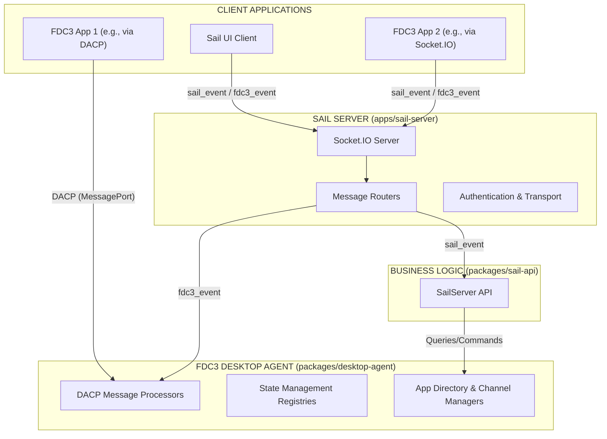
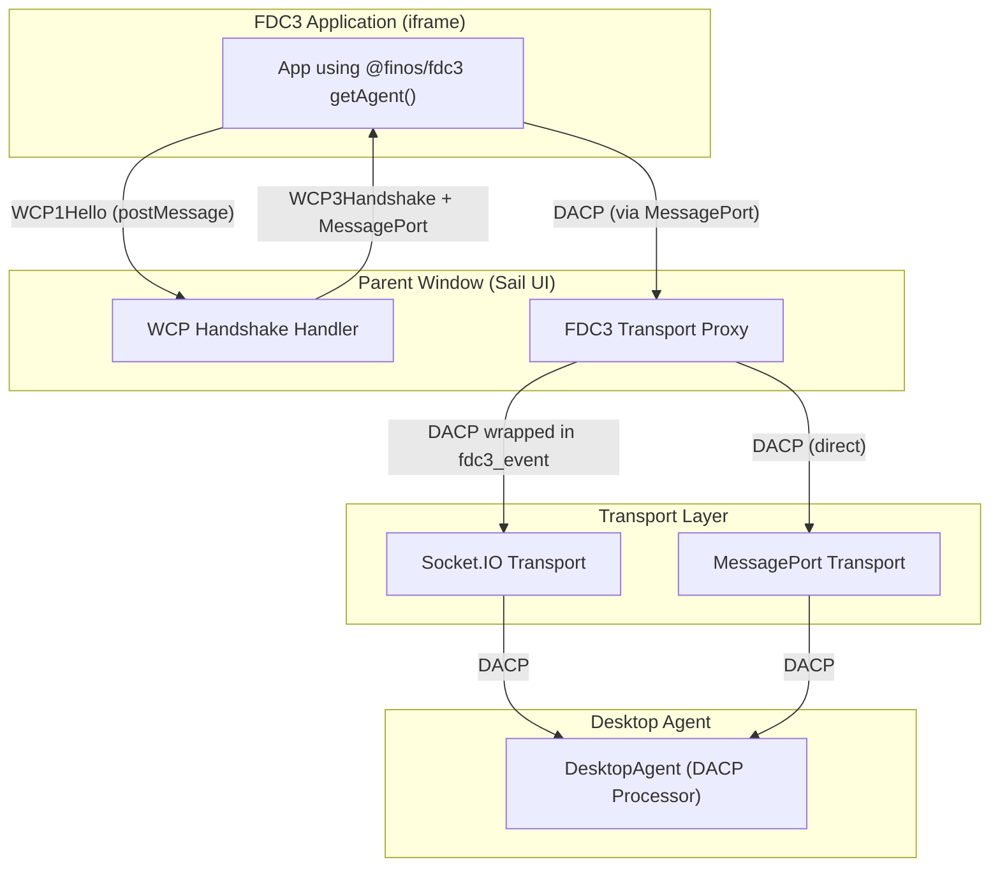
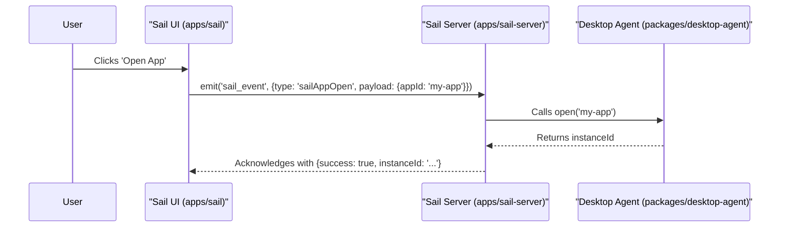
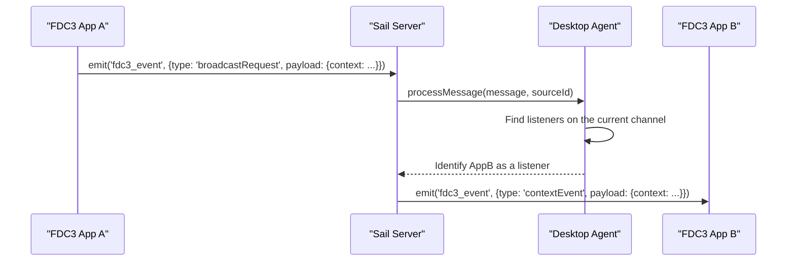
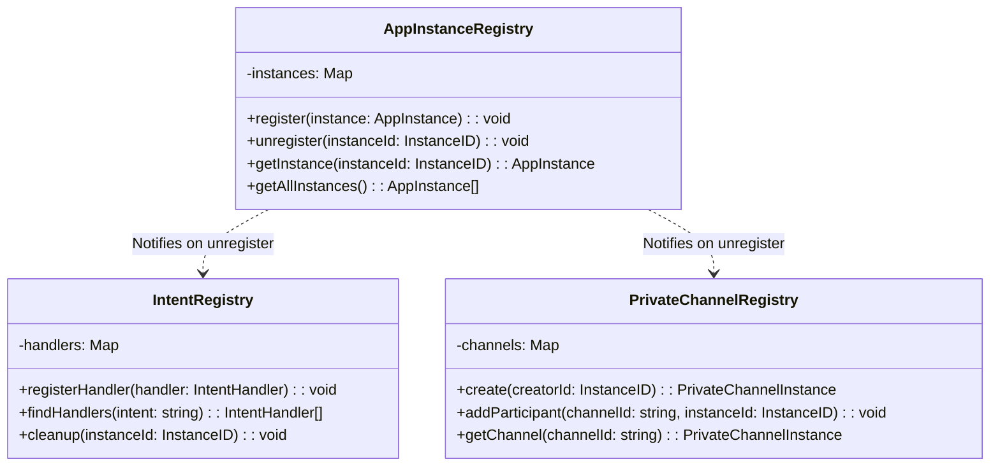

# FDC3-Sail System Architecture

## 1. Overview

This document provides a comprehensive architectural overview of the FDC3-Sail platform. Its purpose is to serve as a central source of truth for developers, explaining how the various components, packages, and applications interact to provide a cohesive FDC3-enabled desktop experience.

## 2. Core Principles

The system is designed around several core principles:

-   **FDC3 Compliance**: Strictly adhere to the FDC3 2.0+ standards, particularly the Desktop Agent Communication Protocol (DACP).
-   **Separation of Concerns**: A clear division between the FDC3-standard "Desktop Agent" engine and the proprietary "Sail" platform services (UI, layouts, workspaces).
-   **Transport Agnosticism**: The core desktop agent is decoupled from the underlying transport layer, allowing it to communicate over Socket.IO, MessagePorts, or other mechanisms.
-   **Extensibility**: The architecture is designed to be modular, allowing for the addition of new apps, services, and features with minimal friction.

## 3. Architecture Diagram

The following diagram illustrates the high-level system architecture, from client applications down to the FDC3 Desktop Agent layer.

## 4. Component Breakdown

The platform is a monorepo composed of several `apps` and `packages`.

-   **`apps/sail-server`**: The central NodeJS backend that orchestrates the entire system. It hosts the Socket.IO server, manages client connections, and initializes the FDC3 Desktop Agent.
-   **`apps/sail`**: The primary frontend application, built with React. It provides the main Sail shell interface, including workspace management, layouts, and the app launcher. It communicates with `sail-server` using the protocols defined below.
-   **`apps/sail-electron`**: An Electron wrapper that packages the `sail` frontend application into a distributable desktop application.
-   **`packages/desktop-agent`**: The heart of FDC3 compliance. This package implements the FDC3 Desktop Agent specification. It is transport-agnostic and responsible for all FDC3 state management (apps, intents, channels) and message processing.
-   **`packages/sail-api`**: Defines the programmatic API for the Sail server. It provides a clear interface for proprietary Sail functionality, separating it from the core FDC3 logic.
-   **`packages/sail-ui`**: A shared React component library that provides a consistent look and feel across all Sail applications.
-   **`packages/app-directories`**: Contains JSON-based app directories that define the applications available to be launched by the desktop agent.

## 5. Communication Protocols

Communication is handled via a unified convention that supports multiple transports.

### 5.1. The Two-Channel Convention (Socket.IO)

For clients connecting via Socket.IO, the system uses exactly two event channels to route all messages, as defined in `@packages/desktop-agent/PROTOCOL.md`.

-   **`fdc3_event`**: Used for all FDC3-standard DACP (Desktop Agent Communication Protocol) messages.
-   **`sail_event`**: Used for all proprietary Sail platform messages (e.g., layout changes, workspace management).

This separation ensures that FDC3-standard logic is cleanly isolated from proprietary features.

### 5.2. FDC3 Transport Abstraction

The architecture supports **transport-agnostic FDC3 communication** through a proxy layer that translates between different transports while maintaining DACP compliance.

#### Transport Modes

**1. Socket.IO Transport (Remote Desktop Agent)**
- FDC3 apps use standard `@finos/fdc3` library and WCP handshake
- Parent window captures DACP messages from MessagePort
- Proxy forwards DACP messages over Socket.IO using `fdc3_event` channel
- Desktop Agent runs on remote server, processes DACP messages
- Use case: Multi-user server environments, cloud deployments

**2. MessagePort Transport (Local Desktop Agent)**
- FDC3 apps use standard `@finos/fdc3` library and WCP handshake
- Parent window routes DACP messages directly to local Desktop Agent
- Desktop Agent runs in parent window/same process
- Use case: Single-user desktop apps, offline environments, iframe-to-iframe communication

#### Key Implementation Details

The **FDC3 Transport Proxy** (implemented in `useFDC3Connection` hook) performs:

1. **WCP Handshake**: Responds to `WCP1Hello` from FDC3 apps with `WCP3Handshake`
2. **MessagePort Bridging**: Links app's MessagePort to selected transport
3. **DACP Forwarding**: Routes DACP messages between app and Desktop Agent
4. **Bi-directional Communication**: Handles both request/response and event messaging

This separation ensures:
- Desktop Agent remains **transport-agnostic** (only processes DACP)
- FDC3 apps remain **unmodified** (use standard `@finos/fdc3` library)
- Transport choice is **runtime configurable** (Socket.IO vs MessagePort vs future options)

## 6. Message & Data Flow

### Sequence Diagram: Sail UI Opening an App

This diagram shows the flow for a proprietary Sail action.

### Sequence Diagram: FDC3 Context Broadcast

This diagram shows the flow for a standard FDC3 action initiated by a client connected via Socket.IO.

### Class Diagram: Core State Management

This diagram shows the planned state management registries within the Desktop Agent.

## 7. Implementation Status

This architecture is partially implemented. Based on the analysis of `@packages/desktop-agent/IMPLEMENTATION_PLAN.md`, the current status is as follows:

-   **Complete**:
    -   Initial state management for `AppInstanceRegistry` and `IntentRegistry`.
    -   Basic project structure for all apps and packages.

-   **In Progress / To-Do**:
    -   Full implementation of all DACP message handlers (e.g., App Management, Private Channels).
    -   Creation of the `PrivateChannelRegistry`.
    -   Formal separation of Sail-specific services from the core server logic.
    -   Comprehensive FDC3 compliance and performance testing suites.

## 8. Related Documents

For more granular details on specific aspects of the architecture and implementation, please refer to the original documents:

-   [**Implementation Plan (`@packages/desktop-agent/IMPLEMENTATION_PLAN.md`)**](../packages/desktop-agent/IMPLEMENTATION_PLAN.md): A detailed, phased plan for implementing the FDC3 Desktop Agent, including specific code structures and handler logic.
-   [**Protocol Convention (`@packages/desktop-agent/PROTOCOL.md`)**](../packages/desktop-agent/PROTOCOL.md): A focused look at the two-channel (`fdc3_event` and `sail_event`) Socket.IO messaging protocol.
-   [**Initial Architecture Analysis (`ARCHITECTURE_ANALYSIS.md`)**](../ARCHITECTURE_ANALYSIS.md): The original analysis document that identified architectural gaps and proposed the foundational changes.
