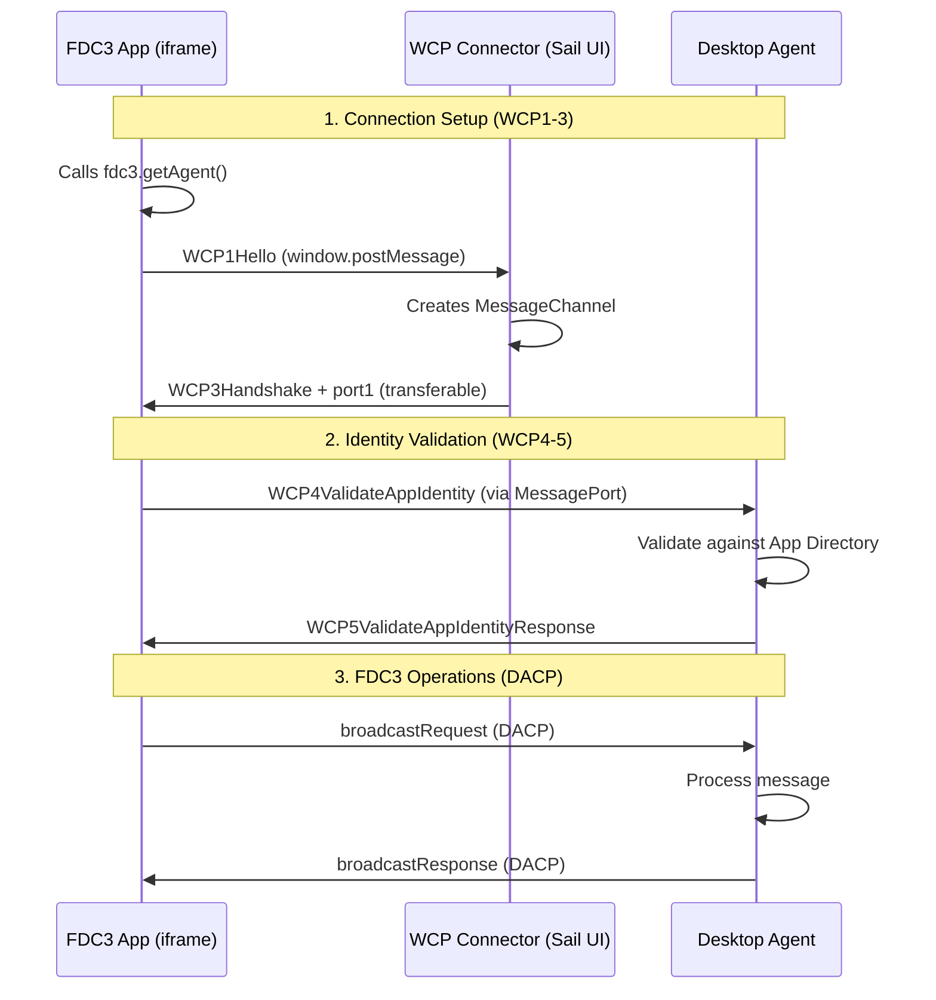
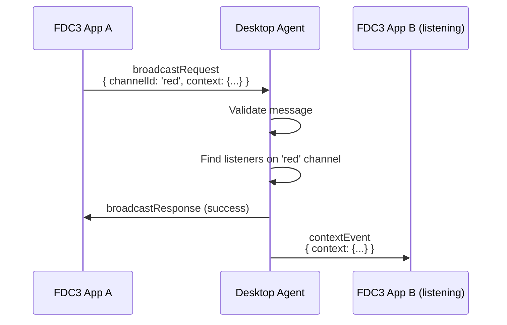
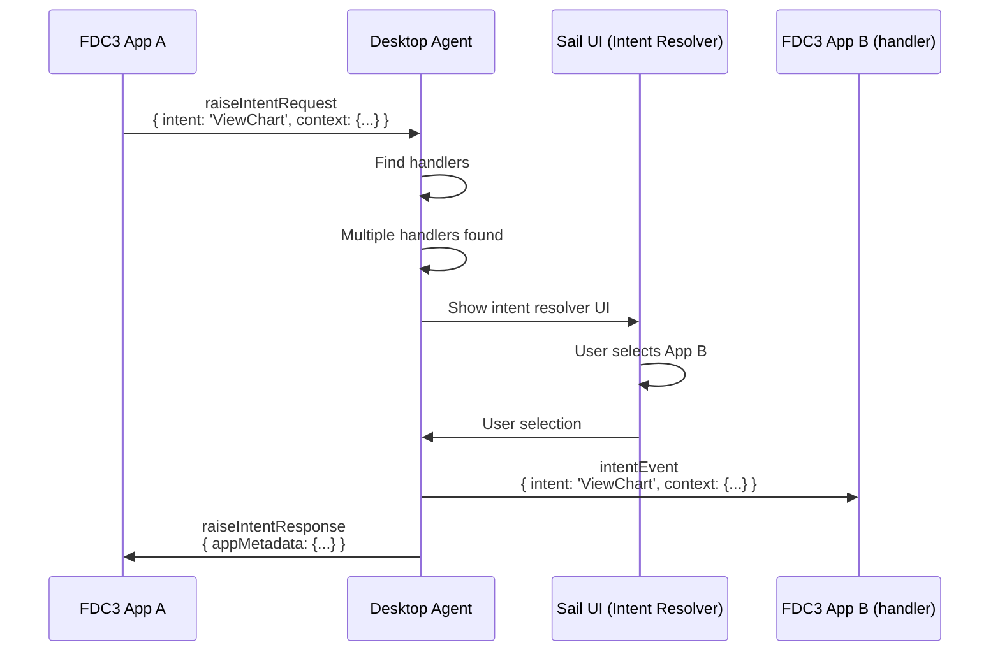

# FDC3 Sail System Architecture

## Overview

FDC3 Sail is a production-ready implementation of the FDC3 2.2 Desktop Agent specification. It provides a complete FDC3 environment with support for multiple deployment modes, transport mechanisms, and UI integration patterns.

This document explains the system architecture, design decisions, and how the components work together.

---

## Core Principles

The architecture is designed around these key principles:

### 1. FDC3 Compliance First
- **Strict adherence** to FDC3 2.2 standards
- Full support for **DACP** (Desktop Agent Communication Protocol)
- Full support for **WCP** (Web Connection Protocol)
- Standard `@finos/fdc3` library works unchanged

### 2. Separation of Concerns
- **Pure FDC3 engine** (`@finos/fdc3-sail-desktop-agent`) - no platform-specific code
- **Platform services** (`@finos/sail-api`) - Sail-specific features and wrappers
- Clear boundaries between FDC3 operations and proprietary features

### 3. Transport Agnostic
- Desktop Agent core has **zero transport dependencies**
- Works with Socket.IO, MessagePort, WebSockets, or any custom transport
- Transport is injected via the `Transport` interface

### 4. Environment Independent
- Desktop Agent package has **no browser or Node.js dependencies**
- Pure TypeScript that runs anywhere JavaScript runs
- Browser-specific code isolated to `desktop-agent/browser` submodule
- Server-specific code isolated to `sail-api/server` submodule

---

## Three-Layer Architecture

```
┌─────────────────────────────────────────────────────────────┐
│  LAYER 3: Application Layer                                 │
│  - Sail UI (React application)                              │
│  - Sail Server (Node.js runtime)                            │
│  - Example FDC3 Apps                                        │
└─────────────────────────────────────────────────────────────┘
                            ↓
┌─────────────────────────────────────────────────────────────┐
│  LAYER 2: Platform Services (@finos/sail-api)               │
│  - Desktop Agent wrappers (Server, Browser)                 │
│  - Transport implementations (Socket.IO, MessagePort)       │
│  - Platform API (Workspaces, Layouts, Config)              │
│  - WCP Gateway (browser-specific connection handler)        │
│  - Middleware (logging, auth, metrics)                      │
└─────────────────────────────────────────────────────────────┘
                            ↓
┌─────────────────────────────────────────────────────────────┐
│  LAYER 1: Pure FDC3 Engine (@finos/fdc3-sail-desktop-agent) │
│  - DACP message handlers                                    │
│  - State registries (Apps, Intents, Channels)              │
│  - WCP validation logic (WCP4-5)                           │
│  - App Directory management                                 │
│  - ZERO external dependencies                               │
└─────────────────────────────────────────────────────────────┘
```

### Why This Structure?

**Layer 1 (Desktop Agent)** is pure, testable FDC3 logic:
- No `window`, no `document`, no `fs`, no `http`
- Can run in Node.js, browsers, workers, Electron, etc.
- Easy to test with mock transports
- Reusable across different FDC3 implementations

**Layer 2 (Sail API)** bridges environments:
- Wraps Layer 1 for specific runtime environments
- Provides transport implementations
- Adds Sail-specific features (workspaces, layouts)
- Handles browser-specific WCP connection setup

**Layer 3 (Applications)** uses the APIs:
- Sail UI uses SailBrowserDesktopAgent
- Sail Server uses SailServerDesktopAgent
- FDC3 apps use standard `@finos/fdc3` library

---

## Package Architecture

### @finos/fdc3-sail-desktop-agent

**Purpose**: Pure FDC3 2.2 Desktop Agent implementation

**Structure**:
```
packages/desktop-agent/
├── src/
│   ├── core/                       # Main export (default)
│   │   ├── desktop-agent.ts        # Main DesktopAgent class
│   │   ├── handlers/
│   │   │   └── dacp/               # DACP message handlers
│   │   ├── state/                  # Registries
│   │   │   ├── app-instance-registry.ts
│   │   │   ├── intent-registry.ts
│   │   │   ├── channel-context-registry.ts
│   │   │   └── private-channel-registry.ts
│   │   ├── app-directory/          # App metadata
│   │   └── interfaces/
│   │       ├── transport.ts        # Interface ONLY
│   │       └── app-launcher.ts     # Interface ONLY
│   ├── browser/                    # Browser submodule (tree-shakeable)
│   │   ├── browser-desktop-agent.ts
│   │   ├── wcp-connector.ts        # WCP1-3 handler
│   │   └── message-port-transport.ts
│   └── transports/                 # Transport implementations
│       └── in-memory-transport.ts  # For testing & WCP
```

**Exports**:
```typescript
// Core (default export)
import { DesktopAgent, AppInstanceRegistry, IntentRegistry } from '@finos/fdc3-sail-desktop-agent'

// Browser submodule (separate entry point)
import { createBrowserDesktopAgent } from '@finos/fdc3-sail-desktop-agent/browser'

// Transports
import { createInMemoryTransportPair } from '@finos/fdc3-sail-desktop-agent/transports'
```

**Key Responsibilities**:
- Process all DACP messages (context, intents, channels, etc.)
- Manage app instances, intent handlers, channel memberships
- Validate WCP identity (WCP4-5)
- Emit events for UI synchronization
- **Zero dependencies** on transport mechanism

**Why Browser Code is Separate**:
- **Tree-shaking**: Server builds don't include browser-only code
- **Type safety**: Browser APIs (`window`, `MessagePort`) only where needed
- **Clear boundaries**: WCP1-3 (browser-specific) vs WCP4-5 (pure logic)

---

### @finos/sail-api

**Purpose**: Sail platform services and Desktop Agent wrappers

**Structure**:
```
packages/sail-api/
├── src/
│   ├── SailDesktopAgent.ts         # Server-side wrapper (main export)
│   ├── SailBrowserDesktopAgent.ts  # Browser-side wrapper
│   ├── adapters/
│   │   ├── socket-io-transport.ts          # Client Socket.IO
│   │   ├── socket-io-server-transport.ts   # Server Socket.IO
│   │   └── SailAppLauncher.ts              # App launcher impl
│   ├── client/
│   │   ├── SailServerClientAPI.ts  # FDC3 operations client
│   │   └── SailPlatformApi.ts      # Platform features client
│   ├── platform/
│   │   ├── ISailPlatformApi.ts     # Platform API interface
│   │   ├── LocalStoragePlatformApi.ts
│   │   └── RemotePlatformApi.ts
│   ├── middleware.ts               # Middleware pipeline
│   └── protocol/
│       └── sail-messages.ts        # Sail protocol types
```

**Exports**:
```typescript
// Server-side Desktop Agent
import { SailServerDesktopAgent, SocketIOServerTransport } from '@finos/sail-api'

// Browser-side Desktop Agent
import { createSailBrowserDesktopAgent } from '@finos/sail-api'

// Client APIs
import { SailServerClientAPI, SailPlatformApi } from '@finos/sail-api'
```

**Key Responsibilities**:
- Wrap Desktop Agent for server and browser environments
- Provide transport implementations
- Add middleware support (logging, auth, metrics)
- Implement Sail platform features (workspaces, layouts, config)
- Handle environment-specific concerns

**Design Decision**: Keep platform services separate from FDC3 core
- FDC3 operations go through Desktop Agent
- Sail-specific features (workspaces) go through SailPlatformApi
- Clear API boundaries prevent mixing concerns

---

### @finos/sail-ui

**Purpose**: Shared React component library

**Structure**:
```
packages/sail-ui/
├── src/
│   ├── components/     # Reusable UI components
│   ├── hooks/          # Shared React hooks
│   └── lib/            # Utilities
```

**Key Responsibilities**:
- Consistent styling across Sail applications
- Reusable UI components (buttons, modals, etc.)
- Shared utilities and hooks

---

## Communication Protocols

### Two-Channel Convention (Socket.IO)

For clients connecting via Socket.IO, the system uses exactly two event channels:

**`fdc3_event`**: All FDC3 DACP messages
```typescript
socket.emit('fdc3_event', {
  type: 'broadcastRequest',
  payload: { channelId: 'red', context: {...} },
  meta: { requestUuid: '...', timestamp: new Date() }
})
```

**`sail_event`**: All Sail platform messages
```typescript
socket.emit('sail_event', {
  type: 'saveWorkspaceLayout',
  payload: { workspaceId: '...', layout: {...} }
})
```

**Why Two Channels?**
- Clean separation of FDC3 standard vs. proprietary features
- Easy to route to correct handler
- Clear protocol boundaries

### Transport Abstraction

The `Transport` interface enables any message protocol:

```typescript
interface Transport {
  send(message: unknown): void
  onMessage(handler: (message: unknown) => void): void
  onDisconnect(handler: () => void): void
  isConnected(): boolean
  disconnect(): void
}
```

**Current Implementations**:
- `SocketIOServerTransport` - Server-side Socket.IO (sail-api)
- `SocketIOTransport` - Client-side Socket.IO (sail-api)
- `MessagePortTransport` - Browser iframe communication (desktop-agent/browser)
- `InMemoryTransport` - Same-process communication (desktop-agent/transports)

**Why This Works**:
- Desktop Agent only knows the `Transport` interface
- Swap transports without changing Desktop Agent code
- Easy to add new transports (WebRTC, WebSockets, IPC, etc.)

---

## WCP Integration Flow



**WCP Component Locations**:
- **WCP1-3** (connection setup): In `desktop-agent/browser/wcp-connector.ts`
  - Uses `window.addEventListener`, `MessageChannel`, `postMessage`
  - Browser-specific, can't run in Node.js

- **WCP4-5** (validation): In `desktop-agent/core/handlers/dacp/wcp-handlers.ts`
  - Pure validation logic
  - Checks app identity against App Directory
  - Environment-agnostic

**Why Split WCP?**
- WCP1-3 requires browser APIs (window, MessageChannel)
- WCP4-5 is pure business logic (validate identity)
- Keeps Desktop Agent core environment-independent

---

## UI Architecture: Sail-Controlled UI

FDC3 Sail uses **Option 2: External UI Control** from the FDC3 specification.

### What This Means

**Traditional Approach (Injected iframes)**:
- Desktop Agent provides URLs for channel selector and intent resolver
- `getAgent()` injects these as iframes into each FDC3 app
- Each app has its own copy of the UI
- UI communicates via `postMessage`

**Sail Approach (External React Components)**:
- Sail UI provides channel selector and intent resolver as React components
- One UI controls all apps (not one per app)
- WCP3Handshake returns `channelSelectorUrl: false`, `intentResolverUrl: false`
- Apps receive standard DACP events (e.g., `userChannelChangedEvent`)

### Benefits

| Aspect | Sail-Controlled UI ✅ | Injected iframe UI |
|--------|---------------------|---------------------|
| **UI Duplication** | Single UI for all apps | One copy per app |
| **Performance** | Direct DOM rendering | iframe overhead |
| **State Management** | Centralized in Sail UI | Per-app via `getAgent()` |
| **Styling** | Full Sail design system | Must match app context |
| **Testing** | Test React components | Mock iframe postMessage |
| **DACP Complexity** | Standard events only | Requires Fdc3UserInterface messages |

### Implementation

**WCP3Handshake Response**:
```typescript
{
  type: "WCP3Handshake",
  payload: {
    fdc3Version: "2.2",
    channelSelectorUrl: false,  // ← Sail provides UI externally
    intentResolverUrl: false,   // ← Sail provides UI externally
  }
}
```

**Desktop Agent Event Emission**:
```typescript
class DesktopAgent {
  async joinUserChannel(instanceId: string, channelId: string) {
    // 1. Update registry
    this.appInstanceRegistry.setChannel(instanceId, channelId)

    // 2. Send DACP event to app
    await this.sendToInstance(instanceId, {
      type: "userChannelChangedEvent",
      payload: { channel: { id: channelId, type: "user" } }
    })

    // 3. Emit event for Sail UI (via middleware in sail-api)
    // Note: This happens in the SailDesktopAgent wrapper, not core
  }
}
```

**Sail UI React Component**:
```typescript
function ChannelSelector() {
  const { socket } = useDesktopAgent()
  const [appChannels, setAppChannels] = useState(new Map())

  useEffect(() => {
    // Listen for app channel changes via Socket.IO
    socket.on('app:channelChanged', ({ instanceId, channelId }) => {
      setAppChannels(prev => new Map(prev).set(instanceId, channelId))
    })
  }, [socket])

  function handleChannelClick(instanceId, channelId) {
    // Direct command to server Desktop Agent
    socket.emit('fdc3_event', {
      type: 'joinUserChannelRequest',
      payload: { instanceId, channelId },
      meta: { requestUuid: uuid(), timestamp: new Date() }
    })
  }

  return (
    <div>
      {Array.from(appChannels).map(([instanceId, channelId]) => (
        <AppChannelControl
          key={instanceId}
          instanceId={instanceId}
          currentChannel={channelId}
          onChannelSelect={(ch) => handleChannelClick(instanceId, ch)}
        />
      ))}
    </div>
  )
}
```

---

## Deployment Modes

FDC3 Sail supports multiple deployment modes based on where the Desktop Agent runs.

### Server Mode (Multi-User, Production)

**Architecture**:
```
Sail UI (Browser)
    ↓ Socket.IO
Sail Server (Node.js)
    ↓
Desktop Agent (in server process)
```

**Use Cases**:
- Multi-user environments
- Centralized state management
- Cloud deployments
- Persistent state across page refreshes

**Setup**:
```typescript
// Server (apps/sail-server)
import { SailServerDesktopAgent, SocketIOServerTransport } from '@finos/sail-api'

io.on('connection', (socket) => {
  const transport = new SocketIOServerTransport(socket)
  const agent = new SailServerDesktopAgent({ transport })
  agent.start()
})

// Client (apps/sail)
import { SailServerClientAPI } from '@finos/sail-api'
import { io } from 'socket.io-client'

const socket = io('http://localhost:8091')
const client = new SailServerClientAPI(socket)
```

### Browser Mode (Single-User, Local)

**Architecture**:
```
Sail UI (Browser)
    ↓ In-Process
Desktop Agent (in browser process)
    ↓ MessagePort
FDC3 Apps (iframes)
```

**Use Cases**:
- Single-user desktop apps
- Offline mode
- Development/testing
- No server needed

**Setup**:
```typescript
// In Sail UI
import { createSailBrowserDesktopAgent } from '@finos/sail-api'

const { desktopAgent, wcpConnector, start } = createSailBrowserDesktopAgent({
  wcpOptions: {
    getIntentResolverUrl: () => false,
    getChannelSelectorUrl: () => false
  }
})

start()
```

### Comparison

| Mode | DA Location | State Persistence | Multi-User | Latency |
|------|-------------|-------------------|------------|---------|
| **Server** | Node.js | Database/memory | ✅ Yes | Network |
| **Browser** | Browser window | Memory only | ❌ No | Instant |

---

## Design Decisions

### Why Transport-Agnostic?

**Flexibility**: Desktop Agent works with any message protocol
- Socket.IO for remote server
- MessagePort for local iframes
- Future: WebRTC, IPC, WebSockets, etc.

**Testability**: Mock transport for unit tests
```typescript
class MockTransport implements Transport {
  sent: unknown[] = []
  send(message: unknown) { this.sent.push(message) }
  simulateReceive(message: unknown) { this.messageHandler(message) }
}
```

**Portability**: Same Desktop Agent code runs in different environments

### Why Separate Packages?

**@finos/fdc3-sail-desktop-agent** (pure FDC3):
- Reusable across different FDC3 implementations
- Easy to test (no environment dependencies)
- Can be extracted to a separate FDC3 library

**@finos/sail-api** (Sail platform):
- Sail-specific features don't pollute FDC3 core
- Easier to contribute FDC3 improvements upstream
- Clear boundaries between standard and proprietary

### Why EventEmitter in Wrapper, Not Core?

**Desktop Agent Core** has no EventEmitter:
- Keeps it pure and dependency-free
- Events are environment-specific (browser, server need different patterns)

**Wrappers** add EventEmitter:
- `SailServerDesktopAgent` can emit events for logging, metrics
- `SailBrowserDesktopAgent` can emit events for UI updates
- Flexibility for different event systems

---

## Message Flows

### Context Broadcast Flow



### Intent Raise Flow (With Resolution)



---

## State Management

### Registries

The Desktop Agent maintains several registries for FDC3 entities:

**AppInstanceRegistry**:
- Tracks all connected app instances
- Stores current channel membership
- Manages context and intent listeners
- Handles lifecycle (connect, disconnect)

**IntentRegistry**:
- Tracks intent handlers across all apps
- Finds matching handlers for intent resolution
- Cleans up handlers when apps disconnect

**ChannelContextRegistry**:
- Stores last broadcast context per channel
- Enables `getCurrentContext()` calls
- Manages user channels and app channels

**PrivateChannelRegistry**:
- Manages private channels created by apps
- Tracks participants on each channel
- Handles disconnect cleanup

**UserChannelRegistry**:
- Predefined FDC3 user channels (red, orange, yellow, green, blue, purple)
- Channel metadata (name, color, glyph)

**AppChannelRegistry**:
- Dynamically created app channels
- Channel lifecycle management

### State Flow

```
FDC3 App connects
    ↓
WCP validation
    ↓
AppInstanceRegistry.register()
    ↓
App can now receive/send messages
    ↓
App adds intent listener
    ↓
IntentRegistry.registerHandler()
    ↓
Another app raises intent
    ↓
IntentRegistry.findHandlers()
    ↓
Intent delivered to handler
```

---

## Testing Strategy

### Unit Tests
- Mock `Transport` for isolated Desktop Agent testing
- No real Socket.IO or MessagePorts needed
- Fast, deterministic tests

### Integration Tests
- Use `InMemoryTransport` pairs for end-to-end DACP flows
- Test complete WCP + DACP sequences
- Validate state changes across registries

### E2E Tests
- Real Socket.IO connections
- Real MessagePort connections
- Test Sail UI + Server + FDC3 Apps together

---

## Further Reading

- [Desktop Agent Architecture](./packages/DESKTOP_AGENT.md)
- [Sail API Architecture](./packages/SAIL_API.md)
- [Transport Layer Details](./TRANSPORT.md)
- [WCP Integration Guide](./WCP_INTEGRATION.md)
- [FDC3 2.2 Specification](https://fdc3.finos.org/docs/api/spec)

---

## Glossary

- **DACP**: Desktop Agent Communication Protocol - FDC3 wire protocol for all operations
- **WCP**: Web Connection Protocol - FDC3 connection handshake for browser apps
- **Transport**: Abstraction for message send/receive (Socket.IO, MessagePort, etc.)
- **Registry**: State management for FDC3 entities (apps, intents, channels)
- **Sail Platform**: Proprietary features (workspaces, layouts, config)
- **Pure FDC3**: Standard FDC3 operations (context, intents, channels)
