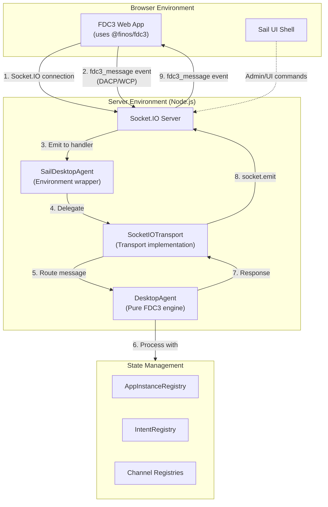
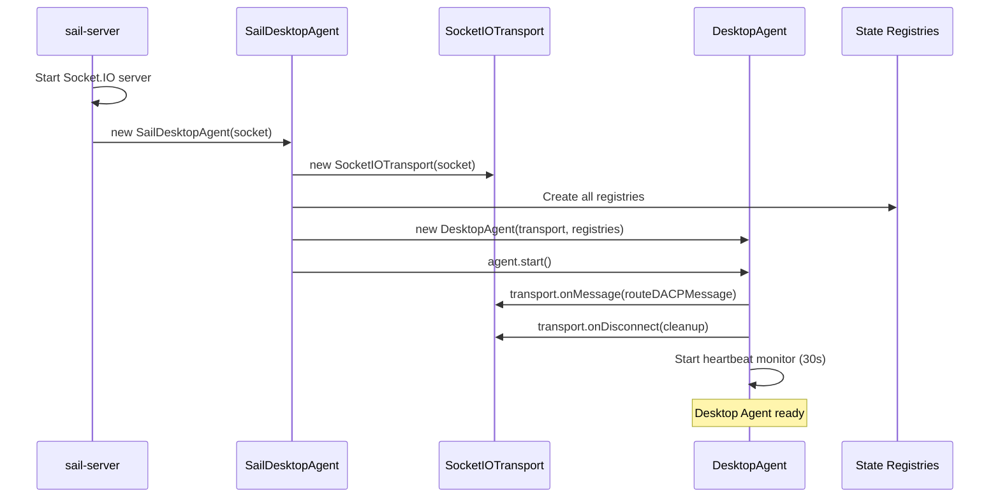
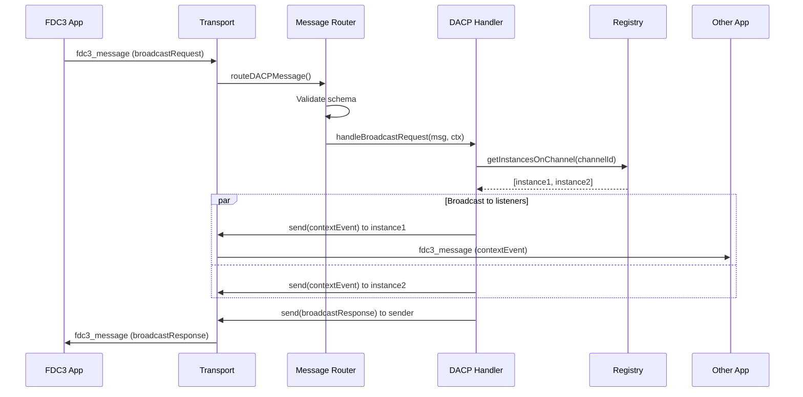
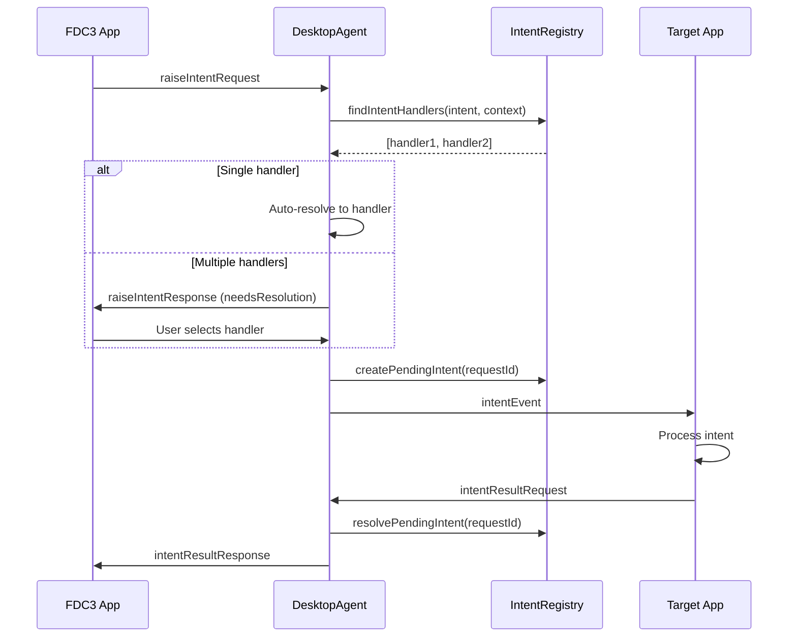
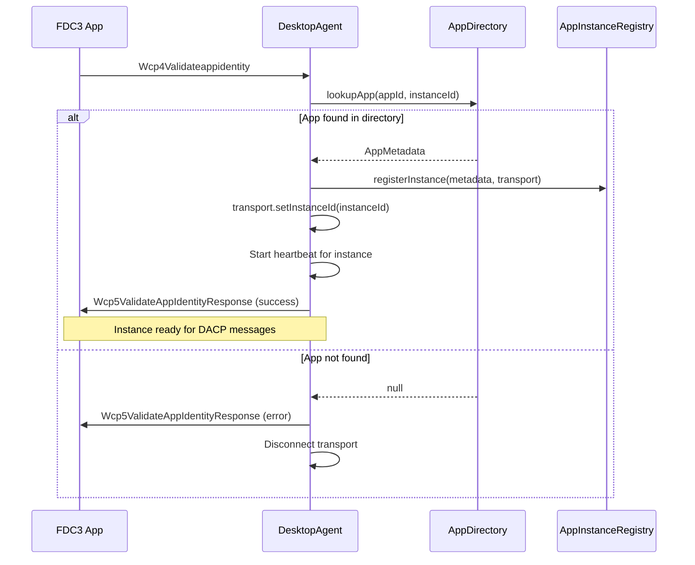
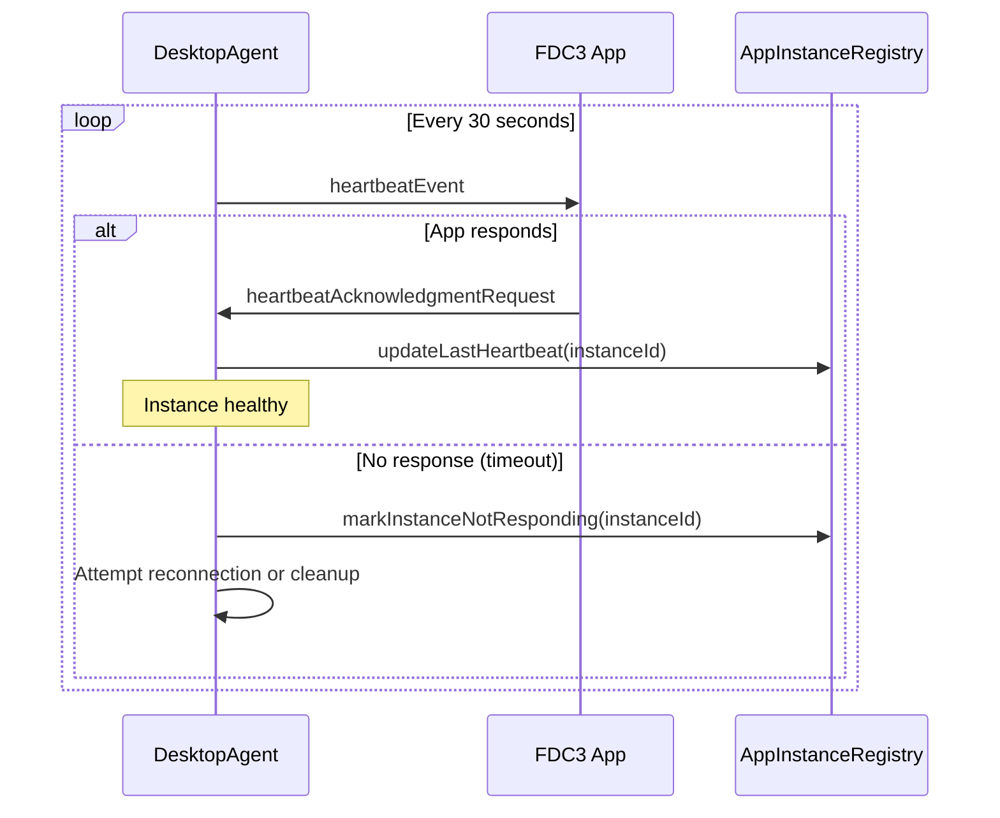

# FDC3 Desktop Agent Architecture

## Overview

This package implements a **pure, spec-compliant FDC3 Desktop Agent Engine** (~75% DACP compliant). Its sole responsibility is to manage the state of an FDC3-enabled environment (applications, channels, intents, context data) and handle interoperability by processing messages that conform to the **Desktop Agent Communication Protocol (DACP)**.

This package is designed as a **reusable, transport-agnostic library** with dependency injection. It can run in any JavaScript environment (Node.js, browser, Electron) when provided with an appropriate transport implementation.

## Core Design Principles

### 1. Transport Abstraction

The desktop agent is **completely decoupled from Socket.IO** through the `Transport` interface. This allows the same FDC3 engine to work in:
- **Server environments** (Node.js + Socket.IO)
- **Browser environments** (MessagePort, BroadcastChannel)
- **Electron environments** (IPC)
- **Testing environments** (Mock transport)

```typescript
interface Transport {
  send(message: DACPMessage): Promise<void>
  onMessage(handler: (message: DACPMessage) => Promise<void>): void
  onDisconnect(handler: () => void): void
  getInstanceId(): string | null
  setInstanceId(id: string): void
  isConnected(): boolean
  disconnect(): void
}
```

### 2. Dependency Injection

All handlers receive dependencies via `DACPHandlerContext`:

```typescript
interface DACPHandlerContext {
  transport: Transport                          // Message transport layer
  appInstanceRegistry: AppInstanceRegistry      // Connected app instances
  intentRegistry: IntentRegistry                // Intent handlers and pending intents
  channelContextRegistry: ChannelContextRegistry // Channel context storage
  userChannelRegistry: UserChannelRegistry      // User channels (red, blue, green, etc.)
  appChannelRegistry: AppChannelRegistry        // Dynamically created app channels
  privateChannelRegistry: PrivateChannelRegistry // Private channels
  appDirectory: AppDirectoryManager             // App metadata and capabilities
  appLauncher?: AppLauncher                     // Optional app launcher
  middlewares?: Middleware[]                    // Optional request/response middleware
  logger: Logger                                // Structured logging
}
```

**No singletons, no global state** - all dependencies are explicitly passed.

### 3. Handler Organization

Handlers are organized by FDC3 domain in a flat, discoverable structure:

```
src/handlers/dacp/
├── index.ts                      # Message router and handler registry (28 handlers)
├── context-handlers.ts           # Context operations (broadcast, addContextListener)
├── intent-handlers.ts            # Intent operations (raiseIntent, addIntentListener)
├── channel-handlers.ts           # Channel operations (join, leave, getCurrentChannel)
├── app-handlers.ts               # App management (getInfo, open, findInstances)
├── event-handlers.ts             # Desktop Agent events (addEventListener)
├── private-channel-handlers.ts   # Private channel operations
├── wcp-handlers.ts               # Web Connection Protocol (handshake)
└── heartbeat-handlers.ts         # Health monitoring (30s heartbeat)
```

Each handler follows the pattern:
1. **Validate** message using generated Zod schema
2. **Execute** business logic using injected registries
3. **Respond** via transport (success/error response)
4. **Emit events** to other instances if needed (broadcast pattern)

### 4. Schema-First Validation

All DACP messages are validated using **78 auto-generated Zod schemas** derived from official FDC3 JSON Schema definitions:

```bash
npm run generate:schemas --workspace=@finos/fdc3-sail-desktop-agent
```

- **Source**: `@finos/fdc3-schema` package (official FDC3 schemas)
- **Generator**: `scripts/generate-schemas.ts` (custom FDC3-aware generator)
- **Output**: `src/handlers/validation/dacp-schemas.ts` (DO NOT EDIT MANUALLY)
- **Usage**: Runtime validation + TypeScript type inference

**Benefits:**
- Single source of truth from FDC3 specification
- Future-proof - regenerate when spec updates
- Type safety across entire stack
- Runtime protection against malformed messages

## System Architecture

### High-Level Message Flow



### Package Structure

```
packages/desktop-agent/
├── src/
│   ├── index.ts                         # Public API exports
│   ├── desktop-agent.ts                 # Main DesktopAgent class
│   │
│   ├── interfaces/                      # Dependency injection interfaces
│   │   ├── transport.ts                 # Transport abstraction
│   │   ├── app-launcher.ts              # App launcher abstraction
│   │   └── index.ts
│   │
│   ├── state/                           # State management registries
│   │   ├── app-instance-registry.ts     # App instances and listeners
│   │   ├── intent-registry.ts           # Intent handlers and pending intents
│   │   ├── channel-context-registry.ts  # Channel context storage
│   │   ├── user-channel-registry.ts     # User channels (red, blue, etc.)
│   │   ├── app-channel-registry.ts      # Dynamically created channels
│   │   └── private-channel-registry.ts  # Private channels
│   │
│   ├── handlers/
│   │   ├── types.ts                     # Handler context and types
│   │   ├── dacp/                        # DACP protocol handlers
│   │   │   ├── index.ts                 # Message router (28 handlers)
│   │   │   ├── context-handlers.ts
│   │   │   ├── intent-handlers.ts
│   │   │   ├── channel-handlers.ts
│   │   │   ├── app-handlers.ts
│   │   │   ├── event-handlers.ts
│   │   │   ├── private-channel-handlers.ts
│   │   │   ├── wcp-handlers.ts
│   │   │   ├── heartbeat-handlers.ts
│   │   │   └── DACP-COMPLIANCE.md       # Implementation status
│   │   └── validation/
│   │       ├── dacp-validator.ts        # Validation logic
│   │       └── dacp-schemas.ts          # 78 auto-generated Zod schemas
│   │
│   ├── app-directory/
│   │   └── app-directory-manager.ts     # Load/query app directories
│   │
│   ├── protocol/
│   │   └── dacp-messages.ts             # DACP message type definitions
│   │
│   └── __tests__/                       # Test utilities and helpers
│
├── scripts/
│   └── generate-schemas.ts              # Schema generator from FDC3 JSON
│
├── ARCHITECTURE.md                      # This file
├── README.md
└── package.json
```

## Initialization Flow



## Message Handling Flow

### Request-Response Pattern



### Intent Resolution Flow



## State Management

### AppInstanceRegistry

Tracks all connected application instances with:

**Core Data:**
- `instanceId` (UUID)
- `appId` (from app directory)
- `metadata` (AppMetadata from directory)
- `connectionState` (PENDING, CONNECTED, NOT_RESPONDING, DISCONNECTING, TERMINATED)
- `transport` (for sending messages)
- `currentChannelId` (user/app/private channel)

**Indexes for Performance:**
- By `instanceId` (O(1) lookup)
- By `appId` (O(1) lookup of all instances of an app)
- By `channelId` (O(1) lookup of all instances on a channel)
- By `contextType` (O(1) lookup of all context listeners for a type)

**Listener Tracking:**
- Context listeners per instance (type filter, channelId)
- Intent listeners per instance (intent name)
- Event listeners per instance (event type: userChannelChanged, etc.)

**Private Channel Access:**
- Which private channels an instance can access
- Validated on every private channel operation

### IntentRegistry

Manages intent resolution and routing:

**Intent Listeners (Runtime):**
- Registered via `addIntentListenerRequest`
- Indexed by: intentName, appId, instanceId
- Unsubscribed automatically on disconnect

**Intent Capabilities (From App Directory):**
- Loaded from app directory on startup
- Defines which apps can handle which intents
- Context type filters (e.g., ViewChart handles fdc3.instrument)

**Pending Intents:**
- Tracks async intent flow (raiseIntent → intentEvent → intentResult)
- Maps `requestId` to pending intent details
- Timeout handling (30s default)
- Stores result for retrieval by sender

**Resolution Logic:**
- `findIntentHandlers(intent, context)` → list of capable instances
- Checks: intent name match + context type compatibility + instance connected
- Returns resolved list for user selection or auto-routing

### Channel Registries

**UserChannelRegistry:**
- Pre-defined channels: red, blue, green, yellow, orange, purple
- Display metadata (displayName, color, glyph)
- System channels (non-dynamic)

**AppChannelRegistry:**
- Dynamically created via `getOrCreateChannelRequest`
- App-specific channels for private communication groups
- Created on-demand, tracked by channelId

**PrivateChannelRegistry:**
- Created via `createPrivateChannelRequest`
- Two-party secure communication
- Tracks connected instances per channel
- Automatic cleanup on disconnect

**ChannelContextRegistry:**
- Stores last broadcast context per channel
- Enables `getCurrentContextRequest` retrieval
- Filtered by context type

## Handler Implementation Pattern

### Example: Broadcast Handler

```typescript
async function handleBroadcastRequest(
  message: unknown,
  context: DACPHandlerContext
): Promise<void> {
  const { transport, appInstanceRegistry, channelContextRegistry, logger } = context

  // 1. Validate message against generated schema
  const request = validateDACPMessage(message, BroadcastRequestSchema)
  const { channelId, context: contextData } = request.payload

  // 2. Get current instance and channel membership
  const instanceId = transport.getInstanceId()
  if (!instanceId) {
    throw new Error("Instance not registered")
  }

  const instance = appInstanceRegistry.getInstanceById(instanceId)
  if (!instance || instance.currentChannelId !== channelId) {
    throw new Error("Not a member of channel")
  }

  // 3. Store context in channel
  channelContextRegistry.setContext(channelId, contextData)

  // 4. Get all instances with matching context listeners
  const listeners = appInstanceRegistry.getContextListeners(
    channelId,
    contextData.type
  )

  // 5. Broadcast contextEvent to listeners (excluding sender)
  const contextEvent = createContextEvent(contextData, channelId)

  for (const listener of listeners) {
    if (listener.instanceId !== instanceId) {
      const targetInstance = appInstanceRegistry.getInstanceById(listener.instanceId)
      if (targetInstance?.transport) {
        await targetInstance.transport.send(contextEvent)
      }
    }
  }

  // 6. Send success response to sender
  const response = createDACPResponse(request, "broadcastResponse", {})
  await transport.send(response)

  logger.debug("Broadcast completed", { channelId, contextType: contextData.type })
}
```

### Handler Registration

All handlers are registered in `src/handlers/dacp/index.ts`:

```typescript
export const dacpHandlers: Record<string, DACPHandler> = {
  // Context operations
  broadcastRequest: handleBroadcastRequest,
  addContextListenerRequest: handleAddContextListenerRequest,
  contextListenerUnsubscribeRequest: handleContextListenerUnsubscribeRequest,

  // Intent operations
  raiseIntentRequest: handleRaiseIntentRequest,
  raiseIntentForContextRequest: handleRaiseIntentForContextRequest,
  addIntentListenerRequest: handleAddIntentListenerRequest,
  intentListenerUnsubscribeRequest: handleIntentListenerUnsubscribeRequest,
  findIntentRequest: handleFindIntentRequest,
  findIntentsByContextRequest: handleFindIntentsByContextRequest,
  intentResultRequest: handleIntentResultRequest,

  // Channel operations
  joinUserChannelRequest: handleJoinUserChannelRequest,
  leaveCurrentChannelRequest: handleLeaveCurrentChannelRequest,
  getCurrentChannelRequest: handleGetCurrentChannelRequest,
  getUserChannelsRequest: handleGetUserChannelsRequest,
  getCurrentContextRequest: handleGetCurrentContextRequest,
  getOrCreateChannelRequest: handleGetOrCreateChannelRequest,

  // App management
  getInfoRequest: handleGetInfoRequest,
  openRequest: handleOpenRequest,
  findInstancesRequest: handleFindInstancesRequest,
  getAppMetadataRequest: handleGetAppMetadataRequest,

  // Desktop Agent events
  addEventListenerRequest: handleAddEventListenerRequest,
  eventListenerUnsubscribeRequest: handleEventListenerUnsubscribeRequest,

  // Private channels
  createPrivateChannelRequest: handleCreatePrivateChannelRequest,
  privateChannelDisconnectRequest: handlePrivateChannelDisconnectRequest,
  privateChannelAddContextListenerRequest: handlePrivateChannelAddContextListenerRequest,

  // Web Connection Protocol
  Wcp4Validateappidentity: handleWcp4Validateappidentity,

  // Health monitoring
  heartbeatAcknowledgmentRequest: handleHeartbeatAcknowledgmentRequest,
}
```

## Web Connection Protocol (WCP) Handshake

The WCP handshake establishes app identity and registers the instance:



## Health Monitoring

The desktop agent automatically monitors connection health:

- **Heartbeat interval**: 30 seconds
- **Heartbeat timeout**: Configurable (default 60s)
- **Mechanism**: Desktop agent sends `heartbeatEvent`, expects `heartbeatAcknowledgmentRequest`



## Middleware System

The desktop agent supports optional middleware for cross-cutting concerns:

```typescript
interface Middleware {
  onRequest?: (message: DACPMessage, context: DACPHandlerContext) => Promise<void>
  onResponse?: (message: DACPMessage, context: DACPHandlerContext) => Promise<void>
  onError?: (error: Error, context: DACPHandlerContext) => Promise<void>
}
```

**Example use cases:**
- Logging (request/response tracing)
- Authentication (validate permissions)
- Metrics (track message counts, latency)
- Rate limiting
- Audit trails

## Testing Strategy

### Unit Tests

Each registry and handler has isolated unit tests:

```typescript
describe("AppInstanceRegistry", () => {
  it("should register instance with metadata", () => {
    const registry = new AppInstanceRegistry()
    const instance = registry.registerInstance(metadata, transport)
    expect(instance.appId).toBe("test-app")
  })

  it("should track channel membership", () => {
    const registry = new AppInstanceRegistry()
    registry.registerInstance(metadata, transport)
    registry.setChannel(instanceId, "red")
    const instances = registry.getInstancesOnChannel("red")
    expect(instances).toHaveLength(1)
  })
})
```

### Integration Tests

Test full message flows with mock transport:

```typescript
describe("Broadcast flow", () => {
  it("should deliver context to channel listeners", async () => {
    const mockTransport = new MockTransport()
    const agent = new DesktopAgent(mockTransport, registries)
    agent.start()

    // Register two apps on same channel
    await sendMessage(mockTransport, addContextListenerRequest)
    await sendMessage(mockTransport, broadcastRequest)

    expect(mockTransport.sent).toContainMessageType("contextEvent")
  })
})
```

## DACP Compliance Status

**Current implementation: ~75% DACP compliant**

See [DACP-COMPLIANCE.md](./src/handlers/dacp/DACP-COMPLIANCE.md) for detailed status.

**Fully Implemented:**
- ✅ Context operations (broadcast, addContextListener)
- ✅ Intent operations (raiseIntent, addIntentListener, findIntent, intentResult flow)
- ✅ Channel operations (join, leave, getCurrentChannel, getUserChannels)
- ✅ App management (getInfo, open, findInstances, getAppMetadata)
- ✅ Desktop Agent events (addEventListener)
- ✅ Private channels (create, disconnect, addListener)
- ✅ WCP handshake (Wcp4ValidateAppidentity)
- ✅ Health monitoring (heartbeat)

**Not Implemented:**
- ❌ UI control messages (Fdc3UserInterfaceRaise, Fdc3UserInterfaceResolve, etc.)
  - **Reason**: Server architecture doesn't need these - UI is separate concern

**In Progress:**
- 🔄 App management handlers need deeper integration with app launcher

## Key Architectural Decisions

### Why Transport Abstraction?

**Goal**: Make the FDC3 engine reusable across environments.

**Benefits:**
- Same engine works in Node.js (Socket.IO), browser (MessagePort), Electron (IPC)
- Easier testing with mock transport
- No vendor lock-in to Socket.IO
- Future-proof for new transport mechanisms

### Why Dependency Injection?

**Goal**: Avoid singletons, enable testability, support multiple instances.

**Benefits:**
- Pure functions with explicit dependencies
- Easy to test (inject mocks)
- No hidden global state
- Can run multiple desktop agents in same process (for testing)

### Why Schema-First Validation?

**Goal**: Maintain compliance with FDC3 specification automatically.

**Benefits:**
- Single source of truth (official FDC3 JSON schemas)
- TypeScript types inferred from runtime schemas (no drift)
- Easy to update when FDC3 spec changes (regenerate)
- Runtime safety against malformed messages

### Why Separate Registries?

**Goal**: Single Responsibility Principle, efficient indexing.

**Benefits:**
- Each registry manages one concern (apps, intents, channels)
- Multiple indexes for O(1) lookups (by id, by channel, by type)
- Easier to reason about state changes
- Testable in isolation

## Environment Integration

### Server Environment (Production)

```typescript
// apps/sail-server/src/main.ts
import { SailDesktopAgent } from "@finos/fdc3-sail-api"

const io = new Server(httpServer)

io.on("connection", (socket) => {
  const agent = new SailDesktopAgent(socket, {
    appDirectories: [trainingAppD, workbenchAppD],
    middlewares: [loggingMiddleware, metricsMiddleware]
  })
  agent.start()
})
```

The `SailDesktopAgent` is a thin wrapper that:
1. Creates `SocketIOTransport` from socket
2. Instantiates all registries
3. Loads app directories
4. Creates pure `DesktopAgent` with injected dependencies
5. Applies middleware

### Browser Environment (Future)

```typescript
// Hypothetical browser usage
import { DesktopAgent, MessagePortTransport } from "@finos/fdc3-sail-desktop-agent/browser"

const transport = new MessagePortTransport(messagePort)
const agent = new DesktopAgent(transport, {
  appDirectories: [localAppD]
})
agent.start()
```

## Performance Characteristics

**Registry Lookups:**
- By instanceId: O(1) - direct Map lookup
- By appId: O(1) - indexed Map
- By channelId: O(1) - indexed Set
- By contextType: O(1) - indexed Set

**Message Routing:**
- Schema validation: O(1) - direct schema lookup
- Handler dispatch: O(1) - direct handler map lookup

**Broadcast Performance:**
- Context broadcast: O(n) where n = listeners on channel
- Intent resolution: O(m) where m = capable handlers

**Target Performance:**
- Support 100+ concurrent app instances
- Sub-millisecond message routing
- Sub-10ms broadcast to 50 listeners

## Future Enhancements

### Short Term
- [ ] Complete app launcher integration
- [ ] Add performance metrics middleware
- [ ] Add request tracing (correlation IDs)
- [ ] Implement rate limiting middleware

### Medium Term
- [ ] Browser MessagePort transport implementation
- [ ] Electron IPC transport implementation
- [ ] Persistent intent registry (survive restarts)
- [ ] Intent resolution UI customization

### Long Term
- [ ] Distributed desktop agent (multi-server)
- [ ] Intent routing across desktop agents
- [ ] Channel federation
- [ ] App directory hot-reloading

## References

- [FDC3 Standard](https://fdc3.finos.org/)
- [DACP Specification](https://fdc3.finos.org/docs/api/specs/desktopAgentCommunicationProtocol)
- [FDC3 For The Web](https://github.com/finos/FDC3/issues?q=label%3A%22FDC3+for+Web+Browsers%22)
- [DACP-COMPLIANCE.md](./src/handlers/dacp/DACP-COMPLIANCE.md) - Implementation status tracker
- [Official FDC3 JSON Schemas](https://github.com/finos/FDC3/tree/main/schemas)

## License

Apache License 2.0 - See LICENSE file for details
