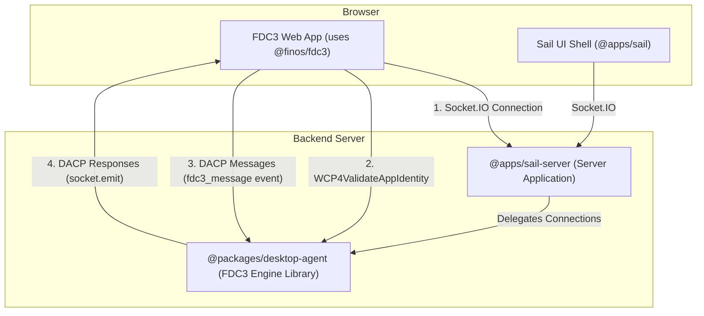

# FDC3 Desktop Agent Architecture

## Overview

This package implements a **pure, spec-compliant FDC3 Desktop Agent Engine**. Its sole responsibility is to manage the state of an FDC3-enabled environment (applications, channels, intents, context data) and handle interoperability by processing messages that conform to the **Desktop Agent Communication Protocol (DACP)**.

This package is designed as a reusable library using **Socket.IO** as the transport layer. It is consumed by a server application (in our case, `@apps/sail-server`) which initializes the desktop agent and wires up Socket.IO connections.

## Architectural Principles

### 2. Separation of Concerns

The system is designed as a two-part architecture to maintain a clean separation between FDC3-standard logic and platform-specific logic.

*   `@packages/desktop-agent` (this package): The FDC3 Engine.
*   `@apps/sail-server`: The Server Application that uses this engine.



### 3. Protocol Definitions

*   **DACP (Desktop Agent Communication Protocol)**: The FDC3-standard wire protocol that defines the JSON message format for all FDC3 API operations. This package is the engine for processing these messages.
*   **WCP (Web Connection Protocol)**: The FDC3-standard handshake protocol for establishing a trusted connection between a web app and the desktop agent. We handle `WCP4ValidateAppIdentity` to validate app identity.
*   **Socket.IO**: The transport layer used for all communication between FDC3 apps and the desktop agent.

### 4. Handler Organization

This package organizes its DACP handlers by FDC3 domain, promoting testability and maintainability.

```typescript
// packages/desktop-agent/src/
├── index.ts                       // startDesktopAgent() entry point
├── handlers/
│   ├── types.ts                   // DACPHandlerContext, DACPHandler types
│   ├── dacp/                      // FDC3 Standard (DACP compliant)
│   │   ├── context.handlers.ts    // Broadcast/listen functions
│   │   ├── intent.handlers.ts     // Intent resolution functions
│   │   ├── channel.handlers.ts    // Channel management functions
│   │   ├── wcp.handlers.ts        // WCP handshake handler
│   │   ├── app-management/        // App lifecycle handlers
│   │   │   └── app.handlers.ts    // getInfo
│   │   └── index.ts               // DACP message router
│   │
│   └── validation/
│       ├── dacp-schemas.ts        // Auto-generated Zod schemas
│       └── dacp-validator.ts      // Validation utilities
│
├── state/                         // Core FDC3 state management
│   ├── AppInstanceRegistry.ts     // App instance lifecycle
│   ├── IntentRegistry.ts          // Intent handler registration
│   └── PrivateChannelRegistry.ts  // Private channel management
│
└── app-directory/                 // FDC3 app directory
    └── appDirectoryManager.ts
```

### 5. Dependency Injection Pattern

All handlers use dependency injection via `DACPHandlerContext`:

```typescript
export interface DACPHandlerContext {
  /** The Socket.IO socket connected to this specific app instance */
  socket: Socket
  /** Unique identifier for this app instance */
  instanceId: string
  /** Registry of all app instances and their state */
  appInstanceRegistry: AppInstanceRegistry
  /** Registry of intent listeners and capabilities */
  intentRegistry: IntentRegistry
  /** App directory manager for app metadata lookups */
  appDirectory: AppDirectoryManager
}

export type DACPHandler = (message: unknown, context: DACPHandlerContext) => void | Promise<void>
```

**No Singletons**: State registries are created once by `startDesktopAgent()` and passed to handlers via context.

### 6. Schema-First Validation

All incoming DACP messages are validated against auto-generated Zod schemas derived from the official FDC3 JSON Schema definitions.

*   **Single Source of Truth**: TypeScript types are inferred from the validation schemas.
*   **Future-Proof**: FDC3 specification updates can be easily integrated by re-running the generation script.
*   **Runtime Safety**: Ensures all messages processed by the engine are compliant.

## Message Flow Architecture

### Socket.IO Transport

The desktop agent uses Socket.IO directly for all communication:

1.  **Connection**: FDC3 app connects to Socket.IO server
2.  **WCP Handshake**: App sends `WCP4ValidateAppIdentity` to validate its identity
3.  **App Registration**: Desktop agent validates app against app directory and registers instance
4.  **DACP Messages**: App sends DACP messages via `fdc3_message` event
5.  **DACP Responses**: Handlers respond via `socket.emit('fdc3_message', response)`
6.  **Cleanup**: On disconnect, instance is removed from registries

### Initialization Flow

```typescript
// 1. Server starts desktop agent
const desktopAgent = startDesktopAgent()

// 2. Server wires up Socket.IO connections
io.on('connection', (socket) => {
  desktopAgent.handleConnection(socket)
})

// 3. Desktop agent handles each connection
handleConnection: (socket: Socket) => {
  // Listen for FDC3 messages
  socket.on('fdc3_message', async (message) => {
    // Create handler context with DI
    const context: DACPHandlerContext = {
      socket,
      instanceId,
      appInstanceRegistry,
      intentRegistry,
      appDirectory
    }

    // Route to appropriate handler
    await routeDACPMessage(message, context)
  })

  // Cleanup on disconnect
  socket.on('disconnect', () => {
    cleanupDACPHandlers(context)
  })
}
```

### Handler Example

```typescript
// Simplified handler showing DI pattern
async function handleBroadcastRequest(
  message: unknown,
  context: DACPHandlerContext
): Promise<void> {
  const { socket, instanceId, appInstanceRegistry } = context

  // 1. Validate message
  const request = validateDACPMessage(message, BroadcastRequestSchema)

  // 2. Execute logic using injected dependencies
  const instancesOnChannel = appInstanceRegistry.getInstancesOnChannel(
    request.payload.channelId
  )

  // 3. Broadcast to listeners
  instancesOnChannel.forEach(instance => {
    if (instance.socket) {
      instance.socket.emit('fdc3_message', contextEvent)
    }
  })

  // 4. Send response to sender
  const response = createDACPSuccessResponse(request, 'broadcastResponse')
  socket.emit('fdc3_message', response)
}
```

## Core State Management

The desktop agent maintains three core registries for FDC3 compliance:

**AppInstanceRegistry**: Tracks all connected applications, their state, channel membership, active listeners, and **Socket.IO socket reference**.

**IntentRegistry**: Manages intent handlers across all applications, enabling intent resolution and routing.

**PrivateChannelRegistry**: Manages private channels and their participants for secure app-to-app communication.

These registries are created once by `startDesktopAgent()` and passed to all handlers via dependency injection. **No singleton exports** - all state is explicitly passed through the call chain.

## Key Architectural Decisions

### Socket Reference in AppInstance

Each `AppInstance` stores its Socket.IO socket reference:

```typescript
export interface AppInstance {
  instanceId: string
  appId: string
  socket?: Socket  // The specific socket for this app instance
  metadata: AppMetadata
  state: AppInstanceState
  // ...
}
```

This allows handlers to send messages directly to specific app instances without needing a separate socket mapping.