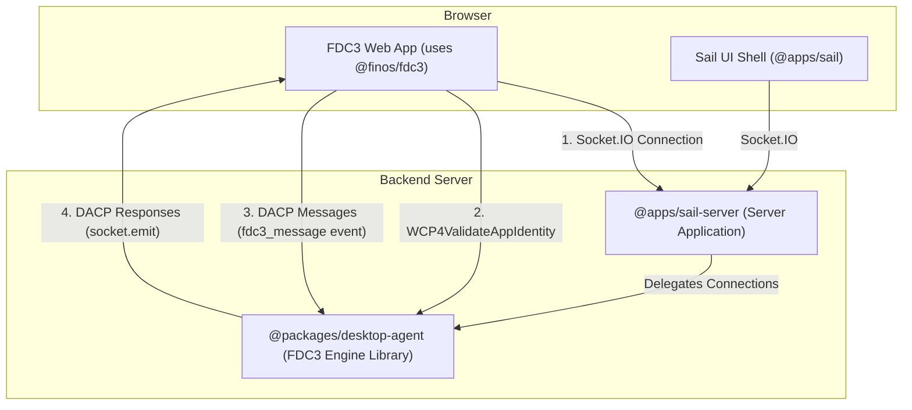

# FDC3 Desktop Agent Architecture

## Overview

This package implements a **pure, spec-compliant FDC3 Desktop Agent Engine**. Its sole responsibility is to manage the state of an FDC3-enabled environment (applications, channels, intents, context data) and handle interoperability by processing messages that conform to the **Desktop Agent Communication Protocol (DACP)**.

This package is designed as a reusable library using **Socket.IO** as the transport layer. It is consumed by a server application (in our case, `@apps/sail-server`) which initializes the desktop agent and wires up Socket.IO connections.

## Architectural Principles

### 2. Separation of Concerns

The system is designed as a two-part architecture to maintain a clean separation between FDC3-standard logic and platform-specific logic.

*   `@packages/desktop-agent` (this package): The FDC3 Engine.
*   `@apps/sail-server`: The Server Application that uses this engine.



### 3. Protocol Definitions

*   **DACP (Desktop Agent Communication Protocol)**: The FDC3-standard wire protocol that defines the JSON message format for all FDC3 API operations. This package is the engine for processing these messages.
*   **WCP (Web Connection Protocol)**: The FDC3-standard handshake protocol for establishing a trusted connection between a web app and the desktop agent. We handle `WCP4ValidateAppIdentity` to validate app identity.
*   **Socket.IO**: The transport layer used for all communication between FDC3 apps and the desktop agent.

### 4. Handler Organization

This package organizes its DACP handlers by FDC3 domain, promoting testability and maintainability.

```typescript
// packages/desktop-agent/src/
├── index.ts                       // startDesktopAgent() entry point
├── handlers/
│   ├── types.ts                   // DACPHandlerContext, DACPHandler types
│   ├── dacp/                      // FDC3 Standard (DACP compliant)
│   │   ├── context.handlers.ts    // Broadcast/listen functions
│   │   ├── intent.handlers.ts     // Intent resolution functions
│   │   ├── channel.handlers.ts    // Channel management functions
│   │   ├── wcp.handlers.ts        // WCP handshake handler
│   │   ├── app-management/        // App lifecycle handlers
│   │   │   └── app.handlers.ts    // getInfo
│   │   └── index.ts               // DACP message router
│   │
│   └── validation/
│       ├── dacp-schemas.ts        // Auto-generated Zod schemas
│       └── dacp-validator.ts      // Validation utilities
│
├── state/                         // Core FDC3 state management
│   ├── AppInstanceRegistry.ts     // App instance lifecycle
│   ├── IntentRegistry.ts          // Intent handler registration
│   └── PrivateChannelRegistry.ts  // Private channel management
│
└── app-directory/                 // FDC3 app directory
    └── appDirectoryManager.ts
```

### 5. Dependency Injection Pattern

All handlers use dependency injection via `DACPHandlerContext`:

```typescript
export interface DACPHandlerContext {
  /** The Socket.IO socket connected to this specific app instance */
  socket: Socket
  /** Unique identifier for this app instance */
  instanceId: string
  /** Registry of all app instances and their state */
  appInstanceRegistry: AppInstanceRegistry
  /** Registry of intent listeners and capabilities */
  intentRegistry: IntentRegistry
  /** App directory manager for app metadata lookups */
  appDirectory: AppDirectoryManager
}

export type DACPHandler = (message: unknown, context: DACPHandlerContext) => void | Promise<void>
```

**No Singletons**: State registries are created once by `startDesktopAgent()` and passed to handlers via context.

### 6. Schema-First Validation

All incoming DACP messages are validated against auto-generated Zod schemas derived from the official FDC3 JSON Schema definitions.

*   **Single Source of Truth**: TypeScript types are inferred from the validation schemas.
*   **Future-Proof**: FDC3 specification updates can be easily integrated by re-running the generation script.
*   **Runtime Safety**: Ensures all messages processed by the engine are compliant.

## Message Flow Architecture

### Socket.IO Transport

The desktop agent uses Socket.IO directly for all communication:

1.  **Connection**: FDC3 app connects to Socket.IO server
2.  **WCP Handshake**: App sends `WCP4ValidateAppIdentity` to validate its identity
3.  **App Registration**: Desktop agent validates app against app directory and registers instance
4.  **DACP Messages**: App sends DACP messages via `fdc3_message` event
5.  **DACP Responses**: Handlers respond via `socket.emit('fdc3_message', response)`
6.  **Cleanup**: On disconnect, instance is removed from registries

### Initialization Flow

```typescript
// 1. Server starts desktop agent
const desktopAgent = startDesktopAgent()

// 2. Server wires up Socket.IO connections
io.on('connection', (socket) => {
  desktopAgent.handleConnection(socket)
})

// 3. Desktop agent handles each connection
handleConnection: (socket: Socket) => {
  // Listen for FDC3 messages
  socket.on('fdc3_message', async (message) => {
    // Create handler context with DI
    const context: DACPHandlerContext = {
      socket,
      instanceId,
      appInstanceRegistry,
      intentRegistry,
      appDirectory
    }

    // Route to appropriate handler
    await routeDACPMessage(message, context)
  })

  // Cleanup on disconnect
  socket.on('disconnect', () => {
    cleanupDACPHandlers(context)
  })
}
```

### Handler Example

```typescript
// Simplified handler showing DI pattern
async function handleBroadcastRequest(
  message: unknown,
  context: DACPHandlerContext
): Promise<void> {
  const { socket, instanceId, appInstanceRegistry } = context

  // 1. Validate message
  const request = validateDACPMessage(message, BroadcastRequestSchema)

  // 2. Execute logic using injected dependencies
  const instancesOnChannel = appInstanceRegistry.getInstancesOnChannel(
    request.payload.channelId
  )

  // 3. Broadcast to listeners
  instancesOnChannel.forEach(instance => {
    if (instance.socket) {
      instance.socket.emit('fdc3_message', contextEvent)
    }
  })

  // 4. Send response to sender
  const response = createDACPSuccessResponse(request, 'broadcastResponse')
  socket.emit('fdc3_message', response)
}
```

## Core State Management

The desktop agent maintains three core registries for FDC3 compliance:

**AppInstanceRegistry**: Tracks all connected applications, their state, channel membership, active listeners, and **Socket.IO socket reference**.

**IntentRegistry**: Manages intent handlers across all applications, enabling intent resolution and routing.

**PrivateChannelRegistry**: Manages private channels and their participants for secure app-to-app communication.

These registries are created once by `startDesktopAgent()` and passed to all handlers via dependency injection. **No singleton exports** - all state is explicitly passed through the call chain.

## Key Architectural Decisions

### Socket Reference in AppInstance

Each `AppInstance` stores its Socket.IO socket reference:

```typescript
export interface AppInstance {
  instanceId: string
  appId: string
  socket?: Socket  // The specific socket for this app instance
  metadata: AppMetadata
  state: AppInstanceState
  // ...
}
```

This allows handlers to send messages directly to specific app instances without needing a separate socket mapping.

---

## Hybrid Architecture Strategy (2025-10-29)

**Goal:** Combine our superior engineering practices with proven FDC3 patterns while adding transport abstraction

### Strategic Decisions

#### 1. Code Duplication, Not Dependency
- **Copy** useful patterns from `@finos/fdc3-web-impl` into our repo
- **Do not** use as npm dependency
- Maintain Apache 2.0 license attribution

#### 2. Transport Abstraction via Constructor Injection
- Support both **browser** (MessagePort) and **server** (Socket.IO) usage
- Transport specified in constructor, not hardcoded
- Single codebase for both environments

#### 3. Keep What Works
- ✅ **Keep:** Zod schema validation (superior to duck typing)
- ✅ **Keep:** Registry-based state with indexed lookups (superior to array filtering)
- ✅ **Keep:** Structured error handling with typed errors
- ✅ **Keep:** Comprehensive logging

#### 4. Adopt Proven Patterns
- ✅ **Adopt:** PendingApp state machine for context delivery to launching apps
- ✅ **Adopt:** PendingIntent pattern for queuing intents to apps being launched
- ✅ **Adopt:** MessageHandler interface (optional, later)

---

### Transport Abstraction Design

#### MessageTransport Interface

```typescript
interface MessageTransport {
  send(instanceId: string, message: object): Promise<void>
  onMessage(handler: (message: object) => Promise<void>): void
  onDisconnect(handler: (instanceId: string) => void): void
}
```

#### SocketIOTransport (Server-Side)

```typescript
class SocketIOTransport implements MessageTransport {
  constructor(private socket: Socket) {}

  async send(instanceId: string, message: object): Promise<void> {
    this.socket.emit('fdc3_message', message)
  }

  onMessage(handler: (message: object) => Promise<void>): void {
    this.socket.on('fdc3_message', handler)
  }

  onDisconnect(handler: (instanceId: string) => void): void {
    this.socket.on('disconnect', () => handler(this.getInstanceId()))
  }
}
```

#### MessagePortTransport (Browser-Side)

```typescript
class MessagePortTransport implements MessageTransport {
  constructor(private port: MessagePort) {}

  async send(instanceId: string, message: object): Promise<void> {
    this.port.postMessage(message)
  }

  onMessage(handler: (message: object) => Promise<void>): void {
    this.port.onmessage = (event) => handler(event.data)
  }

  onDisconnect(handler: (instanceId: string) => void): void {
    // MessagePort lifecycle tracking
  }
}
```

#### DesktopAgent with Transport Injection

```typescript
class DesktopAgent {
  constructor(
    private transport?: MessageTransport,
    private config?: DesktopAgentConfig
  ) {
    // If no transport, create registries for manual instance management
    // If transport provided, setup message routing automatically
  }

  // For server: register instance with transport
  registerInstance(transport: MessageTransport): void {
    transport.onMessage(async (message) => {
      await this.routeMessage(message, transport)
    })

    transport.onDisconnect((instanceId) => {
      this.cleanup(instanceId)
    })
  }
}
```

---

### Package Dual Entry Points

```json
{
  "name": "@finos/fdc3-sail-desktop-agent",
  "exports": {
    ".": "./dist/index.js",
    "./server": "./dist/server.js",
    "./browser": "./dist/browser.js"
  }
}
```

#### Server Usage

```typescript
import { DesktopAgent, SocketIOTransport } from '@finos/fdc3-sail-desktop-agent/server'

const agent = new DesktopAgent()

io.on('connection', (socket) => {
  const transport = new SocketIOTransport(socket)
  agent.registerInstance(transport)
})
```

#### Browser Usage

```typescript
import { DesktopAgent, MessagePortTransport } from '@finos/fdc3-sail-desktop-agent/browser'

const transport = new MessagePortTransport(messagePort)
const agent = new DesktopAgent(transport)
```

---

### Patterns from fdc3-web-impl

#### PendingApp State Machine

**Purpose:** Deliver context to apps after they launch and register listeners

```typescript
enum AppState {
  Opening = "opening",
  DeliveringContext = "delivering",
  Done = "done"
}

class PendingApp {
  private state: AppState = AppState.Opening
  private timeoutHandle?: NodeJS.Timeout

  constructor(
    private appId: string,
    private context: Context,
    private timeoutMs: number,
    private onSuccess: (instanceId: string) => void,
    private onError: (error: Error) => void
  ) {
    this.startTimeout()
  }

  onAppConnected(instanceId: string): void {
    if (this.state === AppState.Opening) {
      this.state = AppState.DeliveringContext
    }
  }

  onContextListenerRegistered(instanceId: string): void {
    if (this.state === AppState.DeliveringContext) {
      this.deliverContext(instanceId)
      this.state = AppState.Done
      this.onSuccess(instanceId)
    }
  }
}
```

**Integration Points:**
- `openRequest` handler creates PendingApp
- `WCP4ValidateAppIdentity` calls `onAppConnected()`
- `addContextListenerRequest` calls `onContextListenerRegistered()`

---

#### PendingIntent Pattern

**Purpose:** Queue intents for apps that haven't registered listeners yet

```typescript
class PendingIntent {
  constructor(
    private intent: string,
    private context: Context,
    private targetAppId: string,
    private requestId: string,
    private onResolved: (result: IntentResult) => void,
    private onError: (error: Error) => void
  ) {
    this.startTimeout()
  }

  onListenerRegistered(instanceId: string): void {
    // Send intentEvent to target
    this.sendIntentEvent(instanceId)
  }

  onResultReceived(result: IntentResult): void {
    this.onResolved(result)
  }
}
```

**Integration Points:**
- `raiseIntentRequest` creates PendingIntent if target not ready
- `addIntentListenerRequest` checks for pending intents
- `intentResultRequest` completes pending intent

---

### Implementation Phases

#### Phase 1: Transport Abstraction (2-3 hours)
1. Create `MessageTransport` interface
2. Implement `SocketIOTransport` and `MessagePortTransport`
3. Refactor handlers to use transport instead of direct socket
4. Create server.ts and browser.ts entry points
5. Update package.json exports

#### Phase 2: Critical Bug Fixes (1 hour)
1. Register missing handlers (openRequest, findInstancesRequest, getAppMetadataRequest)
2. Fix copy-paste errors in app.handlers.ts
3. Fix findInstancesRequest logic
4. Add to app launch timeout list

#### Phase 3: Adopt PendingApp (2-3 hours)
1. Copy and adapt PendingApp from fdc3-web-impl
2. Integrate with openRequest
3. Integrate with WCP4ValidateAppIdentity
4. Integrate with addContextListenerRequest

#### Phase 4: Fix Intent Flow (3-4 hours)
1. Create intentEvent and intentResultRequest schemas
2. Implement PendingIntent pattern
3. Update raiseIntentRequest to use PendingIntent
4. Implement intentResultRequest handler
5. Complete intent event flow

#### Phase 5: Desktop Agent Events (2-3 hours)
1. Add event listener tracking to AppInstanceRegistry
2. Implement addEventListener/eventListenerUnsubscribe
3. Update channelChangedEvent to broadcast to subscribers

#### Phase 6: Additional Features (4-6 hours)
1. Implement findIntentsByContextRequest
2. Implement private channels
3. Implement heartbeat mechanism
4. Replace mock channel data

**Total Estimated Time:** 14-20 hours

---

### File Structure Changes

```
packages/desktop-agent/
├── src/
│   ├── index.ts                    # Main exports (both environments)
│   ├── server.ts                   # Server-specific exports
│   ├── browser.ts                  # Browser-specific exports
│   ├── DesktopAgent.ts             # Main class with transport injection
│   ├── transport/
│   │   ├── MessageTransport.ts     # Interface
│   │   ├── SocketIOTransport.ts    # Server implementation
│   │   └── MessagePortTransport.ts # Browser implementation
│   ├── state/
│   │   ├── AppInstanceRegistry.ts  # (no changes)
│   │   ├── IntentRegistry.ts       # (enhance with PendingIntent)
│   │   ├── PendingApp.ts           # NEW: from fdc3-web-impl
│   │   └── PendingIntent.ts        # NEW: from fdc3-web-impl
│   ├── handlers/
│   │   ├── dacp/
│   │   │   ├── index.ts            # (update for transport)
│   │   │   ├── context.handlers.ts # (no changes)
│   │   │   ├── intent.handlers.ts  # (enhance with PendingIntent)
│   │   │   ├── channel.handlers.ts # (no changes)
│   │   │   ├── app-management/
│   │   │   │   └── app.handlers.ts # (fix bugs)
│   │   │   ├── private-channel.handlers.ts # NEW
│   │   │   ├── event.handlers.ts   # NEW: addEventListener
│   │   │   └── wcp.handlers.ts     # (enhance with PendingApp)
│   │   └── validation/
│   │       └── dacp-schemas.ts     # (add missing schemas)
│   └── fdc3-patterns/              # Code copied from fdc3-web-impl
│       ├── README.md               # Attribution
│       └── [reference files]
```

---

### Success Criteria

**Functionality:**
- [ ] Works with Socket.IO transport (server)
- [ ] Works with MessagePort transport (browser)
- [ ] PendingApp pattern delivers context to launching apps
- [ ] PendingIntent queues intents for launching apps
- [ ] ~90% DACP spec compliance

**Code Quality:**
- [ ] TypeScript strict mode passes
- [ ] All tests pass
- [ ] Zero linting errors
- [ ] Proper Apache 2.0 attribution for copied code

**Performance:**
- [ ] Handler lookup O(1)
- [ ] Instance lookup O(1)
- [ ] Handles 100+ concurrent connections

---

### References

- [FDC3 DACP Spec](https://fdc3.finos.org/docs/api/specs/desktopAgentCommunicationProtocol)
- [fdc3-web-impl source](https://github.com/finos/FDC3/tree/main/toolbox/fdc3-for-web/fdc3-web-impl)
- [DACP-COMPLIANCE.md](./src/handlers/dacp/DACP-COMPLIANCE.md)
- [FDC3 Standard](https://fdc3.finos.org/)