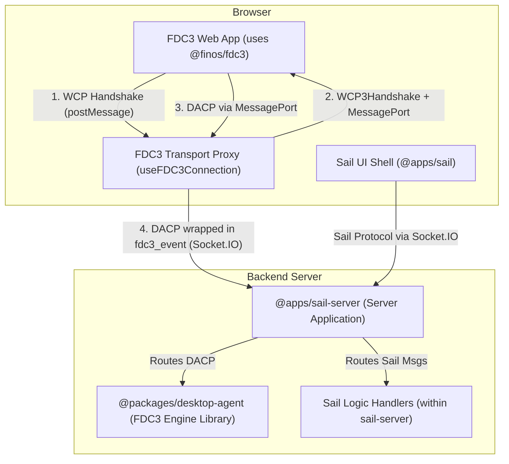

# FDC3 Desktop Agent Architecture

## Overview

This package implements a **pure, spec-compliant FDC3 Desktop Agent Engine**. Its sole responsibility is to manage the state of an FDC3-enabled environment (applications, channels, intents, context data) and handle interoperability by processing messages that conform to the **Desktop Agent Communication Protocol (DACP)**.

This package is designed as a reusable library, decoupled from any specific transport layer or proprietary application logic. It is consumed by a server application (in our case, `@apps/sail-socket`) which is responsible for orchestration.

## Architectural Principles

### 1. Separation of Concerns

The system is designed as a two-part architecture to maintain a clean separation between FDC3-standard logic and platform-specific logic.

*   `@packages/desktop-agent` (this package): The FDC3 Engine.
*   `@apps/sail-socket`: The Server Application that uses this engine and adds proprietary Sail features.



### 2. Protocol Definitions

*   **DACP (Desktop Agent Communication Protocol)**: The FDC3-standard wire protocol that defines the JSON message format for all FDC3 API operations. This package is the engine for processing these messages.
*   **WCP (Web Connection Protocol)**: The FDC3-standard handshake protocol for establishing a trusted connection between a web app and the desktop agent. It uses a `MessageChannel` and `MessagePort` as its transport layer.
*   **Sail Protocol**: A proprietary protocol running over Socket.IO used for features specific to the Sail platform (e.g., layout management, custom authentication).

### 3. Handler Organization

This package organizes its DACP handlers by FDC3 domain, promoting testability and maintainability.

```typescript
// packages/desktop-agent/src/
├── handlers/
│   ├── dacp/                       // FDC3 Standard (DACP compliant)
│   │   ├── context.handlers.ts     // Broadcast/listen functions
│   │   ├── intent.handlers.ts      // Intent resolution functions
│   │   ├── channel.handlers.ts     // Channel management functions
│   │   ├── app-management/         // App lifecycle handlers
│   │   │   └── app.handlers.ts     // getInfo, open, findInstances
│   │   ├── private-channels/       // Private channel handlers
│   │   │   └── private-channel.handlers.ts
│   │   └── index.ts               // DACP message router
│   │
│   └── validation/
│       ├── dacp-schemas.ts         // Auto-generated Zod schemas
│       └── dacp-validator.ts       // Validation utilities
│
├── state/                         // Core FDC3 state management
│   ├── AppInstanceRegistry.ts     // App instance lifecycle
│   ├── IntentRegistry.ts          // Intent handler registration
│   └── PrivateChannelRegistry.ts  // Private channel management
│
└── app-directory/                 // FDC3 app directory
    └── appDirectoryManager.ts
```

### 4. Schema-First Validation

All incoming DACP messages are validated against auto-generated Zod schemas derived from the official FDC3 JSON Schema definitions.

*   **Single Source of Truth**: TypeScript types are inferred from the validation schemas.
*   **Future-Proof**: FDC3 specification updates can be easily integrated by re-running the generation script.
*   **Runtime Safety**: Ensures all messages processed by the engine are compliant.

## Message Flow Architecture

### FDC3 Message Flow (DACP with Transport Abstraction)

This Desktop Agent is **transport-agnostic** and only processes DACP messages. A **transport proxy layer** sits between FDC3 apps and the Desktop Agent.

#### Complete Flow (Socket.IO Transport Example)

1.  **WCP Handshake**: An FDC3 app (using `@finos/fdc3`) sends a `WCP1Hello` via `postMessage` to the parent window
2.  **Proxy Setup**: The FDC3 Transport Proxy (e.g., `useFDC3Connection` hook in parent window):
    - Creates a `MessageChannel`
    - Responds with `WCP3Handshake`, transferring `port1` to the FDC3 app
    - Establishes transport connection (Socket.IO, MessagePort, etc.)
3.  **DACP Forwarding**: The proxy bridges the app's MessagePort (`port2`) to the chosen transport:
    - **Inbound**: App sends DACP via `port2` → Proxy forwards over Socket.IO (`fdc3_event`)
    - **Outbound**: Desktop Agent sends DACP response → Proxy posts back to app via `port2`
4.  **Desktop Agent Processing**: This package receives pure DACP messages and:
    - Validates against FDC3 schemas
    - Processes using state registries (AppInstanceRegistry, IntentRegistry, etc.)
    - Returns DACP-compliant responses
5.  **State Management**: Desktop Agent maintains FDC3 state independently of transport
6.  **Integration**: Desktop Agent integrates with Sail's app lifecycle while remaining transport-agnostic

#### Why This Matters

- **FDC3 Apps**: Use standard `@finos/fdc3` library unchanged, always use WCP/MessagePort
- **Transport Proxy**: Handles WCP handshake and routes DACP to appropriate transport (Socket.IO, direct MessagePort, REST, etc.)
- **Desktop Agent**: Receives and processes only DACP messages, never knows about underlying transport
- **Flexibility**: Same Desktop Agent works locally (MessagePort) or remotely (Socket.IO) without modification

```typescript
// Simplified Flow within this package

// 1. A DACP message is received by a handler
async function handleBroadcastRequest(
  message: unknown,
  context: DACPHandlerContext
): Promise<void> {
  // 2. The message is validated against its specific schema
  const request = validateDACPMessage(message, BroadcastRequestSchema);

  // 3. The handler executes the core logic using state registries
  // - Find listeners in AppInstanceRegistry
  // - Broadcast context to appropriate instances
  await processBroadcast(
    request.payload.channelId,
    request.payload.context,
    context.fdc3Server.appInstanceRegistry
  );

  // 4. A DACP-compliant response is created and sent back
  const response = createDACPSuccessResponse(request, 'broadcastResponse');
  context.messagePort.postMessage(response);
}
```

### Core State Management

This desktop agent maintains three core registries for FDC3 compliance:

**AppInstanceRegistry**: Tracks all connected applications, their state, channel membership, and active listeners.

**IntentRegistry**: Manages intent handlers across all applications, enabling intent resolution and routing.

**PrivateChannelRegistry**: Manages private channels and their participants for secure app-to-app communication.

These registries integrate with the existing `SailAppInstanceManager` for app lifecycle operations while maintaining clean separation between FDC3 standards and Sail-specific functionality.