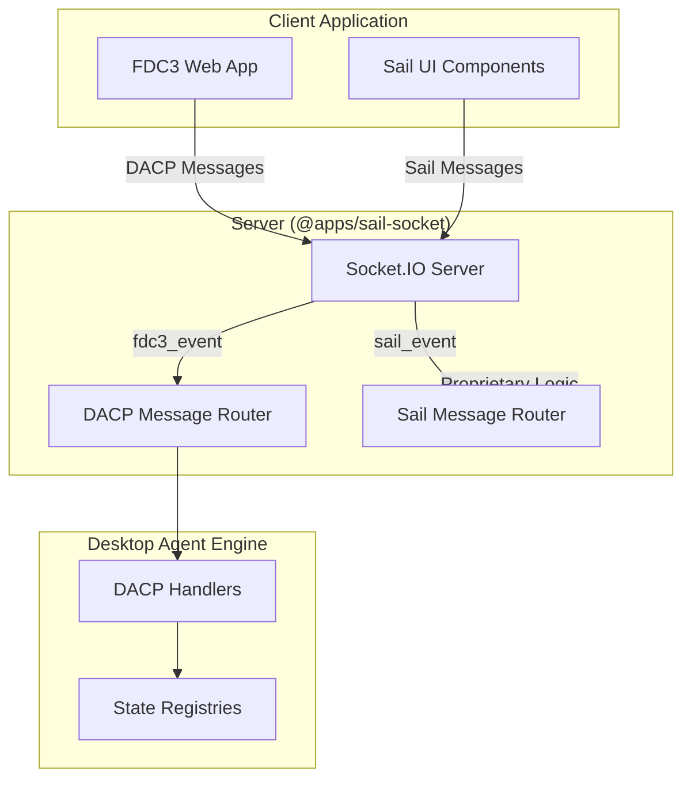

# FDC3 Sail Unified Protocol Convention

## Overview

The FDC3 Sail platform implements a **unified protocol convention** that clearly separates FDC3-standard messaging from proprietary Sail platform functionality using dedicated Socket.IO event channels.

## Protocol Architecture

### Two-Channel System

The system uses exactly **two Socket.IO event channels** to route all messages:

1. **`fdc3_event`** - For all DACP (Desktop Agent Communication Protocol) messages
2. **`sail_event`** - For all proprietary Sail platform messages

```typescript
// Protocol Event Names (from sail-messages.ts)
export const SailMessages = {
  // ... message type definitions ...

  // Protocol Event Names
  SAIL_EVENT: "sail_event", // Socket.IO event for all Sail platform messages
  FDC3_EVENT: "fdc3_event", // Socket.IO event for all DACP messages
} as const
```

### Message Flow Architecture



## Protocol Conventions

### 1. FDC3 Event Channel (`fdc3_event`)

**Purpose**: Handles all FDC3-standard DACP (Desktop Agent Communication Protocol) messages.

**Message Structure**:
```typescript
// All DACP messages follow this structure
interface DACPMessage {
  type: string         // DACP message type (e.g., "broadcastRequest")
  meta: DACPMeta      // Standard DACP metadata
  payload: any        // Message-specific payload
}
```

**Usage Examples**:
```typescript
// Client sending DACP message
socket.emit('fdc3_event', {
  type: 'broadcastRequest',
  meta: { requestId: 'req-123', source: { appId: 'app1', instanceId: 'inst1' } },
  payload: { context: { type: 'fdc3.instrument', id: { ticker: 'AAPL' } } }
}, 'source-instance-id')

// Server handling DACP messages
socket.on('fdc3_event', async (dacpMessage: DACPMessage, sourceId: string) => {
  await routeDACPMessage(dacpMessage, sourceId, context)
})
```

**Routing**: All `fdc3_event` messages are routed through the desktop agent engine's DACP handlers.

### 2. Sail Event Channel (`sail_event`)

**Purpose**: Handles all proprietary Sail platform messages for UI management, layout, authentication, etc.

**Message Structure**:
```typescript
// All Sail messages follow this structure
interface SailMessage {
  type: string         // Sail message type (e.g., "sailAppOpen")
  payload: any        // Message-specific payload
  meta?: any          // Optional metadata
}
```

**Usage Examples**:
```typescript
// Client sending Sail message
socket.emit('sail_event', {
  type: 'sailAppOpen',
  payload: { appId: 'calculator', layoutPosition: 'center' }
}, (response) => {
  console.log('App opened:', response)
})

// Server handling Sail messages
socket.on('sail_event', async (sailMessage: SailMessage, callback?: SocketIOCallback<any>) => {
  await routeSailMessage(sailMessage, callback, context)
})
```

**Routing**: All `sail_event` messages are handled by proprietary Sail platform logic.

## Implementation Details

### Server-Side Handler Registration

```typescript
// Register FDC3 DACP handler (in appManagement.handlers.ts)
socket.on(SailMessages.FDC3_EVENT, async (dacpMessage: DACPMessage, sourceId: string) => {
  await routeDACPMessage(dacpMessage, sourceId, context)
})

// Register Sail platform handler (in desktopAgentCore.handlers.ts)
socket.on(SailMessages.SAIL_EVENT, async (sailMessage: SailMessage, callback?: SocketIOCallback<any>) => {
  await routeSailMessage(sailMessage, callback, context)
})
```

### Message Emission to Clients

```typescript
// Sending DACP response to client
instance.socket?.emit('fdc3_event', dacpResponse)

// Sending Sail platform message to client
instance.socket?.emit('sail_event', sailResponse)
```

## Protocol Benefits

### 1. **Clear Separation of Concerns**
- FDC3-standard logic is cleanly separated from proprietary Sail features
- Easy to maintain FDC3 compliance
- Clear boundaries for testing and debugging

### 2. **Socket.IO Best Practices**
- Uses single event channels instead of creating multiple event listeners per message type
- Reduces memory overhead and improves performance
- Simplifies client-side event handling

### 3. **Extensibility**
- New FDC3 messages can be added without changing the protocol structure
- Sail platform features can evolve independently
- Easy to add new protocol channels if needed in the future

### 4. **Type Safety**
- Strong TypeScript typing for both protocol channels
- Message validation at protocol boundaries
- Clear interfaces for all message types

## Message Type Mappings

### FDC3 Event Channel Messages (`fdc3_event`)
- All DACP messages defined in `@finos/fdc3-standard`
- Examples: `broadcastRequest`, `addContextListenerRequest`, `raiseIntentRequest`, etc.

### Sail Event Channel Messages (`sail_event`)
- App management: `sailAppOpen`, `sailAppState`, `daRegisterAppLaunch`
- Context operations: `sailBroadcastContext`
- Channel management: `sailChannelSetup`, `sailChannelChange`
- Intent resolution: `sailIntentResolve`, `sailIntentResolveOnChannel`
- Handshake: `daHello`, `appHello`, `sailClientState`

## Error Handling

### Protocol-Level Errors
- Invalid message structure triggers validation errors
- Unrecognized message types are logged and ignored
- Transport errors are handled by Socket.IO layer

### Message-Level Errors
- DACP messages follow FDC3 error response patterns
- Sail messages use callback-based error reporting
- All errors include proper error codes and descriptive messages

## Performance Considerations

### Connection Management
- Single Socket.IO connection per client application
- Message multiplexing over two event channels
- Automatic reconnection and message queuing

### Message Routing
- O(1) message type lookup and routing
- Minimal protocol overhead
- Efficient JSON serialization/deserialization

## Compliance

### FDC3 Compliance
- All DACP messages conform to FDC3 2.2 specification
- Message validation ensures specification compliance
- Standard error response formats maintained

### Backwards Compatibility
- Protocol versioning supports future FDC3 spec updates
- Graceful handling of unknown message types
- Client/server version negotiation support

## Debugging and Monitoring

### Logging
- Protocol-level message tracing available
- Separate log channels for FDC3 and Sail messages
- Performance metrics and message statistics

### Development Tools
- Message inspection utilities
- Protocol validation in development mode
- Comprehensive test coverage for both channels