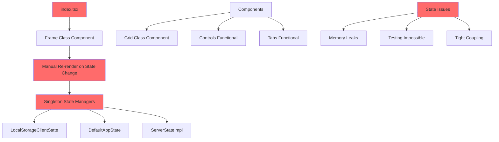
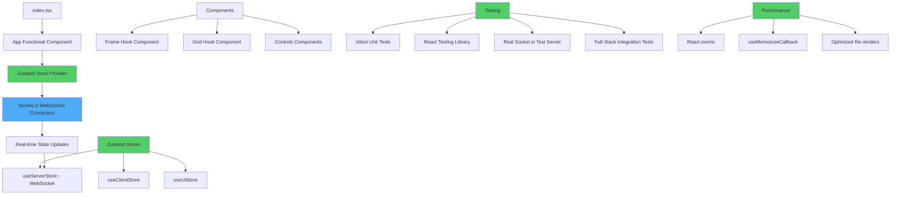

# FDC3 Sail Web Refactoring Plan

## Executive Summary

This document outlines a comprehensive refactoring plan for the `packages/web/` directory to modernize the React codebase, implement proper testing with Vitest, and migrate from singleton state management to Zustand. The goal is to improve code quality, maintainability, and developer experience while ensuring zero breaking changes to existing functionality.

## Current Architecture Issues

### 🔴 Critical Problems
- **No testing framework** - Zero test coverage
- **Class components** with manual re-renders 
- **Singleton state pattern** creating tight coupling
- **Performance issues** from forced re-renders
- **Type safety gaps** with non-null assertions

### 📊 Current Architecture Diagram



## Target Architecture

### 🎯 Proposed Architecture with Zustand + Vitest



## Migration Strategy

### Phase 1: Foundation Setup (Week 1)
**Goal**: Establish testing infrastructure and modern tooling

#### 1.1 Testing Infrastructure
```json
// package.json additions
{
  "devDependencies": {
    "vitest": "^1.0.0",
    "@testing-library/react": "^14.0.0",
    "@testing-library/jest-dom": "^6.0.0",
    "@testing-library/user-event": "^14.0.0",
    "jsdom": "^23.0.0",
    "get-port": "^7.0.0"
  },
  "dependencies": {
    "zustand": "^4.4.0"
  },
  "scripts": {
    "test": "vitest",
    "test:ui": "vitest --ui",
    "test:coverage": "vitest --coverage",
    "test:watch": "vitest --watch"
  }
}
```

#### 1.2 Vitest Configuration
```typescript
// vitest.config.ts
import { defineConfig } from 'vitest/config'
import { resolve } from 'path'

export default defineConfig({
  test: {
    environment: 'jsdom',
    setupFiles: ['./src/test/setup.ts'],
    coverage: {
      provider: 'v8',
      reporter: ['text', 'json', 'html'],
      exclude: ['node_modules/', 'src/test/']
    }
  },
  resolve: {
    alias: {
      '@': resolve(__dirname, './src')
    }
  }
})
```

#### 1.3 Test Setup - Real Socket.io Server
```typescript
// src/test/setup.ts
import '@testing-library/jest-dom'
import { beforeAll, afterAll } from 'vitest'
import { createTestServer } from './test-server'

let testServer: any

beforeAll(async () => {
  testServer = await createTestServer()
})

afterAll(async () => {
  if (testServer) {
    await testServer.close()
  }
})

// src/test/test-server.ts - Use real server from monorepo
import { createServer } from 'http'
import { Server as SocketServer } from 'socket.io'
import getPort from 'get-port'
// Import your actual server setup from ../server package
import { setupSocketHandlers } from '@finos/fdc3-sail-server/socket-handlers'

export const createTestServer = async () => {
  const httpServer = createServer()
  const io = new SocketServer(httpServer, {
    cors: { origin: "*" }
  })
  
  // Use the actual server socket handlers
  setupSocketHandlers(io)
  
  const port = await getPort()
  
  return new Promise((resolve, reject) => {
    httpServer.listen(port, (err?: Error) => {
      if (err) reject(err)
      else resolve({
        port,
        close: () => new Promise(resolveClose => {
          httpServer.close(() => resolveClose(void 0))
        })
      })
    })
  })
}

// src/test/utils/socket-test-utils.ts
import { io } from 'socket.io-client'

export const createTestClient = (port: number) => {
  return io(`http://localhost:${port}`, {
    autoConnect: false
  })
}
```

### Phase 2: Zustand State Migration (Week 2-3)
**Goal**: Replace singleton pattern with Zustand stores

#### 2.1 Store Definitions
```typescript
// src/stores/useClientStore.ts
import { create } from 'zustand'
import { devtools, persist } from 'zustand/middleware'

interface ClientState {
  activeTab: Tab
  tabs: Tab[]
  panels: AppPanel[]
  contextHistory: ContextHistory[]
  // Actions
  setActiveTab: (tab: Tab) => void
  addPanel: (panel: AppPanel) => void
  removePanel: (panelId: string) => void
}

export const useClientStore = create<ClientState>()(
  devtools(
    persist(
      (set, get) => ({
        activeTab: defaultTab,
        tabs: [defaultTab],
        panels: [],
        contextHistory: [],
        
        setActiveTab: (tab) => set({ activeTab: tab }),
        addPanel: (panel) => set((state) => ({ 
          panels: [...state.panels, panel] 
        })),
        removePanel: (panelId) => set((state) => ({
          panels: state.panels.filter(p => p.panelId !== panelId)
        }))
      }),
      { name: 'client-store' }
    )
  )
)
```

#### 2.2 WebSocket State with Zustand
```typescript
// src/stores/useServerStore.ts
import { create } from 'zustand'
import { devtools } from 'zustand/middleware'
import { io, Socket } from 'socket.io-client'

interface ServerState {
  socket: Socket | null
  isConnected: boolean
  appStates: SailAppStateArgs
  // Actions
  connect: () => void
  disconnect: () => void
  registerAppLaunch: (params: AppLaunchParams) => Promise<string>
  intentChosen: (requestId: string, app: string, intent: string, channel: string) => void
}

export const useServerStore = create<ServerState>()(
  devtools((set, get) => ({
    socket: null,
    isConnected: false,
    appStates: [],
    
    connect: () => {
      const socket = io('ws://localhost:8090')
      
      socket.on('connect', () => {
        set({ isConnected: true })
      })
      
      socket.on('disconnect', () => {
        set({ isConnected: false })
      })
      
      socket.on('appStateUpdate', (states: SailAppStateArgs) => {
        set({ appStates: states })
      })
      
      set({ socket })
    },
    
    registerAppLaunch: async (params) => {
      const { socket } = get()
      return new Promise((resolve, reject) => {
        if (!socket?.connected) {
          reject(new Error('Socket not connected'))
          return
        }
        
        socket.emit('registerAppLaunch', params, (response: { instanceId: string }) => {
          resolve(response.instanceId)
        })
      })
    },
    
    intentChosen: (requestId, app, intent, channel) => {
      const { socket } = get()
      socket?.emit('intentChosen', { requestId, app, intent, channel })
    },
    
    disconnect: () => {
      const { socket } = get()
      socket?.disconnect()
      set({ socket: null, isConnected: false })
    }
  }))
)
```

### Phase 3: Component Modernization (Week 4-5)
**Goal**: Convert class components to hooks with comprehensive testing

#### 3.1 Frame Component Refactor
```typescript
// src/client/frame/Frame.test.tsx
import { describe, it, expect } from 'vitest'
import { render, screen } from '@testing-library/react'
import { Frame } from './Frame'

describe('Frame Component', () => {
  it('renders main layout structure', () => {
    render(<Frame />)
    
    expect(screen.getByTestId('frame-top')).toBeInTheDocument()
    expect(screen.getByTestId('frame-left')).toBeInTheDocument()
    expect(screen.getByTestId('frame-main')).toBeInTheDocument()
  })
  
  it('handles popup state correctly', async () => {
    const { user } = setup(<Frame />)
    
    await user.click(screen.getByTestId('new-panel-button'))
    expect(screen.getByTestId('appd-panel')).toBeInTheDocument()
  })
})
```

#### 3.2 Modern Frame Component
```typescript
// src/client/frame/Frame.tsx
import { useState, useCallback } from 'react'
import { useClientStore } from '@/stores/useClientStore'

enum Popup {
  NONE = 'none',
  APPD = 'appd',
  SETTINGS = 'settings',
  RESOLVER = 'resolver',
  CONTEXT_HISTORY = 'context_history'
}

export const Frame = () => {
  const [popup, setPopup] = useState<Popup>(Popup.NONE)
  const { activeTab } = useClientStore()
  
  const closePopup = useCallback(() => setPopup(Popup.NONE), [])
  
  return (
    <div className={styles.outer} data-testid="frame">
      <div className={styles.top} data-testid="frame-top">
        <Logo />
        <ContextHistory 
          onClick={() => setPopup(Popup.CONTEXT_HISTORY)}
        />
        <Settings onClick={() => setPopup(Popup.SETTINGS)} />
      </div>
      
      <div className={styles.left} data-testid="frame-left">
        <Tabs />
        <Controls>
          <NewPanel onClick={() => setPopup(Popup.APPD)} />
          <Bin />
        </Controls>
      </div>
      
      <main 
        className={styles.main} 
        data-testid="frame-main"
        style={{ border: `1px solid ${activeTab.background}` }}
      >
        <Grids />
      </main>
      
      {popup === Popup.APPD && (
        <AppDPanel closeAction={closePopup} />
      )}
    </div>
  )
}
```

### Phase 4: Performance Optimization (Week 6)
**Goal**: Optimize renders and add memoization

#### 4.1 Memoized Components
```typescript
// src/client/grid/Grid.tsx
import { memo, useMemo } from 'react'

export const Grid = memo(({ panels }: { panels: AppPanel[] }) => {
  const sortedPanels = useMemo(() => 
    panels.sort((a, b) => a.order - b.order),
    [panels]
  )
  
  return (
    <div className={styles.grids} data-testid="grid">
      {sortedPanels.map(panel => (
        <AppFrame key={panel.panelId} panel={panel} />
      ))}
    </div>
  )
})
```

#### 4.2 Custom Hooks for Complex Logic
```typescript
// src/hooks/useGridManagement.ts
export const useGridManagement = () => {
  const { panels, removePanel } = useClientStore()
  
  const handlePanelClose = useCallback((panelId: string) => {
    removePanel(panelId)
  }, [removePanel])
  
  return {
    panels,
    handlePanelClose
  }
}
```

## Testing Strategy

### Unit Tests (70% coverage target)
- **Components**: All UI components with user interactions
- **Hooks**: Custom hooks with edge cases
- **Utilities**: Pure functions and helpers
- **Stores**: Zustand store actions and state changes

### Integration Tests (20% coverage target)
- **User workflows**: Complete user journeys (open app, switch tabs)
- **State synchronization**: Cross-store interactions
- **API integration**: Server communication flows

### E2E Tests (10% coverage target)
- **Critical paths**: App launch → use → close
- **Cross-iframe communication**: FDC3 protocol testing

### Test Examples

```typescript
// Component Test
describe('Controls', () => {
  it('should add new panel when clicking add button', async () => {
    const { user } = setup(<Controls />)
    const initialPanelCount = useClientStore.getState().panels.length
    
    await user.click(screen.getByTestId('add-panel'))
    
    expect(useClientStore.getState().panels).toHaveLength(initialPanelCount + 1)
  })
})

// Store Test  
describe('useClientStore', () => {
  it('should remove panel by id', () => {
    const store = useClientStore.getState()
    store.addPanel(mockPanel)
    
    store.removePanel(mockPanel.panelId)
    
    expect(store.panels.find(p => p.panelId === mockPanel.panelId)).toBeUndefined()
  })
})

// Socket Integration Test
describe('useServerStore', () => {
  let testClient: any
  let store: any
  
  beforeEach(async () => {
    const { port } = await createTestServer()
    testClient = createTestClient(port)
    store = useServerStore.getState()
    await new Promise(resolve => {
      testClient.connect()
      testClient.on('connect', resolve)
    })
  })
  
  afterEach(() => {
    testClient?.disconnect()
  })
  
  it('should register app launch and receive instanceId', async () => {
    const result = await store.registerAppLaunch({
      appId: 'test-app',
      hosting: 'frame'
    })
    
    expect(result).toBeDefined()
    expect(typeof result).toBe('string')
  })
})

// Full-Stack Integration Test
describe('App Launch Flow', () => {
  it('should launch app, communicate with server, and display in grid', async () => {
    const { user } = setup(<Frame />)
    
    await user.click(screen.getByTestId('new-panel-button'))
    await user.click(screen.getByText('Test App'))
    
    // Wait for WebSocket communication
    await waitFor(() => {
      expect(screen.getByTestId('app-frame')).toBeInTheDocument()
    })
    
    // Verify server state was updated
    const serverStore = useServerStore.getState()
    expect(serverStore.appStates.length).toBeGreaterThan(0)
  })
})
```

## Migration Checklist

### Phase 1: Foundation ✅
- [ ] Install Vitest and testing dependencies
- [ ] Configure vitest.config.ts
- [ ] Set up test utilities and mocks
- [ ] Add CI/CD test pipeline
- [ ] Create initial test examples

### Phase 2: State Migration ✅
- [ ] Create Zustand stores (client, app, UI)
- [ ] Set up React Query for server state
- [ ] Add store tests
- [ ] Create migration utilities
- [ ] Gradual migration of singleton usage

### Phase 3: Component Migration ✅
- [ ] Convert Frame class → hooks
- [ ] Convert Grid class → hooks  
- [ ] Add comprehensive component tests
- [ ] Remove manual re-render logic
- [ ] Add proper TypeScript types

### Phase 4: Performance & Polish ✅
- [ ] Add React.memo where needed
- [ ] Implement custom hooks
- [ ] Add error boundaries
- [ ] Performance testing and optimization
- [ ] Documentation updates

## Risk Mitigation

### Technical Risks
1. **Breaking Changes**: Feature flags for gradual rollout
2. **Performance Regression**: Before/after performance benchmarks
3. **State Synchronization**: Comprehensive integration tests
4. **Type Safety**: Strict TypeScript configuration

### Timeline Risks
1. **Scope Creep**: Fixed scope per phase
2. **Resource Constraints**: Parallel development where possible
3. **Testing Overhead**: Automated test generation tools

## Success Metrics

- **Test Coverage**: >80% overall, >90% for critical paths
- **Performance**: <100ms for state updates, <1s for app launches
- **Developer Experience**: Hot reload <200ms, test execution <5s
- **Code Quality**: ESLint score >95%, zero TypeScript errors
- **Bundle Size**: <10% increase from current build

## Post-Migration Benefits

1. **Maintainability**: Modern React patterns, comprehensive tests
2. **Developer Experience**: Fast feedback loops, type safety
3. **Performance**: Optimized renders, efficient state updates
4. **Scalability**: Modular architecture, easy to extend
5. **Quality**: Automated testing prevents regressions

---

*This refactoring plan prioritizes incremental delivery and risk mitigation while modernizing the entire frontend architecture. Each phase delivers measurable value and can be deployed independently.*