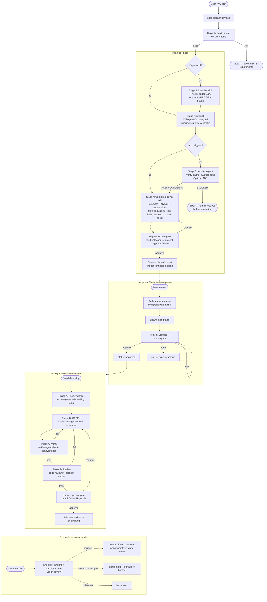
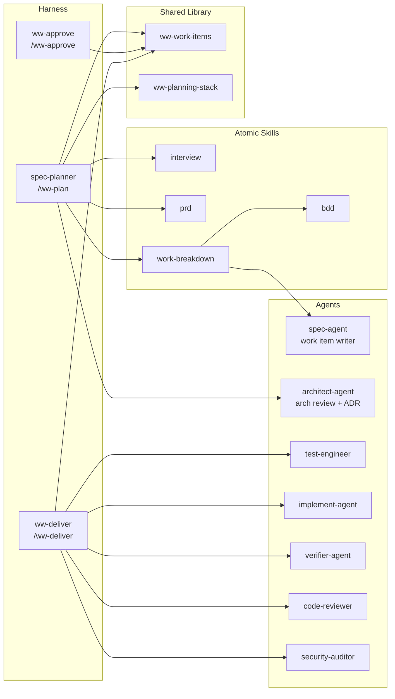

# Watson Workflow

Full lifecycle for the FDC3-Sail Watson planning and delivery workflow.

---

## Commands

| Command | What it does |
|---|---|
| `/ww-plan` | Plan: interview → PRD → arch review → work breakdown → human gate |
| `/ww-approve` | Review and approve draft work items (standalone, after a break) |
| `/ww-deliver` | Implement one approved work item (RED → GREEN → verify → review) |
| `/ww-reconcile` | Sync PR status after merge; archive done items |

---

## Full lifecycle diagram



---

## Skill and agent map



---

## Automation tiers

| Tier | After human `approve` at delivery gate |
|---|---|
| `stage_only` | Stage files only — human commits manually |
| `commit_push` | Commit + push branch → `status: committed` |
| `draft_pr` | Commit + push + open draft PR → `status: pr_awaiting` |

This repo default: **`commit_push`**. Set per-workload in `plans/workflow-config.yaml` under `workloads:`.

---

## Status lifecycle

```
draft
  → approved          (human gate in /ww-plan or /ww-approve)
       → in-progress  (/ww-deliver start)
            → blocked        (waiting on human decision)
            → waiting_on_user (staged, human review gate)
                 → committed / pr_awaiting
                      → done (after merge via /ww-reconcile)
            → escalated      (loop_count ≥ loop_limit → dead-letter)
```

Full status fields and automation tier mapping:
`.cursor/skills/ww-work-items/references/status-lifecycle.md`

PR reconcile procedure:
`.cursor/skills/ww-work-items/references/reconcile.md`

---

## Continual learning

Runs automatically after the session ends when:
- ≥ 10 turns since last run, AND
- ≥ 2 hours since last run, AND
- Transcript has advanced

Invoke manually anytime: *"run continual-learning now"*

Updates `## Learned User Preferences` and `## Learned Workspace Facts` in `AGENTS.md`.
State: `.cursor/hooks/state/continual-learning.json`
Index: `.cursor/hooks/state/continual-learning-index.json`
