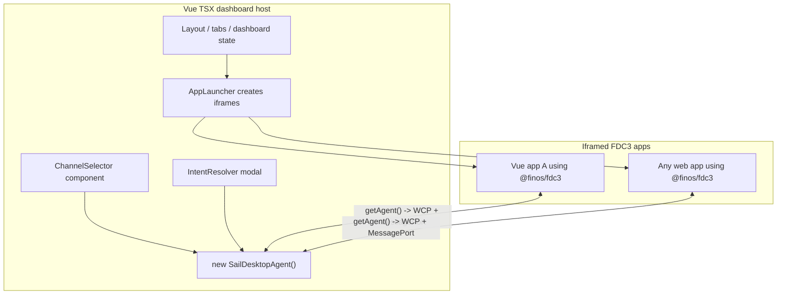
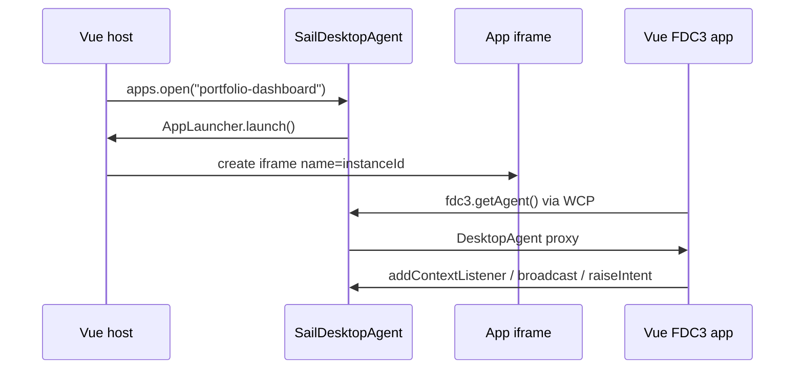

# Sail Desktop Agent Vue Consumer Guide

This is a standalone handoff for the Vue dashboard owner. That team is responsible for adding `@finos/sail-desktop-agent` to the dashboard host and giving app teams the `@finos/fdc3` pattern for their iframe apps.

The important split is:

- The **Vue dashboard** is the host shell. It can be fully componentized with Vue/TSX components for layout, tabs, toolbar controls, app tiles, channel UI, and resolver UI. It creates one `SailDesktopAgent`, launches app iframes, and listens for app lifecycle events.
- The **hosted apps** may also be componentized Vue apps, but they become separate FDC3 apps only when each app runs inside its own iframe or child-window browsing context. Inside that iframe, the app uses `@finos/fdc3` and `fdc3.getAgent()`. It should not import `@finos/sail-desktop-agent`.



## What They Need

Package ownership:

- The **dashboard host** installs and imports `@finos/sail-desktop-agent`.
- Each **iframe app** installs and imports `@finos/fdc3`.
- The dashboard may also keep `@finos/fdc3` as a dependency for shared FDC3 types, but app code is the only place that should call `fdc3.getAgent()`.

Your initial list is the right starting point:

- `ChannelSelector`
- `IntentResolver`
- `CustomLauncher`
- a way for iframe apps to call `fdc3.getAgent()`

Add these items to the handoff checklist:

- A single `SailDesktopAgent` instance for the lifetime of the host page.
- An FDC3 app directory, either loaded with `apps.addDirectory("/apps.json")` or registered in memory with `apps.addAll([...])`.
- An `AppLauncher` that creates iframes and sets `iframe.name` to the returned `instanceId`. This is how Sail correlates the host-created iframe with the app's `getAgent()` handshake.
- Host-owned `ChannelSelector` UI wired to `desktopAgent.channels`.
- Host-owned `IntentResolver` UI wired to `desktopAgent.intentResolver`.
- Lifecycle listeners for app connect, disconnect, handshake failure, and host tab close.
- A clear boundary: same-page Vue components are host UI; componentized apps inside iframes or child windows are FDC3 apps.
- Security decisions for allowed app URLs, iframe sandboxing, CSP, and which origins are allowed in the app directory.
- Teardown rules: call `apps.disconnect(instanceId)` when the host closes a tab; implement `AppLauncher.close` if you support app-initiated `fdc3.close()`.

## Foreseeable Issues

- **Iframe root not mounted yet:** the launcher must fail loudly if the iframe container is missing. If it returns an `instanceId` without mounting the iframe, `fdc3.getAgent()` in the app will time out.
- **Instance cleanup:** keep a host-side map of `instanceId` to iframe element. Avoid relying only on CSS selectors for cleanup, because instance IDs are protocol values and should not become fragile selector strings.
- **Vue lifecycle:** create controller subscriptions inside `setup()` and unsubscribe in `onUnmounted()`. Async FDC3 listener registration should also clean up if the component unmounts before the promise resolves.
- **Independent launches:** a page opened without an iframe parent or `window.opener` cannot discover the in-page Sail agent through standard `@finos/fdc3` discovery. Do not solve this by importing `@finos/sail-desktop-agent` into app code.
- **Component boundary:** a Vue component rendered directly in the dashboard is not a separate FDC3 app. The same component packaged behind an iframe URL can be a separate FDC3 app because the iframe gives it its own browsing-context identity.
- **Security policy:** decide allowed app origins, iframe `sandbox`, CSP, and whether apps need capabilities such as clipboard access before production.
- **Intent resolver timeout:** if the modal never calls `select` or `cancel`, the raising app will eventually see a timeout or cancellation. Always complete every resolver request.

## Host Setup

Install the host package in the dashboard:

```bash
npm install @finos/sail-desktop-agent
```

Create one agent and expose it to Vue through the dashboard's existing dependency injection, store, or service layer.

```tsx
// sail-agent.ts
import { SailDesktopAgent } from "@finos/sail-desktop-agent"
import type { AppLauncher } from "@finos/sail-desktop-agent"

const iframeRoot = () => document.getElementById("fdc3-apps")
const appFrames = new Map<string, HTMLIFrameElement>()

export function removeAppFrame(instanceId: string) {
  appFrames.get(instanceId)?.remove()
  appFrames.delete(instanceId)
}

const appLauncher: AppLauncher = {
  async launch(request, app) {
    const instanceId = request.app?.instanceId ?? crypto.randomUUID()
    const url = app.type === "web" ? String(app.details?.url ?? "") : ""
    const root = iframeRoot()

    if (!url) {
      throw new Error(`App ${app.appId} does not have a web launch URL`)
    }

    if (!root) {
      throw new Error("Missing #fdc3-apps iframe container")
    }

    const iframe = document.createElement("iframe")
    iframe.name = instanceId
    iframe.src = url
    iframe.dataset.appId = app.appId
    iframe.dataset.instanceId = instanceId
    iframe.allow = "clipboard-read; clipboard-write"

    appFrames.set(instanceId, iframe)
    root.appendChild(iframe)

    return { appId: app.appId, instanceId }
  },

  async close(instanceId) {
    removeAppFrame(instanceId)
  },
}

declare global {
  interface Window {
    __sailDesktopAgent?: SailDesktopAgent
  }
}

export function getSailDesktopAgent() {
  if (!window.__sailDesktopAgent) {
    window.__sailDesktopAgent = new SailDesktopAgent({
      appLauncher,
      appConnectionOptions: {
        channelSelectorUrl: false,
        intentResolverUrl: false,
      },
    })
  }

  return window.__sailDesktopAgent
}

export function stopSailDesktopAgent() {
  window.__sailDesktopAgent?.stop()
  window.__sailDesktopAgent = undefined
  for (const iframe of appFrames.values()) {
    iframe.remove()
  }
  appFrames.clear()
}
```

At dashboard startup, load the app directory and subscribe to lifecycle events.

```tsx
// dashboard-bootstrap.ts
import { getSailDesktopAgent, removeAppFrame } from "./sail-agent"

export async function initializeDashboardFdc3() {
  const desktopAgent = getSailDesktopAgent()
  const { apps, channels, intentResolver } = desktopAgent

  await apps.addDirectory("/apps.json")

  const offConnect = apps.onConnect(meta => {
    console.log("FDC3 app connected", meta.appId, meta.instanceId)
  })

  const offDisconnect = apps.onDisconnect(instanceId => {
    removeAppFrame(instanceId)
  })

  const offHandshakeFailure = apps.onHandshakeFailure(({ error, connectionAttemptUuid }) => {
    console.error("FDC3 app failed to connect", connectionAttemptUuid, error)
  })

  function dispose() {
    offConnect()
    offDisconnect()
    offHandshakeFailure()
  }

  return { desktopAgent, apps, channels, intentResolver, dispose }
}
```

## Vue TSX Provider

Use whatever state pattern the dashboard already has. This example uses Vue `provide` / `inject` so TSX components can share the same controllers.

```tsx
// SailProvider.tsx
import { defineComponent, inject, onUnmounted, provide, type InjectionKey } from "vue"
import { getSailDesktopAgent, stopSailDesktopAgent } from "./sail-agent"

const SailAgentKey: InjectionKey<ReturnType<typeof getSailDesktopAgent>> = Symbol("SailAgent")

export function useSailAgent() {
  const agent = inject(SailAgentKey)
  if (!agent) {
    throw new Error("Sail agent has not been provided")
  }
  return agent
}

export const SailProvider = defineComponent({
  name: "SailProvider",
  setup(_, { slots }) {
    const agent = getSailDesktopAgent()
    provide(SailAgentKey, agent)

    onUnmounted(() => {
      stopSailDesktopAgent()
    })

    return () => slots.default?.()
  },
})
```

## Launching Apps

The host can launch apps through the Sail controller. The app directory provides the URL and FDC3 metadata.

```tsx
import { defineComponent } from "vue"
import { useSailAgent } from "./SailProvider"

export const AppLauncherButton = defineComponent({
  name: "AppLauncherButton",
  props: {
    appId: { type: String, required: true },
  },
  setup(props) {
    const { apps } = useSailAgent()

    async function openApp() {
      await apps.open(props.appId, {
        context: {
          type: "fdc3.instrument",
          id: { ticker: "AAPL" },
        },
      })
    }

    return () => <button onClick={openApp}>Open app</button>
  },
})
```

For host tab close, remove the iframe and disconnect the instance:

```tsx
import { useSailAgent } from "./SailProvider"
import { removeAppFrame } from "./sail-agent"

export function useHostTabActions() {
  const { apps } = useSailAgent()

  function closeHostTab(instanceId: string) {
    removeAppFrame(instanceId)
    apps.disconnect(instanceId)
  }

  return { closeHostTab }
}
```

Apps that are launched independently can only connect through standard `getAgent()` if they still have a browser relationship to the host, usually an iframe parent or `window.opener`. A page opened with no parent/opener cannot discover this browser-resident Sail agent through standard `@finos/fdc3` discovery. If independent launch is required, plan a separate app-connection or bridge instead of asking app code to import Sail internals.

## Channel Selector

Render channel chrome in the Vue host and call `channels.changeAppChannel(instanceId, channelId)`.

```tsx
import { defineComponent, onUnmounted, ref } from "vue"
import { useSailAgent } from "./SailProvider"

export const ChannelSelector = defineComponent({
  name: "ChannelSelector",
  props: {
    instanceId: { type: String, required: true },
  },
  setup(props) {
    const { channels } = useSailAgent()
    const selected = ref(channels.getAppChannelId(props.instanceId))
    const userChannels = channels.getUserChannels()

    const offChannel = channels.onAppChannelChange(event => {
      if (event.instanceId === props.instanceId) {
        selected.value = event.channelId
      }
    })

    onUnmounted(offChannel)

    return () => (
      <select
        value={selected.value ?? ""}
        onChange={event => {
          const value = (event.target as HTMLSelectElement).value
          void channels.changeAppChannel(props.instanceId, value || null)
        }}
      >
        <option value="">No channel</option>
        {userChannels.map(channel => (
          <option key={channel.id} value={channel.id}>
            {channel.displayMetadata?.name ?? channel.id}
          </option>
        ))}
      </select>
    )
  },
})
```

Do not call `fdc3.joinUserChannel()` from the host. That API is for iframe apps after `getAgent()` resolves. The host uses the Sail `channels` controller.

## Intent Resolver

When more than one app can handle an intent, Sail asks the host to pick a target. The Vue modal completes the request with `select` or `cancel`.

```tsx
import { defineComponent, onUnmounted, ref } from "vue"
import { useSailAgent } from "./SailProvider"

export const IntentResolverDialog = defineComponent({
  name: "IntentResolverDialog",
  setup() {
    const { intentResolver } = useSailAgent()
    const pending = ref(intentResolver.getPendingRequests()[0] ?? null)

    const offRequest = intentResolver.onRequest(request => {
      pending.value = request
    })

    onUnmounted(offRequest)

    return () => {
      const request = pending.value
      if (!request) return null

      const choices = request.choices ?? []

      return (
        <dialog open>
          <h2>Choose an app</h2>
          {choices.map(choice => (
            <button
              key={`${choice.intent.name}:${choice.handler.app.appId}:${choice.handler.instanceId ?? "new"}`}
              onClick={() => {
                intentResolver.select(request.requestId, choice)
                pending.value = null
              }}
            >
              {choice.handler.app.title ?? choice.handler.app.name ?? choice.handler.app.appId}
              {" - "}
              {choice.intent.displayName ?? choice.intent.name}
            </button>
          ))}
          <button
            onClick={() => {
              intentResolver.cancel(request.requestId)
              pending.value = null
            }}
          >
            Cancel
          </button>
        </dialog>
      )
    }
  },
})
```

Explicit app targets and unambiguous intent matches do not need this UI. The resolver appears only when the Desktop Agent needs user choice.

## App Directory Shape

The host needs app metadata before it can launch, validate, and route to apps. Keep the app directory aligned with the deployed app URLs.

```json
[
  {
    "appId": "portfolio-dashboard",
    "name": "portfolio-dashboard",
    "title": "Portfolio Dashboard",
    "type": "web",
    "details": {
      "url": "https://apps.example.com/portfolio/"
    },
    "intents": [
      {
        "name": "ViewInstrument",
        "displayName": "View Instrument",
        "contexts": ["fdc3.instrument"]
      }
    ]
  }
]
```

## Iframed Vue App Using `getAgent()`

In every FDC3 app, install and use `@finos/fdc3`. The app should work the same whether it is written in Vue, React, or plain TypeScript.

```bash
npm install @finos/fdc3
```

```tsx
// useFdc3Agent.ts
import { fdc3, type DesktopAgent } from "@finos/fdc3"
import { onMounted, ref } from "vue"

export function useFdc3Agent() {
  const agent = ref<DesktopAgent | null>(null)
  const error = ref<unknown>(null)

  onMounted(async () => {
    try {
      agent.value = await fdc3.getAgent()
    } catch (caught) {
      error.value = caught
    }
  })

  return { agent, error }
}
```

```tsx
// InstrumentWidget.tsx
import { defineComponent, onUnmounted, ref, watch } from "vue"
import { useFdc3Agent } from "./useFdc3Agent"

export const InstrumentWidget = defineComponent({
  name: "InstrumentWidget",
  setup() {
    const { agent, error } = useFdc3Agent()
    const ticker = ref("AAPL")
    let unsubscribe: (() => void) | undefined
    let disposed = false

    watch(
      agent,
      async currentAgent => {
        if (!currentAgent || unsubscribe || disposed) return

        const listener = await currentAgent.addContextListener("fdc3.instrument", context => {
          const nextTicker = context.id?.ticker
          if (typeof nextTicker === "string") {
            ticker.value = nextTicker
          }
        })

        if (disposed) {
          listener.unsubscribe()
          return
        }

        unsubscribe = () => listener.unsubscribe()
      },
      { immediate: true },
    )

    onUnmounted(() => {
      disposed = true
      unsubscribe?.()
    })

    async function broadcastInstrument() {
      await agent.value?.broadcast({
        type: "fdc3.instrument",
        id: { ticker: ticker.value },
      })
    }

    async function raiseViewChart() {
      await agent.value?.raiseIntent("ViewChart", {
        type: "fdc3.instrument",
        id: { ticker: ticker.value },
      })
    }

    return () => (
      <section>
        {error.value ? <p>FDC3 agent unavailable</p> : null}
        <p>Current instrument: {ticker.value}</p>
        <button onClick={broadcastInstrument}>Broadcast</button>
        <button onClick={raiseViewChart}>View chart</button>
      </section>
    )
  },
})
```

The app does not need to know that Sail is the host. `fdc3.getAgent()` discovers Sail through the browser Web Connection Protocol because the app is running inside an iframe or child window owned by the host.



## Common Gotchas

- If `getAgent()` times out, check that the app is in an iframe or child window with a parent/opener, the host agent has started, and the iframe `name` matches the launched `instanceId`.
- If intents do not resolve, check app directory `intents`, running listeners, and whether the `IntentResolverDialog` calls `select` or `cancel`.
- If channel UI does not update, subscribe to `channels.onAppChannelChange`; do not poll `desktopAgent.getState()`.
- If an app is just a Vue component rendered in the host page, treat it as host UI. Put it in an iframe if it needs its own FDC3 identity.
- If the host closes an iframe, call `apps.disconnect(instanceId)` so the Desktop Agent removes channel membership, listeners, and routing state.
