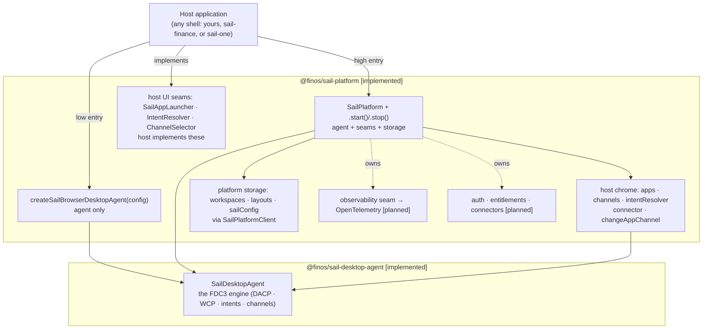
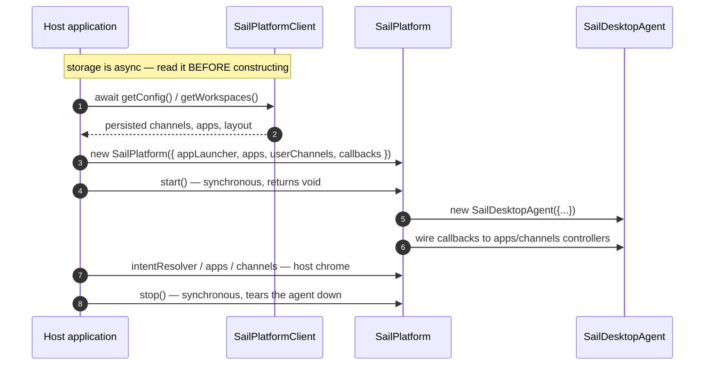

# Architecture Overview

This page is the single source of truth in these docs for how the FDC3 Sail packages compose: who
owns what, the two supported entry points, the host-contract surface, and how an app connects. Every
other page links here instead of redrawing the stack.

## Status markers

Every architectural claim on this page (and, by convention, elsewhere in these docs) carries one of
two markers:

- **`[implemented]`** — the code does this today. You can rely on it and build against it now.
- **`[planned]`** — designed, and possibly partially scaffolded, but not usable yet. Never read a
  `planned` claim as something you can call today.

Status is read off the code, not off how many hosts in this repo happen to exercise an API. An API is
`implemented` if the package implements it, whether or not any shell here drives it.

## Core principles

### 1. FDC3 compliance first

- FDC3 apps use the standard `@finos/fdc3` library.
- App-to-agent communication follows FDC3 For-the-Web: WCP for discovery and connection, DACP for
  Desktop Agent operations.
- Sail-specific workspace, layout, config, and product-shell behavior stays outside the FDC3 engine.

### 2. Clear package ownership

- **`@finos/sail-desktop-agent`** **`[implemented]`** — the FDC3 engine. Owns `SailDesktopAgent`, DACP
  handlers, the WCP browser app connection, host contracts, and app directory logic. It does not depend
  on the platform or any shell (enforced — see [Enforced boundaries](#enforced-boundaries) below).
  `DesktopAgent` is the internal base class `SailDesktopAgent` extends; it is `@internal` and not a
  public entry point — see [Composition & internals](../packages/desktop-agent/composition#one-construction-path).
- **`@finos/sail-platform`** **`[implemented]`** — the composition layer. Packages the engine together
  with host UI seams, push-based host chrome, pluggable platform storage (workspaces, layouts, config),
  and a lifecycle. See [Two entry points](#two-entry-points) below and
  [@finos/sail-platform](../packages/platform/overview) for the full package description.
- **Shells** — `sail-finance` and `sail-one` are **example host applications**: working, deployable UIs
  that demonstrate what the platform can be built into. They provide UI, app launch surfaces, and
  packaging, composing the stack either directly or through the platform layer. The split between them is
  **domain**, not maturity: `sail-finance` is a **finance-specific** example, `sail-one` a
  **domain-neutral** one for more general use. Treat both as starting points to deploy or adapt, not as
  the only shapes a Sail host can take.

### 3. Composition over hidden globals

Sail does not rely on a host-page `window.fdc3` preload. FDC3 apps run in iframe or window browsing
contexts and discover the Desktop Agent through WCP. Host UI talks to `SailPlatform` or
`SailDesktopAgent` APIs directly.

### 4. Browser-first Desktop Agent

The supported v3-pre product path is a browser-resident Desktop Agent: one `SailDesktopAgent` per host
page, with FDC3 apps connecting through WCP and per-app `MessagePort`s. Worker, server, native, and
cross-device paths are future adapters rather than current adoption paths — see
[Deployment targets](./deployment-targets).

### 5. One Desktop Agent per browsing context **`[implemented]`**

FDC3 assumes one logical Desktop Agent per user session — one channel graph, one app-instance registry,
one intent-resolution flow. Neither `@finos/sail-desktop-agent` nor `@finos/sail-platform` enforces this
globally (tests and advanced setups may construct more than one `DesktopAgent`/`SailPlatform`), so **a
browser host must enforce the singleton itself** — one agent per top-level `window` (tab). Creating two
in the same tab yields split-brain: duplicate WCP listeners, conflicting instance registries, and
channel UI that reads the wrong agent. This is a property of the package's design, not a bug to route
around — see [Integrator guide — one Desktop Agent per context](../packages/desktop-agent/integrator-guide.md#one-desktop-agent-per-context)
for the enforcement pattern.

## Two entry points

`@finos/sail-platform` exposes two ways in. **Both end at the same `SailDesktopAgent`** — there is one
FDC3 engine, not two — and neither is more mature or more "correct" than the other. Pick by **what you
want the package to own**, not by which shell in this repo happened to pick which:

| | `createSailBrowserDesktopAgent(config)` | `new SailPlatform(config)` + `.start()` |
|---|---|---|
| Returns | a `SailDesktopAgent` | a platform object owning an agent |
| FDC3 conformance | identical — same engine | identical — same engine |
| Host UI seams | `appLauncher` | `appLauncher`, `intentResolver`, `channelSelector` |
| Lifecycle callbacks | none | connect / disconnect / channel-change / handshake-failure |
| Platform storage | none | `workspaces`, `layouts`, `sailConfig` |
| Host owns | everything above the agent | everything above the platform |
| Status | **`[implemented]`** | **`[implemented]`** |

- **`createSailBrowserDesktopAgent`** — reach for this when you want a standards-compliant FDC3 Desktop
  Agent and nothing else: you already have state management, persistence, and UI, and you'll bind the
  agent's controllers yourself. This is what `sail-finance` calls (`sail-finance/src/main.tsx:110`).
- **`SailPlatform`** — reach for this when you want the agent *plus* host scaffolding: pluggable
  persistence for workspaces and layouts, lifecycle callbacks instead of manual controller wiring, the
  intent-resolver and channel-selector seams, and a place for the `[planned]` services tier to arrive
  without a re-architecture. This is what `sail-one` calls (`sail-one/src/state/sail-host.ts:129`).

Both require an `appLauncher`. You can start at the low entry and move up later — the FDC3 surface your
apps see is identical either way.



### Lifecycle and its one real constraint

`SailPlatform.start()` (`sail-platform.ts:222`) constructs `new SailDesktopAgent({...})` internally
(`:227`) and wires the config's lifecycle callbacks to the agent's grouped controllers (`:384`).
`start()` and `stop()` are **synchronous** — both return `void`, not a `Promise` (`sail-platform.ts:222,261`).
Calling `start()` twice throws; every accessor throws `"SailPlatform not started"` before `start()`
is called (`:373`).



**The constraint worth knowing `[implemented]`:** `apps` and `userChannels` are **constructor data**,
and `start()` is **synchronous** — but platform storage (`workspaces`/`layouts`/`sailConfig`) is
**asynchronous**. A host that seeds the agent from persisted state must therefore `await` its reads
*before* constructing, not after starting. Starting first and reconciling later means the agent runs
briefly on defaults and needs a restart to correct itself. This is a property of the package's contract,
not of any one host — `sail-one/src/state/sail-host.ts` is a worked example of following it.

## Host-contract surface

A host implements a small set of seams to plug into either entry point:

| Seam | Required? | Purpose |
|---|---|---|
| `appLauncher: AppLauncher` | **yes** | Open and close apps in the host's own windows/panels. |
| `intentResolver?: IntentResolver` | no | Render intent-resolution UI. Omitted ⇒ first handler auto-selected. |
| `channelSelector?: ChannelSelector` | no | Render channel-selection UI. Omitted ⇒ apps handle it themselves. |

**`SailAppLauncher` is the intended host seam, not the raw `AppLauncher` interface.** `AppLauncher` is
the low-level contract the engine calls (`launch`/`close`); `SailAppLauncher` (from
`@finos/sail-platform`) is the supplied implementation of it — give it `onLaunchApp` and `onCloseApp`
callbacks and it handles instance-id generation and delegation for you. Both shells in this repo
construct a `SailAppLauncher` rather than implementing `AppLauncher` by hand
(`sail-finance/src/main.tsx:35`, `sail-one/src/state/sail-host.ts:172`).

Because Sail hosts control their own UI, both entry points disable the agent's injected-iframe intent
resolver and channel-selector surfaces by default (`getIntentResolverUrl: () => false`,
`getChannelSelectorUrl: () => false`) — the host's own implementations are the only UI.

**Host chrome `[implemented]`.** `SailPlatform` (and `SailDesktopAgent` directly, for the low entry)
expose push-based grouped controllers for host UI — `apps`, `channels`, `intentResolver` — plus
`changeAppChannel(instanceId, channelId)` and the authoritative one-off read `getAppUserChannel(instanceId)`.
Hosts should bind to these controllers rather than polling agent state.

## App connection model

FDC3 apps connect through WCP and then exchange DACP messages over a per-app `MessagePort`:

```text
FDC3 app iframe/window
        │  WCP discovery + MessagePort
        ▼
Browser edge connector (BrowserAppConnection)
        │  attached app connection
        ▼
SailDesktopAgent
```

For the detailed connection flow, module ownership, and manual composition patterns, see
[Composition & internals](../packages/desktop-agent/composition) and the
[Desktop Agent integrator guide](../packages/desktop-agent/integrator-guide). See
[Channel selection](./channel-selection) for the boundary between host chrome, `SailPlatform`, and
app-hosted selector URLs.

## Platform storage `[implemented]`, with two real caveats

`SailPlatform`'s `workspaces` (`list`/`get`/`create`/`delete`), `layouts` (`get`/`save`), and
`sailConfig` (`get`/`update`) are implemented today, delegating through `SailPlatformClient` to a
working `LocalStorageBackend` (`sail-platform/src/client/local-storage-backend.ts:72-130`). This is
true regardless of whether a shell in this repo drives it — neither `sail-one` nor `sail-finance`
currently does, which is a fact about those shells, not a limitation of the API. Two honest caveats:

- payloads are typed `unknown` (`sail-platform.ts:139-160`) — the schemas are not yet part of the
  contract;
- `storage: "remote"` **`[planned]`** — the option exists and **throws**
  `"Remote storage backend not yet implemented"` (`sail-platform-client.ts:78`); only `"localStorage"`
  works today.

## Extensibility: the observability seam `[planned]`

There is no middleware mechanism to document here. `sail-platform`'s `MiddlewarePipeline`
(`sail-browser-desktop-agent.ts`) is collected but never wired into the message path and is
**superseded** — do not treat it as a live extension point.

The customisation and telemetry mechanism is instead the **agent observability seam**: a typed
`AgentEvent` stream surfaced on the `SailDesktopAgent` controller surface — alongside logging, channels,
and intents — emitted **after** each FDC3 operation and unable to block or alter it. It has two
separable halves: event tracking, mapped to OpenTelemetry inside `@finos/sail-platform` (the agent takes
no OTEL dependency); and logging, where the existing `Logger` stays plain diagnostics that a host may map
to OTEL Logs itself.

The seam is fully designed but **not yet built** — no `observe()` API exists to call today. This page
describes its intended shape only; it will be documented properly when it lands.

## Enforced boundaries

The layering above is not just prose — it is a CI gate. `lint:boundaries` (backed by
`.oxlintrc.json`'s `no-restricted-imports` rules) fails the build if:

- `@finos/sail-desktop-agent` imports the platform or any shell (the engine must not depend on what
  composes it);
- `sail-finance` and `sail-one` import each other (shells share only `@finos/sail-theme` or the
  platform, never shell-to-shell).

Treat this as the executable version of the rules on this page, not a restatement of them.

## Learn more

- [Deployment targets](./deployment-targets) — browser host deployment and the future native-shell direction.
- [Channel selection](./channel-selection) — host chrome vs app-hosted channel selector flows.
- [@finos/sail-desktop-agent](../packages/desktop-agent/overview) — FDC3 engine, integrator guide, and composition diagrams.
- [@finos/sail-platform](../packages/platform/overview) — Sail platform services and host integration APIs.
