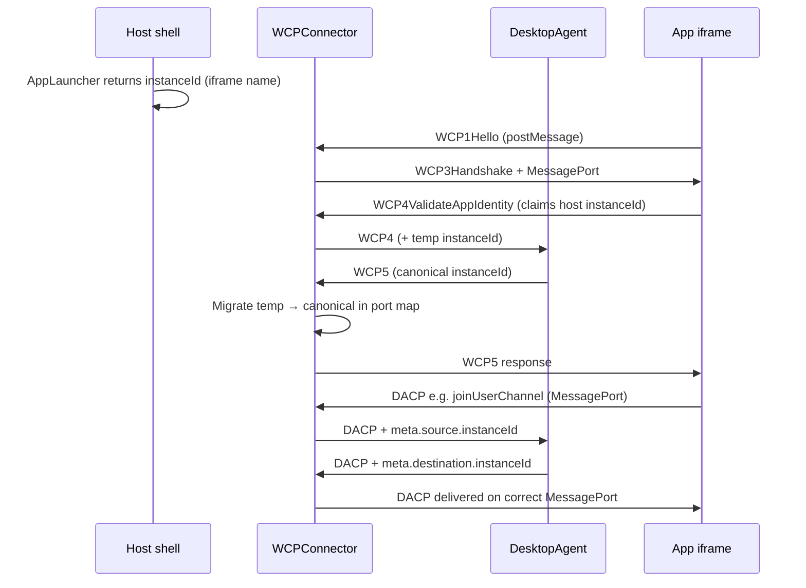
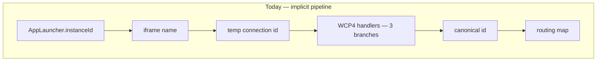
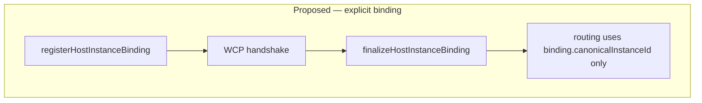

# Browser edge and Desktop Agent

This document is the **primary integrator guide** for FDC3 in the browser. The package implements two cooperating roles:

1. **Browser edge** — everything that talks to iframe apps (WCP, MessagePort, per-app routing).
2. **Desktop Agent (DA)** — headless FDC3 logic (DACP handlers, channel state, intents, instance registry).

Everything else is detail under one of those two boxes.

## Two-box model

```text
┌────────────────────────── BROWSER EDGE ──────────────────────────┐
│  Host shell: iframes, AppLauncher, optional IntentResolver UI    │
│  WCPConnector (connectors/browser)                               │
│    • WCP1–3 handshake (postMessage + MessageChannel)             │
│    • MessagePort per connected app                               │
│    • Routes DACP by meta.destination.instanceId                  │
└────────────────────────────┬─────────────────────────────────────┘
                             │ Transport — ONE pipe (not per app)
                             ▼
┌────────────────────────── DESKTOP AGENT ─────────────────────────┐
│  DesktopAgent (core/)                                            │
│    • All fdc3.* behaviour via DACP handlers                      │
│    • WCP4–5 identity validation → canonical instanceId           │
│    • Channel membership, intents, open-with-context, heartbeat   │
└──────────────────────────────────────────────────────────────────┘
```

| Role | Package path | Speaks to |
|------|--------------|-----------|
| Browser edge | `src/connectors/browser/`, `src/protocols/wcp/` | iframe apps (WCP + MessagePort) |
| Desktop Agent | `src/core/`, `src/protocols/dacp/` | Host via `Transport`; apps only via edge |

**InMemoryTransport** (local mode) is only the **short internal wire** between edge and DA in the same JS process. It is **not** how apps connect. Toolbox `AppTimeout` failures usually mean **MessagePort routing or instanceId mismatch** on the edge, not broken InMemoryTransport.

## Host contract example

FDC3 in the browser is three runtime parts. Only the bottom two come from this package; **your host shell** wires the contracts in the middle.

```text
  FDC3 Apps          Your host (contracts)       FDC3 engine
  @finos/fdc3    →   launcher · directory   →   createBrowserDesktopAgent()
  getAgent()         intent UI · channel UI      (edge + DA, in-process)
                     open/close · lifecycle
```

Iframe apps call `fdc3.getAgent()` via `@finos/fdc3` — you do not implement that layer. You **do** implement the host contracts below, then pass them to `createBrowserDesktopAgent`.

### Browser mode (engine in same tab)

```typescript
import { createBrowserDesktopAgent } from "@finos/sail-desktop-agent/presets"
import type { AppLauncher, IntentResolver, ChannelControl } from "@finos/sail-desktop-agent"

// --- Host contract: open apps (required) ---

const appShell = document.getElementById("app-shell")!

const appLauncher: AppLauncher = {
  async launch(request, app) {
    const instanceId = request.app?.instanceId ?? crypto.randomUUID()
    const iframe = document.createElement("iframe")
    iframe.name = instanceId // MUST match WCP4 identity — host ↔ engine link
    iframe.src = app.type === "web" ? (app.details?.url as string) : ""
    iframe.dataset.appId = app.appId
    appShell.appendChild(iframe)
    return { appId: app.appId, instanceId }
  },
}

// --- Host contract: intent disambiguation (optional) ---

const intentResolver: IntentResolver = {
  async resolve(request) {
    const picked = await showIntentPicker(request.handlers) // your modal / shell UI
    if (!picked) return null
    return {
      selectedHandler: picked,
      target: { appId: picked.app.appId, instanceId: picked.instanceId },
    }
  },
}

// --- Host contract: channel chrome (optional) ---
// Default wcpOptions omit channelSelectorUrl injection — the host owns channel UI.
// ChannelControl is the contract shape for your toolbar (not a createBrowserDesktopAgent option yet).
// SailPlatform implements channel changes via changeAppChannel; pure DA hosts use getAppUserChannelId + shell UI.

const channelToolbar: ChannelControl = {
  async selectChannel(request) {
    return showChannelPicker(request.availableChannels, request.currentChannel)
  },
}
// channelToolbar.selectChannel(...) from your shell when the user picks a channel

// --- Wire engine + host contracts ---

const desktopAgent = createBrowserDesktopAgent({
  appDirectories: ["/apps.json"],
  appLauncher,
  intentResolver,
  // wcpOptions omitted → intentResolverUrl/channelSelectorUrl false (host-owned UI)

  onAppConnected: meta => {
    tabs.markConnected(meta.instanceId, meta.appId)
  },
  onAppDisconnected: instanceId => {
    tabs.remove(instanceId)
    appShell.querySelector(`iframe[name="${instanceId}"]`)?.remove()
  },
  onHandshakeFailed: (error, connectionId) => {
    console.error("WCP handshake failed", connectionId, error)
  },
})

// Auto-started by default — iframe apps can await fdc3.getAgent()

// Host closes an app: tear down iframe, then tell the engine
function closeApp(instanceId: string) {
  appShell.querySelector(`iframe[name="${instanceId}"]`)?.remove()
  desktopAgent.disconnectInstance(instanceId)
}

// Host reads channel membership for chrome (join usually via app fdc3 API or your channel bar)
function currentChannel(instanceId: string) {
  return desktopAgent.getAppUserChannelId(instanceId)
}

// Teardown
// desktopAgent.stop()
```

| Host contract | Required? | Wired via |
|---------------|-----------|-----------|
| `appLauncher` | **Yes** — FDC3 `open()` needs a host that creates iframes/windows | `createBrowserDesktopAgent({ appLauncher })` |
| `appDirectories` or `apps` | **Yes** — app metadata for open/intent resolution | `appDirectories: [...]` or `apps: [...]` |
| `intentResolver` | When multiple handlers — host shell UI, not WCP3 iframe injection | Preset wires `intentResolverNeeded` → `resolve()` |
| Channel UI | When `channelSelectorUrl` is false (default) — host toolbar/chrome | `ChannelControl` contract; read state with `getAppUserChannelId` |
| Lifecycle | Recommended — tab chrome, cleanup | `onAppConnected` / `onAppDisconnected` / `onHandshakeFailed` |

`createBrowserDesktopAgent` returns a single `DesktopAgent` handle; the browser edge starts and stops with `desktopAgent.start()` / `desktopAgent.stop()`. You do not manage `WCPConnector` in application code.

### Wiring intent resolver and channel selector UI

FDC3 defines **two different mechanisms** for each UI. Sail and this package default to **host-owned UI** (no iframe injected into the app window).

| UI | Mechanism A — host shell (recommended) | Mechanism B — WCP3 iframe injection |
|----|----------------------------------------|-------------------------------------|
| Intent resolver | `intentResolver` contract or `intentResolverNeeded` event | `wcpOptions.intentResolverUrl` — `@finos/fdc3` loads a page **inside the app window** |
| Channel selector | Host toolbar + `joinUserChannel` on behalf of the app | `wcpOptions.channelSelectorUrl` — `@finos/fdc3` loads a page **inside the app window** |

**Default (omit `wcpOptions`):** both URLs are `false` — your host shell owns both UIs. This matches FDC3 when the [browser-resident host](https://fdc3.finos.org/docs/api/specs/browserResidentDesktopAgents) renders chrome outside the app iframe.

#### Intent resolver — host shell UI

When `raiseIntent` matches multiple handlers, the engine pauses and asks the host to pick one.

**Option 1 — preset contract (simplest):** implement `IntentResolver` and pass it to `createBrowserDesktopAgent`. The preset listens for `intentResolverNeeded` and calls your `resolve()`:

```typescript
const intentResolver: IntentResolver = {
  async resolve(request) {
    // Open YOUR modal — React dialog, native picker, etc.
    const picked = await myIntentModal.open({
      intent: request.intent,
      context: request.context,
      handlers: request.handlers,
    })
    if (!picked) return null // user cancelled
    return {
      selectedHandler: picked,
      target: { appId: picked.app.appId, instanceId: picked.instanceId },
    }
  },
}

createBrowserDesktopAgent({ appLauncher, intentResolver })
```

**Option 2 — event listener (same wiring, more control):** use when you already hold `wcpConnector` (`createWCPClient`) or need `getBrowserDesktopAgentSession`:

```typescript
import { getBrowserDesktopAgentSession } from "@finos/sail-desktop-agent/browser"

const { wcpConnector } = getBrowserDesktopAgentSession(desktopAgent)

wcpConnector.on("intentResolverNeeded", payload => {
  void myIntentModal.open(payload).then(selection => {
    wcpConnector.resolveIntentSelection({
      requestId: payload.requestId,
      selectedHandler: selection
        ? { appId: selection.appId, instanceId: selection.instanceId }
        : null,
    })
  })
})
```

Reference implementation: `packages/sail-web/src/stores/intent-resolver-store.ts` + `IntentResolverDialog` (uses `SailPlatform.connector` — same event/response API).

**Option 3 — injected iframe (uncommon for custom hosts):**

```typescript
createBrowserDesktopAgent({
  appLauncher,
  wcpOptions: { intentResolverUrl: true }, // FINOS reference UI, or a URL string
})
```

No `intentResolver` contract needed — `@finos/fdc3` hosts the picker inside each app window.

#### Channel selector — host shell UI

When `channelSelectorUrl` is `false` (default), the **host** renders channel chrome (toolbar button, per-app dropdown). The app does not get an injected channel iframe.

1. **Read** current channel: `desktopAgent.getAppUserChannelId(instanceId)`
2. **List** channels: `desktopAgent.getUserChannels()`
3. **Change** channel: send `joinUserChannelRequest` / `leaveCurrentChannelRequest` on behalf of the app, then wait for `channelChanged` on the edge

With **`SailPlatform`** (easiest — wraps the DACP send):

```typescript
const platform = new SailPlatform({ appLauncher, intentResolver })
await platform.start()

// In your ChannelSelector component (see packages/sail-web/src/components/ChannelSelector.tsx):
const channels = platform.getUserChannels()
const currentId = platform.getAppUserChannel(instanceId)
await platform.changeAppChannel(instanceId, channelId) // or null to leave

// Keep toolbar state in sync
platform.connector.on("channelChanged", (id, channelId) => {
  updateTabChrome(id, channelId)
})
```

With **`createBrowserDesktopAgent` only** (no platform-api):

```typescript
import { getBrowserDesktopAgentSession } from "@finos/sail-desktop-agent/browser"

const { wcpConnector, connectorTransport } = getBrowserDesktopAgentSession(desktopAgent)

function changeAppChannel(instanceId: string, channelId: string | null): Promise<void> {
  return new Promise((resolve, reject) => {
    const requestUuid = crypto.randomUUID()
    const timeout = setTimeout(() => {
      cleanup()
      reject(new Error("Channel change timeout"))
    }, 10_000)

    const onChanged = (changedId: string, newChannelId: string | null) => {
      if (changedId === instanceId && newChannelId === channelId) {
        cleanup()
        resolve()
      }
    }
    const cleanup = () => {
      clearTimeout(timeout)
      wcpConnector.off("channelChanged", onChanged)
    }

    wcpConnector.on("channelChanged", onChanged)

    connectorTransport.send({
      type: channelId ? "joinUserChannelRequest" : "leaveCurrentChannelRequest",
      payload: channelId ? { channelId } : {},
      meta: {
        requestUuid,
        timestamp: new Date().toISOString(),
        source: { instanceId },
      },
    })
  })
}

// Host toolbar click handler
channelButton.onclick = () => {
  void changeAppChannel(activeInstanceId, "fdc3.channel.1")
}
```

`ChannelControl` in `host-contracts/` describes the **picker contract** (`selectChannel(request)`); wire your toolbar to call `changeAppChannel` with the returned channel id. Sail web does not use `ChannelControl` directly — it uses `SailPlatform.changeAppChannel` plus `channelChanged` events (`connection-store.ts`).

**Injected channel iframe (uncommon):**

```typescript
createBrowserDesktopAgent({
  appLauncher,
  wcpOptions: { channelSelectorUrl: "/host/channel-selector.html" }, // or true for FINOS reference
})
```

#### End-to-end with Sail (reference stack)

```text
SailPlatform.start()
  → createBrowserDesktopAgent({ intentResolver, wcpOptions: false/false })
  → SailDesktopAgentProvider wires stores to platform.connector events
  → <IntentResolverDialog /> listens via intent-resolver-store
  → <ChannelSelector instanceId={...} /> calls platform.changeAppChannel
```

See `packages/sail-web/src/contexts/SailDesktopAgentContext.tsx` for provider wiring.

### Remote engine (server or Web Worker)

Host contracts stay the same on the **browser** side; only engine placement changes.

```typescript
import { createWCPClient } from "@finos/sail-desktop-agent/browser"
import { DesktopAgent } from "@finos/sail-desktop-agent"
import type { AppLauncher } from "@finos/sail-desktop-agent"

// Browser host — same appLauncher, same iframe shell, same lifecycle UI
const { wcpConnector, start, stop } = createWCPClient({
  transport: mySocketOrWorkerTransport,
  // same wcpOptions default: host-owned intent/channel UI
})

wcpConnector.on("appConnected", meta => tabs.markConnected(meta.instanceId, meta.appId))
wcpConnector.on("appDisconnected", id => tabs.remove(id))
start()

// Remote process — engine only (no WCP, no iframes)
const agent = new DesktopAgent({
  transport: serverTransport,
  appLauncher: serverSideLauncherOrStub, // if open() originates server-side
  appDirectories: ["/apps.json"],
})
agent.start()
```

For the full Sail stack (workspace, layout, pre-built launcher/resolver/channel UI), use `SailPlatform` in `@finos/sail-platform-api` — it implements the same host contracts and delegates engine wiring to this package.

## FDC3 2.2 alignment

This package implements a [Browser-Resident Desktop Agent](https://fdc3.finos.org/docs/api/specs/browserResidentDesktopAgents) with the split prescribed by FDC3 2.2:

| FDC3 2.2 concept | This package |
|------------------|--------------|
| `getAgent()` / WCP connection | **Edge** (`WCPConnector`) — WCP1–3, per-app `MessagePort` |
| DACP over `MessagePort` | **DA** (`DesktopAgent`) — all `fdc3.*` API behaviour |
| WCP4 `ValidateAppIdentity` | **DA** — `core/handlers/dacp/wcp-handlers.ts` |
| WCP5 success / failure | **DA** responds; **edge** migrates port map to canonical `instanceId` |
| WCP6 `Goodbye` | **Edge** tears down port; **DA** cleans registry |

Spec references (v2.2):

- [Web Connection Protocol](https://fdc3.finos.org/docs/api/specs/webConnectionProtocol) — handshake, UI URL fields, identity validation
- [Browser-Resident Desktop Agents](https://fdc3.finos.org/docs/api/specs/browserResidentDesktopAgents) — host shell responsibilities
- [Desktop Agent Communication Protocol](https://fdc3.finos.org/docs/api/specs/desktopAgentCommunicationProtocol) — DACP request/response routing via `meta.source` / `meta.destination`

### WCP phases (spec vs implementation)

| Step | FDC3 2.2 requirement | Owner in this package |
|------|------------------------|------------|
| WCP1 `Hello` | App posts to parent; includes `connectionAttemptUuid` | App (`@finos/fdc3`); edge listens |
| WCP3 `Handshake` | DA returns `MessagePort` + `intentResolverUrl` + `channelSelectorUrl` | Edge sends; values from `wcpOptions` |
| WCP4 | First message on port; `identityUrl` / `actualUrl` origins MUST match `WCP1` origin | DA validates |
| WCP4 reconnect | Optional `instanceId` + `instanceUuid`; DA MUST verify `instanceUuid` secret and `WindowProxy` | DA (`instance-identity-registry`) |
| WCP5 | DA assigns or reuses `appId`, `instanceId`, `instanceUuid` | DA; edge updates routing |
| DACP | All FDC3 API traffic on validated port | DA handlers; edge routes by `meta.destination.instanceId` |

### Injected UI URLs (`WCP3Handshake` payload)

FDC3 names these fields **`intentResolverUrl`** and **`channelSelectorUrl`** on the WCP3 payload. Each MAY be:

- a **URL string** — `@finos/fdc3` loads that page in an iframe for the app window;
- **`false`** — the app does not need an injected iframe (host or DA provides UI another way);
- **`true`** — use the FINOS reference UI.

This package defaults both to **`false`** when `wcpOptions` is omitted. That is spec-compliant when the host renders channel chrome and intent resolution outside injected iframes (see [Channel Selector and Intent Resolver](https://fdc3.finos.org/docs/api/specs/browserResidentDesktopAgents#channel-selector-and-intent-resolver-user-interfaces)).

**Two different “intent resolver” mechanisms:**

| Mechanism | Purpose |
|-----------|---------|
| WCP3 `intentResolverUrl` | iframe URL injected **into the app window** by `@finos/fdc3` |
| `intentResolver` on `createBrowserDesktopAgent` | Host callback when DA needs disambiguation; wired to `wcpConnector.on('intentResolverNeeded')` |

Most browser hosts use **`false`** for WCP3 URLs and implement **`intentResolver`** (and channel UI) in the host shell via [host contracts](https://github.com/finos/FDC3-Sail/tree/main/packages/sail-desktop-agent/src/host-contracts).

### Package extensions (not FDC3 API)

These behaviours stay within FDC3 MUSTs but are host conventions supported by this library:

- **`iframe name = launcher instanceId`** — correlates `AppLauncher` output with WCP4; cross-origin iframes may not expose `window.name` to the host (integration tests use same-origin fixtures).
- **Host-adopt path** — `open` registers a `PENDING` instance; WCP4 may claim that `instanceId` before first connect so canonical id matches the launcher (supports `open()` returning `instanceId` early).
- **`HostInstanceBinding`** (below) — proposed integrator sugar only; not part of the FDC3 standard.

## Connection lifecycle (happy path)



**Debugging rule:** follow **one instanceId** from launcher → iframe `name` → WCP4 payload → WCP5 canonical → `meta.destination.instanceId`. A break anywhere in that chain produces toolbox `AppTimeout`.

## Where WCP lives

| Phase | Owner | Location |
|-------|--------|----------|
| WCP1–3 (Hello, Handshake, MessageChannel) | **Edge** | `wcp-connector.ts`, `protocols/wcp/wcp1-3-handshake.ts` |
| Per-app MessagePort bridge | **Edge** | `message-port-transport.ts`, `protocols/wcp/wcp-message-routing.ts` |
| WCP4–5 (validate identity, canonical id) | **DA** | `core/handlers/dacp/wcp-handlers.ts` |
| WCP6 (Goodbye) | **Both** | Edge disconnects port; DA cleans registry |
| DACP (open, channels, intents, …) | **DA** | `core/handlers/dacp/*` |

Integrators normally touch **presets/factories** and **host contracts** (`AppLauncher`, `IntentResolver`), not WCP internals.

## How to wire (decision tree)

Use this tree instead of reading four parallel README patterns.

```text
Where does the Desktop Agent run?
│
├─ Same browser tab as your host UI
│    → createBrowserDesktopAgent() from @finos/sail-desktop-agent/presets
│    → Implement AppLauncher (iframes + instanceId on iframe name)
│    → Optional: intentResolver host contract; channel UI in host (omit wcpOptions → both URLs false)
│
└─ Remote (Node server, Web Worker, …)
     → Server/worker: new DesktopAgent({ transport: serverTransport })
     → Browser host: createWCPClient({ transport: clientTransport })
     → Same AppLauncher / iframe responsibilities on the browser side
```

| Integrator goal | Entry point | Avoid unless advanced |
|-----------------|-------------|------------------------|
| Ship a browser desktop | `createBrowserDesktopAgent` | Manual `InMemoryTransport` + `WCPConnector` |
| Remote DA | `createWCPClient` + server `DesktopAgent` | Duplicating WCP in app code |
| Unit-test FDC3 handlers | `MockTransport` + `DesktopAgent` | Expecting this to prove iframe delivery |

**Canonical import:** `@finos/sail-desktop-agent/presets` for application code. `@finos/sail-desktop-agent/browser` remains for tree-shaking and advanced composition.

## Public API — today vs simplified story

### Today (four equal-looking patterns in README)

```typescript
// Pattern 1 — preset
import { createBrowserDesktopAgent } from "@finos/sail-desktop-agent/presets"

// Pattern 2 — same factory, different path
import { createBrowserDesktopAgent } from "@finos/sail-desktop-agent/browser"

// Pattern 3 — remote client
import { createWCPClient } from "@finos/sail-desktop-agent/browser"

// Pattern 4 — manual
const [daTransport, wcpTransport] = createInMemoryTransportPair()
const desktopAgent = new DesktopAgent({ transport: daTransport })
const wcpConnector = new WCPConnector(wcpTransport)
```

### Browser edge (internal to the preset)

`createBrowserDesktopAgent` couples a hidden **`WCPConnector`** (the browser edge) to the returned `DesktopAgent`:

- `desktopAgent.start()` also starts the edge (`window` listener for WCP1, MessagePort routing)
- `desktopAgent.stop()` tears down the edge and the DA transport

You do **not** destructure or manage `wcpConnector` in application code. Host code uses `desktopAgent` plus `appLauncher` / `intentResolver`. Optional `onAppConnected` / `onAppDisconnected` callbacks replace direct `wcpConnector.on(...)` wiring.

Advanced access (host channel control via `connectorTransport`, edge-contract tests): `getBrowserDesktopAgentSession(desktopAgent)` from `@finos/sail-desktop-agent/browser`.

### Simplified integrator surface

```typescript
// 90% of browser hosts — one entry
import { createBrowserDesktopAgent } from "@finos/sail-desktop-agent/presets"

const desktopAgent = createBrowserDesktopAgent({
  appLauncher: myLauncher,
  intentResolver: myResolver, // optional — host shell UI, not WCP3 iframe injection
  // wcpOptions optional — defaults intentResolverUrl/channelSelectorUrl to false (FDC3 host-controlled)
})

// Auto-started by default — iframe apps connect via fdc3.getAgent()
```

Teardown: `desktopAgent.stop()`. Pass `autoStart: false` only if you must configure the agent before the edge listens, then call `desktopAgent.start()` yourself.

```typescript
// Injected FINOS reference UIs (WCP3 payload) — uncommon when the host owns UI
createBrowserDesktopAgent({
  appLauncher: myLauncher,
  wcpOptions: { intentResolverUrl: true, channelSelectorUrl: true },
})

// Custom iframe URLs (same names as FDC3 WCP3 payload fields)
createBrowserDesktopAgent({
  appLauncher: myLauncher,
  wcpOptions: {
    intentResolverUrl: "/host/intent-resolver.html",
    channelSelectorUrl: "/host/channel-selector.html",
  },
})

// Per-instance URLs — keep getters when URL depends on instanceId
createBrowserDesktopAgent({
  appLauncher: myLauncher,
  wcpOptions: {
    getChannelSelectorUrl: id => `/channels?instance=${id}`,
  },
})
```

```typescript
// Remote DA — browser side only
import { createWCPClient } from "@finos/sail-desktop-agent/browser"

const { wcpConnector, start } = createWCPClient({
  transport: myWebSocketClientTransport,
  // omit wcpOptions — same false/false default as local preset
})
start()
```

Manual composition stays in an **Advanced** appendix for framework authors, not the main quick start.

### `wcpOptions` — do you need to change anything?

**No.** Omitting `wcpOptions` already produces `intentResolverUrl: false` and `channelSelectorUrl: false` on every WCP3Handshake (see `WCPConnector` constructor). You do **not** need:

```typescript
wcpOptions: {
  getIntentResolverUrl: () => false,
  getChannelSelectorUrl: () => false,
}
```

unless you prefer the explicit form. Static fields (`intentResolverUrl`, `channelSelectorUrl`) mirror the FDC3 payload names and are equivalent to constant getters. Use **`getIntentResolverUrl` / `getChannelSelectorUrl`** only when the URL varies per connection (`instanceId` at handshake time is still `temp-{uuid}` until WCP5).

## Instance identity — today vs proposed

### Today (logic spread across modules)

Identity is correct when several conditions align, but the story is implicit:

```text
AppLauncher.launch() → instanceId
       ↓
iframe name={instanceId}
       ↓
WCP1Hello → temp-{connectionAttemptUuid} on edge connection map
       ↓
WCP4 payload.instanceId + instanceUuid + sourceWindow
       ↓
wcp-handlers: canReuse | canAdoptPendingHost | else createAppInstance (new UUID)
       ↓
WCP5 canonical instanceId → edge migrates MessagePort map temp → canonical
       ↓
open-with-context / broadcast / raiseIntent use meta.destination.instanceId
```

Relevant code today:

- Launcher contract: `src/host-contracts/app-launcher.ts`
- Open registers **PENDING**: `src/core/handlers/dacp/app-handlers.ts`
- WCP4 adopt vs mint: `src/core/handlers/dacp/wcp-handlers.ts` (`canAdoptPendingHostInstance`, `createAppInstance`)
- Port map migration: `src/protocols/wcp/wcp-connection-management.ts`, `wcp-message-routing.ts`
- Open-with-context waits on target id: `src/core/handlers/dacp/utils/open-with-context.ts`



### Proposed (same split, explicit binding) — not in FDC3 2.2

Keep edge + DA split. Add a **single host-facing contract** and one log line per transition (illustrative future API):

```typescript
// host-contracts/instance-binding.ts (proposed — illustrative)

/** One correlation record per launched iframe; edge + DA share this view. */
export interface HostInstanceBinding {
  /** From AppLauncher / iframe name — host authority */
  launcherInstanceId: string
  /** WCP1Hello correlation */
  connectionAttemptUuid: string
  /** After WCP5 — used in all DACP meta.destination */
  canonicalInstanceId: string
}

/** Host calls when mounting iframe (proposed API) */
export function registerHostInstanceBinding(
  wcpConnector: WCPConnector,
  binding: Pick<HostInstanceBinding, "launcherInstanceId" | "connectionAttemptUuid">
): void {
  // Edge: ensure PENDING instance exists under launcherInstanceId
  // Edge: log [instance-binding] registered launcher=… attempt=…
}

/** Edge calls after WCP5 (proposed) */
export function finalizeHostInstanceBinding(
  binding: HostInstanceBinding
): void {
  // Assert canonical === launcher when adopt path taken
  // log [instance-binding] canonical=… launcher=… match=true|false
}
```



**No merge of edge and DA** — only a named object and structured logs so toolbox debugging is “follow `HostInstanceBinding`,” not grep three folders.

## Testing model

| Suite | Proves | Does not prove |
|-------|--------|----------------|
| Cucumber + `MockTransport` (~103 `@conformance2.2`) | DA / DACP handler behaviour | iframe MessagePort delivery |
| Vitest handler tests | Individual DACP paths | WCP handshake |
| **Edge contract** (`wcp-desktop-agent.integration.test.ts`) | Edge + DA + MessagePort seam | Full FINOS toolbox oracle |

**Edge contract tests** (maintain here):

1. Single app: WCP4 → temp→canonical migration (existing).
2. Two apps: user-channel broadcast received on listener app.
3. Host instanceId: open → PENDING → WCP4 adopt → canonical === launcher id.
4. Assert `meta.destination.instanceId` on delivered `broadcastEvent`.

Run:

```bash
npm test -w @finos/sail-desktop-agent -- wcp-desktop-agent.integration
```

## Related docs

- [Package overview](./overview)
- [Composition & internals](./composition)
- [Conformance traceability](./conformance)